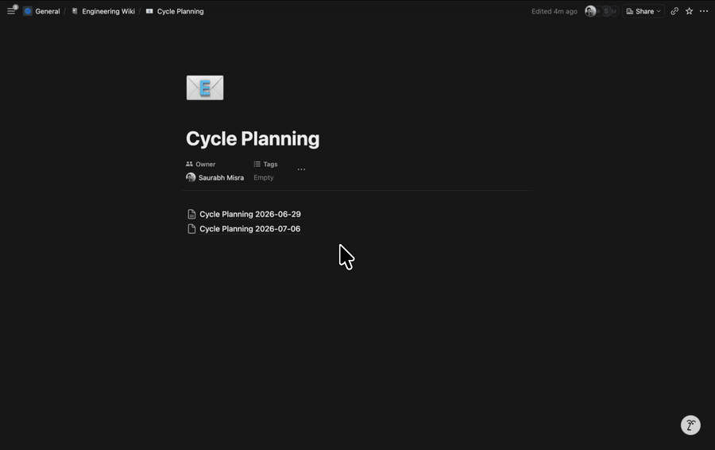
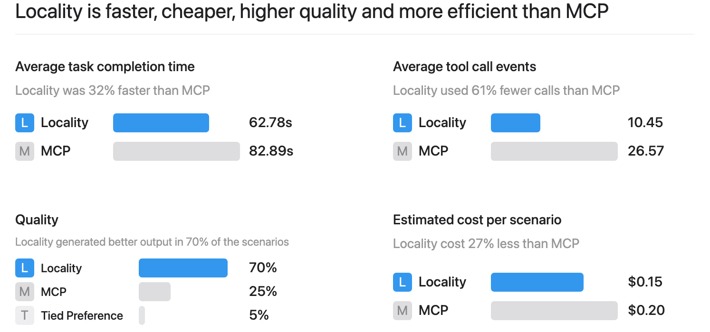
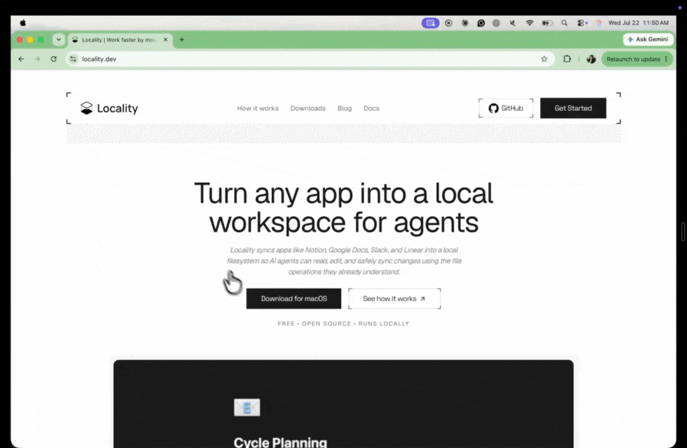
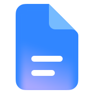
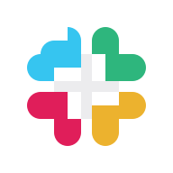

<div align="center">
  <picture>
    <source media="(prefers-color-scheme: dark)" srcset="docs-site/images/locality-logo-light.svg">
    <source media="(prefers-color-scheme: light)" srcset="docs-site/images/locality-logo-dark.svg">
    
  </picture>

  <h3>Your work apps, available as local files.</h3>

  <p>
    Locality turns the knowledge in Notion, Slack, Google Docs, Linear, and other
    work apps into a private, live-synced filesystem workspace for you and your AI agents.
  </p>

  <p>
    <a href="https://www.locality.dev/downloads">
      
    </a>
  </p>

  <p>
    <a href="https://github.com/codeflash-ai/locality/releases/latest"></a>
    <a href="https://github.com/codeflash-ai/locality/actions/workflows/ci.yml"></a>
    <a href="LICENSE"></a>
    <a href="https://github.com/codeflash-ai/locality/stargazers"></a>
  </p>

  <p>
    <a href="https://www.locality.dev/">Website</a>
    &nbsp;&bull;&nbsp;
    <a href="https://docs.locality.dev/overview">Documentation</a>
    &nbsp;&bull;&nbsp;
    <a href="https://www.locality.dev/blog/locality-why-filesystems-perform-better-than-mcps-for-production-agents">Locality vs. MCP</a>
  </p>
</div>

<p align="center">
  <a href="https://www.locality.dev/downloads">
    
  </a>
</p>

## Why Locality

Your company's knowledge already exists. It lives across documents, messages,
issues, meetings, and calendars. But every app exposes that knowledge through a
different interface, and every agent integration adds another API, tool schema,
authentication flow, and runtime dependency.

Locality makes those systems feel local. It presents their content as local
files and folders while keeping the original applications synchronized. People,
editors, scripts, and agents can use the filesystem tools they already understand.

This is not a one-time export and it is not another knowledge silo. Your connected
apps remain the systems of record; Locality gives them a shared, local file-based interface.

## Locality vs. MCP

MCP is useful for making individual tools callable at runtime. Locality takes a
different approach for knowledge-heavy and production agent workflows: it prepares
a unified filesystem workspace before the agent begins, so the agent can discover,
search, and combine information with normal file tools.

In our evaluation of 20 cross-application scenarios using Notion, Slack, Linear,
and source repositories, agents working through Locality completed tasks faster,
used fewer tool calls, cost less, and produced the preferred result more often.

<p align="center">
  <a href="https://www.locality.dev/blog/locality-why-filesystems-perform-better-than-mcps-for-production-agents">
    
  </a>
</p>

<p align="center">
  <a href="https://www.locality.dev/blog/locality-why-filesystems-perform-better-than-mcps-for-production-agents"><strong>Read the full methodology and results &rarr;</strong></a>
</p>

With files, agents can use fast, composable operations such as search, filtering,
parallel reads, and scripts across every connected source. They do not need to
reason through a different tool surface for every application or place broad app
credentials inside the agent sandbox.

## Get started in minutes

<table>
  <tr>
    <td width="50%">
      <h3>1. Download Locality</h3>
      <p>Get the latest desktop release from the <a href="https://www.locality.dev/downloads">Locality website</a>. The app keeps itself up to date.</p>
    </td>
    <td width="50%">
      <h3>2. Connect your apps</h3>
      <p>Choose a source such as Notion, Google Docs, Slack, Linear, Gmail, Calendar, or Granola and approve the access you want Locality to use.</p>
    </td>
  </tr>
  <tr>
    <td width="50%">
      <h3>3. Open your Locality folder</h3>
      <p>Your connected knowledge appears as files and folders that work with Finder, editors, search tools, scripts, and terminals.</p>
    </td>
    <td width="50%">
      <h3>4. Work with any agent</h3>
      <p>Open the workspace with Codex, Claude Code, or another filesystem-capable agent. Live Mode keeps active work fresh and safely synchronized.</p>
    </td>
  </tr>
</table>

<p align="center">
  
  <br>
  <sub>Install Locality, connect your workspace, and use it directly from Claude.</sub>
</p>

## One knowledge layer for you and your agents

<table>
  <tr>
    <th width="50%">For you</th>
    <th width="50%">For your agents</th>
  </tr>
  <tr>
    <td>
      <ul>
        <li>Browse knowledge from different apps in one familiar place.</li>
        <li>Search with Finder, your editor, or ordinary filesystem tools.</li>
        <li>Edit supported content without changing how your team collaborates.</li>
        <li>Keep a local, inspectable workspace instead of another hosted copy.</li>
      </ul>
    </td>
    <td>
      <ul>
        <li>Give agents durable context without building an integration per app.</li>
        <li>Search across sources with the same tools agents use for code.</li>
        <li>Keep app credentials outside the agent's working directory.</li>
        <li>Review and safely synchronize agent-generated changes.</li>
      </ul>
    </td>
  </tr>
</table>

### What can you do with Locality?

- **Build a personal knowledge base** from the work already spread across your apps.
- **Give agents better context** across documents, conversations, issues, and meetings.
- **Research across sources** without copying and pasting content between tools.
- **Edit through files** and synchronize supported changes back to the original app.
- **Use existing workflows** built around editors, shell tools, scripts, and coding agents.
- **Keep collaboration intact** because teammates can continue working in the source apps.

## How it works

<table>
  <tr>
    <td align="center" width="20%"><strong>Your apps</strong><br><sub>Notion, Slack, Linear, Google, Granola</sub></td>
    <td align="center" width="6%">&#8644;</td>
    <td align="center" width="20%"><strong>Locality</strong><br><sub>Connect, project, validate, synchronize</sub></td>
    <td align="center" width="6%">&#8644;</td>
    <td align="center" width="20%"><strong>Local files</strong><br><sub>Markdown, folders, metadata, attachments</sub></td>
    <td align="center" width="6%">&#8644;</td>
    <td align="center" width="20%"><strong>You + agents</strong><br><sub>Editors, search, scripts, Codex, Claude</sub></td>
  </tr>
</table>

Locality maintains a synchronized view of connected content and exposes it through
the operating system's filesystem. Opening or searching a file can hydrate current
content on demand. Supported edits are validated and translated back into operations
for the source application.

The remote app keeps its identity, structure, permissions, and collaboration model.
Locality keeps durable local sync state so it can distinguish remote changes, local
changes, and conflicts rather than blindly overwriting either side.

## Private by design. Yours by default.

For the desktop app, your workspace and sync state live on your machine. The
desktop client talks directly to each connected app's API for content and
synchronization. No Locality backend or middleman sits between you and your apps,
and the desktop app does not collect or transmit usage telemetry.

Locality does not require moving your knowledge into a new proprietary knowledge database.

<table>
  <tr>
    <td colspan="2">
      <strong>Direct connections. No telemetry.</strong><br>
      Your desktop client communicates directly with your connected apps. Your workspace content and activity are not routed through a Locality backend or telemetry service.
    </td>
  </tr>
  <tr>
    <td width="50%">
      <strong>Local workspace</strong><br>
      Connected content is presented through files you can inspect and use with the tools you choose.
    </td>
    <td width="50%">
      <strong>Protected credentials</strong><br>
      App credentials live in the operating system credential store; Locality keeps only credential metadata in its local database.
    </td>
  </tr>
  <tr>
    <td width="50%">
      <strong>Your apps remain authoritative</strong><br>
      Locality preserves remote identity and structure instead of asking you to migrate your team's knowledge into another silo.
    </td>
    <td width="50%">
      <strong>Safe synchronization</strong><br>
      Locality checks the current remote version before writes and pauses when a conflict or risky change needs review.
    </td>
  </tr>
</table>

You decide which sources to connect, which content to expose, and which agents or
local tools can access the resulting workspace.

## Features

| Feature | What it means |
| --- | --- |
| **Live Mode** | Keeps active files fresh, automatically synchronizes safe edits, and pauses when human review is needed. |
| **`loc` command-line tool** | Lets agents, scripts, and terminal workflows locate, inspect, refresh, review, and safely update mounted content. |
| **A filesystem for every app** | Work with one familiar interface instead of learning a new API or agent tool schema for each source. |
| **Two-way synchronization** | Supported edits can flow back to the source app while remote updates flow into clean local files. |
| **Conflict-aware writes** | Locality compares local, remote, and last-synced state before applying mutations. |
| **Agent-ready workspaces** | Generated `AGENTS.md` and `CLAUDE.md` guidance helps coding agents understand mounted content and safe write behavior. |
| **Fast local discovery** | Agents and people can use familiar search, filtering, scripting, and editor workflows across sources. |
| **On-demand content** | Large workspaces can appear locally without eagerly downloading every file before you begin. |
| **Reviewable changes** | Inspect pending changes and planned source operations before applying sensitive updates. |

### Live Mode

Live Mode is Locality's background synchronization loop. It prioritizes open,
recently used, and locally changed files instead of continuously crawling an entire
workspace.

When a change is clearly safe, Live Mode can synchronize it automatically. When
Locality detects concurrent edits, unsupported operations, destructive changes, or
remote drift that needs a decision, it pauses and asks for review instead of guessing.

### `loc`: a command line for agents and scripts

The `loc` command-line tool lets agents, scripts, and automated workflows interact
with Locality mounts using the same sync and safety guardrails as the desktop app.
See the [CLI reference](docs/cli.md) for the complete command surface.

## Locality Cloud for production agents

**Locality Cloud is a separate product from Locality Desktop.** It maintains a
pre-synced, cached state of approved company knowledge and mounts it into an agent
sandbox immediately when a sandbox starts. Agents get the same filesystem-native
experience without waiting for source APIs, while teams get centralized,
fine-grained access control and keep provider credentials out of the sandbox.

If you are building production agents and want to use Locality Cloud,
[contact us](https://www.locality.dev/contact).

## Connected apps

| Source | Local workspace | Write support |
| --- | --- | --- |
|  &nbsp; **Notion** | Pages, databases, properties, and supported media | Conservative page, block, property, and database-row updates |
|  &nbsp; **Google Docs** | Explicitly selected documents | Conservative document-body updates and root-level creates |
|  &nbsp; **Google Calendar** | Primary-calendar events | Reviewed event-draft creation |
|  &nbsp; **Gmail** | Messages and threads | Reviewed Gmail-draft creation |
|  &nbsp; **Linear** | Teams, issues, and issue context | Supported issue edits |
|  &nbsp; **Slack** | Channels, private channels, DMs, group DMs, and users | Read-only |
|  &nbsp; **Granola** | Meeting summaries and transcripts | Read-only |

Connector capabilities are intentionally explicit. Locality does not pretend every
shape in every source can be edited safely. Unsupported or lossy operations pause
before mutation rather than silently degrading the original content.

## Our philosophy

- **Files are the universal interface.** Editors, scripts, operating systems, people,
  and agents already know how to work with them.
- **Connected, not exported.** A local workspace should stay linked to the place where
  teams already collaborate.
- **Your context should outlive any agent.** Knowledge should not be trapped inside a
  model provider, chat session, or proprietary agent memory.
- **Inspectability beats hidden magic.** You should be able to see the files, changes,
  sync state, and evidence an agent used.
- **Safety comes before automation.** Locality automates obvious operations and pauses
  when the correct action requires human judgment.
- **Bring your own agent.** Locality is a workspace layer, not an AI-provider lock-in.

## FAQ

<details>
  <summary><strong>Is Locality an export tool?</strong></summary>
  <br>
  No. Exports become stale snapshots. Locality keeps a synchronized local projection while preserving the connected app as the system of record. If you do want to export an app workspace as ordinary files, pass <code>--projection plain-files</code> when mounting it with <code>loc</code>.
</details>

<details>
  <summary><strong>Does Locality replace Notion, Slack, Google Docs, or Linear?</strong></summary>
  <br>
  No. Your team can continue collaborating in those apps. Locality adds a filesystem interface for local tools and agents.
</details>

<details>
  <summary><strong>Does Locality replace MCP?</strong></summary>
  <br>
  Not in every situation. MCP is useful for invoking tools and perfoming actions dynamically. Locality is designed for workflows where agents need broad, repeated, cross-source access to knowledge. It can replace many app-specific retrieval calls with a prepared filesystem workspace. See our <a href="https://www.locality.dev/blog/locality-why-filesystems-perform-better-than-mcps-for-production-agents">Locality vs. MCP evaluation</a> for the tradeoffs and results.
</details>

<details>
  <summary><strong>Which agents work with Locality?</strong></summary>
  <br>
  Any agent that can read files can use a Locality workspace. Locality includes generated guidance for agents such as Codex and Claude Code.
</details>

<details>
  <summary><strong>Can agents write back to connected apps?</strong></summary>
  <br>
  Yes, for supported connectors and operations. Locality validates changes, checks for remote drift, and pauses risky or conflicting writes for review. Read-only connectors remain read-only.
</details>

<details>
  <summary><strong>Where is my data stored?</strong></summary>
  <br>
  The desktop workspace, sync metadata, and hydrated content are stored locally. Credentials are protected by the operating system credential store. The original content also remains in the connected source application.
</details>

## Development

<details>
  <summary><strong>Build and test Locality from source</strong></summary>
  <br>

The root `Makefile` is the shortest path into the project:

```sh
make setup
make build
make test
```

For local development:

```sh
make dev-tauri
```

Useful engineering references:

- [Sync model](docs/sync-model.md)
- [Live Mode](docs/live-mode.md)
- [Connector SDK](docs/connector-sdk.md)
- [Agent guidance](docs/agent-guidance.md)
- [Public documentation source](docs-site/README.md)

Run `make help` for the complete list of build, test, lint, packaging, and release targets.
</details>

## Community and support

- Read the [documentation](https://docs.locality.dev/overview).
- Download the [latest desktop release](https://www.locality.dev/downloads).
- Report bugs or request features through [GitHub Issues](https://github.com/codeflash-ai/locality/issues).
- Talk to us about an agent workflow through the [Locality contact page](https://www.locality.dev/contact).

## License

Locality is available under the [Apache License 2.0](LICENSE).
