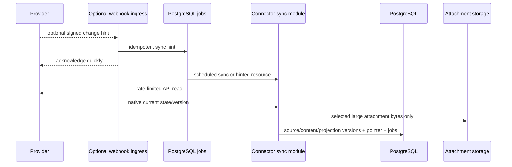
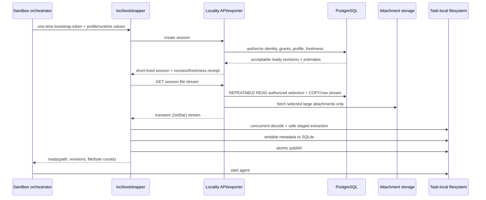
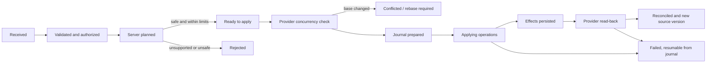

# Cloud Sandbox Data Plane Architecture

Status: proposed target architecture with a pragmatic v1 delivery path

Date: 2026-07-17

Scope: Locality backend, sandbox client, connector execution, replica transfer,
permissions, mutations, search, security, and migration

This document describes the target architecture for making Locality the data
layer for coding agents running in cloud sandboxes. It does not describe the
currently shipped local-first architecture; see [architecture.md](architecture.md)
for that system.

In this document, **sandbox v1** means the first generally usable backend data
plane release. It does not rename or replace the currently shipped local-first
Locality v1.

## Decision Summary

Locality should become a continuously maintained, multi-tenant replica of the
remote sources that a customer has explicitly connected and granted. A sandbox
must never crawl Notion, Slack, Google Drive, or another provider during startup,
and normal file reads must never call a provider or Locality API.

The main decisions are:

1. Use managed PostgreSQL as the v1 system of record and read-serving database
   for tenants, source identities, immutable resource/content versions, current
   projections, policies, sessions, search, changesets, journals, and audit
   metadata.
2. Store canonical text and normal projected-file bodies in PostgreSQL. Keep
   large opaque attachments and backups in regional object storage with managed
   encryption; the exporter resolves them behind the same session stream. V1
   has no persistent content-pack layer or custom client-side encryption.
3. In backend mode, run provider connector code only in backend workers.
   Provider credentials stay in a backend secret manager and never enter an
   agent sandbox. The existing direct connector mode remains available to the
   local-first desktop and headless `loc` client; a mount uses exactly one mode
   at a time.
4. Resolve authorization and job filters once in an indexed PostgreSQL query
   against a complete ready revision. Stream exactly the selected ordinary files
   as a transient standard tar response with negotiated Zstandard wire
   compression; do not build, compact, authorize, or retain profile-specific
   packs or client-side catalogs.
5. Materialize selected content as ordinary files on task-local disk before the
   agent starts. `rg`, `grep`, compilers, editors, and ordinary POSIX calls then
   operate at local filesystem speed with no read-time network calls.
6. Use `locality-core`'s three-tree model only for writable resources. Read-only
   content has one materialized tree plus backend session/audit metadata; it
   does not pay local identity-row, conflict-tracking, or baseline-storage costs.
7. Treat a local edit as an explicit changeset. The agent can inspect it with
   `loc status` and `loc diff`, then submit it with `loc push`. The backend
   re-authorizes, re-plans, checks provider concurrency, applies, reads back,
   journals, and publishes the new version. Human review workflows can be added
   later without changing the changeset boundary.
8. Separate an administrator's read-disclosure ceiling (`DataGrant`) from a
   job's filesystem selection and write request (`WorkspaceProfile`). V1 may use
   broad, explicit grants for selected source scopes; profiles narrow the exact
   rows delivered and strictly constrain writes, but can never grant beyond the
   administrator's ceiling.
9. Start backend search with PostgreSQL full-text search behind a replaceable
   interface. Move large Slack-like corpora to a dedicated search service only
   when measured query volume or corpus size warrants it. Search is always a
   derived, rebuildable projection, never the source of truth.
10. Deploy content in regional data cells close to supported sandbox fleets and
    pin each tenant to a home cell. V1 implements one Locality-managed cloud, but
    logical object references and the narrow storage/secret boundaries leave a
    later dedicated or customer-cloud cell possible without redesigning domain
    records.
11. Treat the backend and local host as adapters around the same versioned Rust
    domain and application workflows. The desktop app, headless `loc` CLI, and
    sandbox client share the filesystem-oriented local runtime; backend mode
    changes how remote truth is obtained, not how files, diffs, plans, and
    journals behave.
12. Keep the export repository behind a narrow interface. Add a ClickHouse
    read-serving replica only when measured PostgreSQL scan, concurrency, or
    isolation limits prevent the service from saturating supported sandbox
    links. ClickHouse is not a v1 dependency or mutation authority.

### Pragmatic Delivery Contract

The target model is intentionally broader than the first implementation. Build
the smallest vertical slice that proves the product, while fixing boundaries
that would be expensive to change later.

The first generally usable cloud-sandbox release is a multi-tenant product, not
a single-tenant or Notion-only pilot. It includes:

- one Locality-managed regional cell serving multiple customers;
- a small production connector set implemented through one connector-neutral
  synchronization contract, with at least two structurally different sources
  usable in the same profile before the release is called generally usable;
- coarse administrator-selected scopes such as roots, shared drives, channels,
  mailboxes, teams, or projects, plus explicit broad pilot groups/grants;
- exact server-side authorization/profile filtering and one negotiated
  Zstd-or-identity streaming file export per session;
- ordinary task-local files, including read-only and explicitly writable paths;
- replica-at-start freshness with no live sandbox delta stream;
- no read-only metadata import; a small SQLite session store tracks only
  writable entries, local changes, journals, and submitted changesets;
- PostgreSQL title/path/content search for profile discovery, with local `rg` as
  the primary search path after materialization; and
- local `status` and `diff`, explicit `push`, backend precondition checking,
  journaled apply, and read-back reconciliation for connectors whose declared
  capabilities include safe writes. Other initial connectors may be read-only.

"Broad" in v1 is an explicit product configuration, not an authorization
bypass. Tenant isolation, the source connection's visibility ceiling, encrypted
storage, short-lived sessions, exact export queries, audit, and backend write
checks remain mandatory. The pilot grant is easy to replace with narrower grants
later because sessions, query inputs, delivery digests/counts or optional exact
receipts, and changesets already carry stable tenant, principal, source,
access-set, and policy identities.

The first release does not need every high-cardinality personal-file or DM ACL
shape, a dedicated search/serving database, a custom mmap file format,
multi-region active/active operation, WORM export, or an operated BYOC product.
It must, however, version replica/changeset/export protocols, use logical content
references, and keep export, storage, and secret access behind narrow boundaries
so a read replica or cache can be added without replacing the domain model.

V1 has an explicit complexity budget: no custom cryptographic container/key
service, external job broker, separate global control-plane service, distributed
rate-limit service, live sandbox delta stream, export-seed pipeline, content-pack
builder, dedicated search/serving cluster, persistent sandbox cache, or human
reviewer workflow. Add a deferred subsystem only when a measured launch blocker
or concrete customer requirement justifies its operational and security cost.
Interfaces and version fields may reserve room for later capabilities, but v1
code does not implement them.

## Why This Direction

The current architecture has two properties that conflict with cloud-agent
workloads:

- Initial discovery is performed by a short-lived client against source APIs.
  Notion alone limits a connection to an average of three requests per second
  and also applies a workspace-wide limit. A ten-minute source crawl cannot be
  put on the critical path of a sandbox with a bounded execution window.
- Virtual files hydrate on access. This turns ordinary reads into unpredictable
  remote operations, makes recursive filesystem tools expensive, and prevents
  the agent from assuming that the visible tree is locally searchable.

Central ingestion amortizes source API work across every sandbox. An indexed,
revision-consistent PostgreSQL export then converts a rate-limited API problem
into one bounded sequential response. The sandbox materializes that response
before the agent starts, so later reads and searches are local filesystem I/O.

## Research Findings

The design is based on primary product and provider documentation retrieved on
2026-07-16.

| Observed pattern                                                                                                                                                      | Evidence                                                                                                                                                                                                                                                                                                                                                                                                                                                                                                                                                                                                                                                                             | Design implication                                                                                                                                                                                                                                  |
| --------------------------------------------------------------------------------------------------------------------------------------------------------------------- | ------------------------------------------------------------------------------------------------------------------------------------------------------------------------------------------------------------------------------------------------------------------------------------------------------------------------------------------------------------------------------------------------------------------------------------------------------------------------------------------------------------------------------------------------------------------------------------------------------------------------------------------------------------------------------------ | --------------------------------------------------------------------------------------------------------------------------------------------------------------------------------------------------------------------------------------------------- |
| Cloud coding agents start from an ephemeral checkout, run setup, edit local files, and hand back a diff or pull request.                                              | [Codex cloud environments](https://learn.chatgpt.com/docs/environments/cloud-environment), [GitHub Copilot cloud agent](https://docs.github.com/en/copilot/concepts/agents/cloud-agent/about-cloud-agent), [Claude Code on the web](https://code.claude.com/docs/en/claude-code-on-the-web)                                                                                                                                                                                                                                                                                                                                                                                          | Locality data should be staged beside the checkout as local files and use a diff/review workflow for writes.                                                                                                                                        |
| Sandbox vendors avoid repeated setup through cached environments, templates, snapshots, or persistent volumes.                                                        | Codex caches environments for up to 12 hours; Claude snapshots setup output for roughly seven days; [E2B templates and volumes](https://e2b.mintlify.app/docs/use-cases/coding-agents); [Daytona snapshots](https://www.daytona.io/docs/en/snapshots)                                                                                                                                                                                                                                                                                                                                                                                                                                | Cache only generic Locality binaries in shared images. Stream customer data into task-local storage after cache restore; consider an encrypted tenant-dedicated result cache only after repeat-session measurements justify it.                     |
| Network is denied or allowlisted by default, and credential-injecting proxies keep durable credentials outside the sandbox.                                           | [Codex agent internet access](https://learn.chatgpt.com/docs/cloud/internet-access), [GitHub Copilot firewall](https://docs.github.com/en/copilot/how-tos/copilot-on-github/customize-copilot/customize-cloud-agent/customize-the-agent-firewall), Claude's [secure deployment guide](https://code.claude.com/docs/en/agent-sdk/secure-deployment)                                                                                                                                                                                                                                                                                                                                   | The sandbox should need only the Locality API/data endpoint. Provider tokens belong in a backend vault or host-side proxy.                                                                                                                          |
| External business data is commonly exposed through MCP tools. Some hosted agents let MCP tools run autonomously, and firewall coverage may not include MCP processes. | [GitHub repository MCP configuration](https://docs.github.com/en/copilot/how-tos/copilot-on-github/customize-copilot/configure-mcp-servers)                                                                                                                                                                                                                                                                                                                                                                                                                                                                                                                                          | MCP remains a control/search fallback, not the bulk data plane. Tool allowlists and write authorization must remain explicit.                                                                                                                       |
| Provider change notifications are hints, not complete state.                                                                                                          | [Notion webhook delivery](https://developers.notion.com/reference/webhooks-events-delivery) omits full content, can arrive out of order, is aggregated, and can be delayed; Google Drive pairs [push notifications](https://developers.google.com/workspace/drive/api/guides/push) with a durable [changes feed](https://developers.google.com/workspace/drive/api/guides/manage-changes).                                                                                                                                                                                                                                                                                           | Persist idempotent hint jobs, fetch current head, and make scheduled cursor/poll repair the correctness path. Never treat a webhook payload as canonical content.                                                                                   |
| Source APIs make per-sandbox backfills fundamentally slow.                                                                                                            | [Notion request limits](https://developers.notion.com/reference/request-limits), [Notion search limitations](https://developers.notion.com/reference/search-optimizations-and-limitations), [Slack rate limits](https://docs.slack.dev/apis/web-api/rate-limits), [`conversations.history`](https://docs.slack.dev/reference/methods/conversations.history)                                                                                                                                                                                                                                                                                                                          | Do one resumable organization-level backfill, then maintain it incrementally. Sandbox startup only selects an already built revision.                                                                                                               |
| PostgreSQL can stream the result of a filtered query without a per-row application request.                                                                           | PostgreSQL [`COPY`](https://www.postgresql.org/docs/current/sql-copy.html) supports `COPY (query) TO STDOUT`; [row security](https://www.postgresql.org/docs/current/ddl-rowsecurity.html), [partitioning](https://www.postgresql.org/docs/current/ddl-partitioning.html), JSONB, and full-text search keep authorization and selection beside current projection state.                                                                                                                                                                                                                                                                                                             | Start with one indexed, exact-delivery export query and a streaming API. Keep metadata separate from bodies so rejected rows do not fetch content; benchmark before adding a serving database.                                                      |
| Analytical systems use columnar stores and parallel object exports when one transactional database no longer meets scan/concurrency needs.                            | ClickHouse [`MergeTree`](https://clickhouse.com/docs/engines/table-engines/mergetree-family/mergetree) manages sorted parts/background merges and streams an efficient [Native format](https://clickhouse.com/docs/interfaces/formats/Native); Snowflake, BigQuery, and Redshift expose parallel query-result export paths.                                                                                                                                                                                                                                                                                                                                                          | Preserve a replaceable export boundary, but add ClickHouse or disposable cached exports only after PostgreSQL throughput, concurrency, or workload-isolation measurements justify a second data plane.                                              |
| Cloud ETL products start with coarse workspaces, then add scoped roles and teams.                                                                                     | Airbyte makes the workspace an isolation boundary and issues short-lived workspace-scoped tokens ([workspaces](https://docs.airbyte.com/ai-agents/concepts/architecture/workspaces), [credentials](https://docs.airbyte.com/ai-agents/concepts/architecture/connectors-and-credentials), [RBAC](https://docs.airbyte.com/platform/access-management/rbac)). Fivetran scopes roles hierarchically across account, destination, connection, team, and workspace resources ([RBAC](https://fivetran.com/docs/getting-started/fivetran-dashboard/account-settings/role-based-access-control), [workspaces](https://fivetran.com/docs/activations/misc/security-and-privacy/workspaces)). | Offer one explicit broad pilot group for fast onboarding, but represent tenant, source, grant, profile, and session as separate scopes from day one. Keep provider credentials server-side and give jobs short-lived, narrowly scoped capabilities. |
| Mature data systems separate who may configure a pipeline from what the running pipeline may read.                                                                    | Estuary separates user grants, role/data grants, storage mappings, and data-plane placement, and supports progressively narrower catalog-name prefixes ([prefix access control](https://docs.estuary.dev/guides/prefix-access-control/), [catalogs](https://docs.estuary.dev/concepts/catalogs/)). AWS separates the launching principal, execution role, resource policy, and session/permission boundary ([AWS Glue IAM](https://docs.aws.amazon.com/glue/latest/dg/security-iam.html)).                                                                                                                                                                                           | Model control-plane administration, source-data disclosure, job selection, and runtime identity independently. Effective access is their intersection; an agent cannot inherit the administrator's credential power.                                |

The dominant current pattern is therefore two different data planes. Repository
context is cloned locally and can be searched or edited with native tools;
business-system context is usually fetched through setup scripts, direct APIs,
or one MCP tool call at a time. The latter adds network/provider latency to each
discovery step, puts secrets or a privileged tool server in the execution path,
and returns bounded tool results instead of a corpus on which `rg`, `find`, and
editors can operate. Code mutations benefit from branches, diffs, and pull
requests, while business-system mutations are often immediate API actions. The
target Locality design gives business data the useful properties of the first
plane and gives its writes an explicit review object analogous to a pull request.

Two cautions follow directly from the research:

- Codex Business/Enterprise caches may be shared by users of an environment,
  and Claude environment setup output is reused. A Locality bootstrap must run
  in a task-specific volume after cache restoration. A generic environment
  setup script may install `loc`, but it must not download tenant content into
  the cached image layer.
- A plain local filesystem cannot provide both native `grep` performance and a
  perfect server-side log of every file read. Governance should record exactly
  what was delivered to a sandbox and every backend action. Per-file read audit
  requires an explicitly slower, instrumented projection mode.

The ETL comparison also exposes a trap to avoid. Broad defaults are useful for
pilots, but additive inherited grants can become difficult to narrow later.
Locality therefore makes the pilot grant an explicit, replaceable `DataGrant`
and computes every session by intersection. A narrower profile or session can
always reduce an administrator's ceiling; no lower layer can expand it.

Airbyte and Fivetran RBAC primarily protect control-plane objects such as
workspaces, connections, destinations, and who may run or edit them. That is
necessary but does not preserve a Notion-page, Slack-channel, or Drive-file ACL
after data is replicated. Locality adopts their workspace/team hierarchy,
server-held credentials, and scoped job tokens, then adds a distinct
content-disclosure layer (`DataGrant` + provider ACL facts + an exact filtered
export query). Estuary's separation of user, task-data, storage, and data-plane
grants and AWS's separation of launcher and execution role reinforce that
boundary.

## Goals And Non-Goals

### Goals

- No provider API calls on sandbox startup, directory listing, file open, file
  read, local search, status, or diff.
- All selected content is present before the agent begins its task.
- Ordinary files support `rg`, `grep`, `find`, editors, language tools, and
  atomic rename-based writes.
- A reusable profile starts in time proportional to selected bytes transferred,
  not source object count or provider request rate.
- Session startup does not perform an O(resource count) metadata import into a
  writable database before the agent can run.
- Arbitrary job filters and ACLs are evaluated in one indexed server query,
  without profile-specific stored artifacts, client-side overfetch, or one
  database/API request per file.
- Source state is continuously maintained with resumable backfills, change feeds,
  webhooks, polling, and repair scans.
- Permissions can express read, search, update, create, move, delete, comment,
  and attachment access independently.
- Local edits are durable and reviewable even if the sandbox or backend worker
  crashes.
- Tenant isolation, residency, deletion, audit, and enterprise deployment are
  part of the data model rather than retrofits.
- Existing local pending changes and journals survive migration to backend mode.
- Direct-source and backend-replica modes use the same canonical renderer,
  projection rules, changeset planner, guardrails, and apply/reconcile state
  machine rather than implementations that can drift.
- Storage and transfer costs are observable per tenant, profile, and session,
  with within-tenant content reuse and explicit retention defaults.

### Non-goals

- A globally atomic replica across independent providers. A session records a
  separate replica revision, watermark, and freshness statement for every source.
- Zero-knowledge storage. Locality must decrypt content to render, search, diff,
  and apply it. The privacy boundary is a trusted regional data plane with
  encryption, isolation, and auditable policy.
- Assuming every provider exposes complete, timely native ACL events. V1 can
  query high-cardinality ACL facts exactly once observed, but connector coverage
  and freshness still determine whether a scope is safe to serve.
- Perfect recall of bytes already delivered to an ephemeral sandbox after an
  administrator revokes access. Revocation blocks new sessions, exports, search,
  and mutations; short session TTLs and sandbox destruction bound prior exposure.
- Replacing Git or a code-host pull request. Locality changesets are a parallel
  review object for business-system data and may link to a code PR.
- Building a human-review workflow in v1. The agent or operator reviews locally
  with `loc status`/`loc diff` and explicitly runs `loc push`; a later approval
  service can bind a reviewer decision to the immutable changeset digest.

## System Architecture

```mermaid
flowchart LR
  subgraph Sources[Remote sources]
    N[Notion]
    S[Slack]
    G[Google Drive / Docs]
    O[Other connectors]
  end

  subgraph Cell[Regional Locality data cell]
    APP[Modular backend<br/>API, sync, render, export, apply]
    PG[(PostgreSQL<br/>content, policy, jobs, search)]
    BS[(Encrypted object storage<br/>large attachments and backups)]
    SM[Secret manager]
  end

  subgraph Sandbox[Ephemeral cloud sandbox]
    LC[Shared local-host runtime<br/>loc + localityd]
    FS[Ordinary local files]
    AG[Agent, rg, grep, editor]
  end

  N <--> APP
  S <--> APP
  G <--> APP
  O <--> APP
  APP <--> PG
  APP <--> BS
  APP --> SM
  APP -->|short-lived capability + filtered Zstd(tar) stream| LC
  LC --> FS
  FS <--> AG
  LC -->|immutable changeset| APP
```

### Deployment Shape

The first production deployment is a modular monolith. It has:

- one backend binary containing API, optional webhook ingress, connector sync,
  shared engine/provider execution, streaming export, search-index, and apply
  modules. It may run API and worker process modes independently for scaling,
  but they are not separate services;
- one managed PostgreSQL cluster per regional cell;
- one regional object-store namespace for large attachments and backups;
- one managed secret store; and
- one PostgreSQL `jobs` table processed with leases and `FOR UPDATE SKIP LOCKED`.

PostgreSQL is authoritative for v1 replica/query state; providers remain the
external systems of record. Object storage is authoritative only for the large
attachment objects it owns. Jobs are inserted in the
same transaction as the state that makes them necessary and may execute more
than once; every worker operation is idempotent against a durable event, version,
replica, or journal key. Add an external broker and outbox publisher only when
measured job volume, isolation, or database contention requires them.

V1 stores organizations, billing references, identity configuration, and the
tenant-to-cell record in a control-plane module and schema in the same deployment.
It does not run a separate global control-plane service. Customer content,
provider credentials, search documents, projected content, and mutation journals
stay in the tenant's home cell. Split the control plane only when multiple cells,
residency routing, or independent scaling makes that operationally useful.

### Deployment Modes And Region Affinity

The cell is a portable deployment boundary, not shorthand for a Locality-owned
cloud account. Support these modes from the same binaries and schemas:

1. a multi-tenant Locality-managed regional cell;
2. a Locality-operated dedicated customer cell; and
3. a customer-operated cell in the customer's cloud/VPC.

Only the first mode is required for v1. Durable object references use logical
cell/object IDs rather than provider-specific bucket URLs. A narrow object-store
adapter requires TLS and managed encryption with a tenant key reference; it owns
the cloud-specific SSE-KMS/CMEK settings. A secret-store boundary keeps provider
tokens out of domain records. V1 uses PostgreSQL jobs and one-time bootstrap
tokens directly rather than inventing generic queue, KMS, workload-identity,
DNS, or multi-cloud orchestration frameworks. Those integrations can be added at
the cell boundary when a second deployment mode is implemented.

The control plane chooses a home cell using residency and supported sandbox
regions. Place PostgreSQL, the streaming exporter, attachment storage, and API
close to the sandbox fleet because database-to-exporter and exporter-to-sandbox
network paths can dominate session cost. Same-region transfer is not assumed to
be free: each platform path is benchmarked and priced, including cloud/account
boundaries and private connectivity. A later platform integration may provide
an encrypted, tenant-scoped persistent content cache, but customer bytes must
never enter a shared generic sandbox image.

## Core Data Concepts And Identities

Do not force every provider object into one lossy universal document table. The
model has five layers.

The authorization vocabulary is:

- **tenant**: one customer security, residency, billing, and encryption
  boundary;
- **principal**: a human or service identity that can authenticate and be
  audited; every workload binds a service principal even when it also acts for
  a human;
- **group**: a tenant-owned set of principals, usually synchronized from an IdP
  or explicitly managed in Locality; and
- **grant**: an administrator-owned, versioned rule assigning subjects a maximum
  resource scope and action set. A `DataGrant` never contains provider
  credentials and never implies that every resource visible to a connector is
  visible to its subjects.

Provider identities and groups link to Locality IDs through stable provider
subject IDs. Display names are never identity, and email addresses are used for
linking only after issuer/domain verification.

### 1. Source Resource

A source resource is a provider-owned identity:

- source connection and stable provider ID;
- provider kind and connector-owned object kind;
- current parent/membership edges;
- opaque provider version or concurrency token;
- deletion/tombstone state;
- connector metadata and native ACL observations; and
- discovery and observation timestamps.

Paths and titles are not identity. A resource may have multiple edges, aliases,
or shortcuts. A provider version is opaque and is compared for equality or
passed back as a provider precondition.

The shared Rust representation of this layer, `SourceObject`, is portable
provider state. It must not contain a local `MountId`, an absolute filesystem
path, SQLite row identity, hydration state, or a backend-only PostgreSQL row
handle. Hosts bind those concerns outside the connector/domain value.

### 2. Immutable Source Version

Every accepted fetch creates an immutable source version containing references
to:

- the native payload in managed encrypted storage;
- a versioned canonical intermediate representation;
- one or more rendered artifacts;
- the provider version and fetch provenance;
- connector, renderer, and canonical-format versions; and
- content hashes and timestamps.

The current resource row points at the latest accepted version. Old versions are
retained according to policy so diffs, review, undo, and audit do not depend on
mutable current state.

### 3. Projection Entry

A projection entry is a filesystem artifact. It deliberately differs from a
source resource:

- a Notion page can map to a directory plus `page.md` and assets;
- a Slack thread can aggregate many message resources into one Markdown file;
- a Gmail thread can aggregate messages and attachments;
- a database can emit a directory, row entries, `_schema.yaml`, and views.

Each projection entry has a stable projection ID, relative path, content reference,
input resource versions, file kind, format version, and connector-supported
action set. Effective actions are session policy, not intrinsic content
metadata. The many-to-many `projection_inputs` relationship lets connectors
aggregate or split resources without corrupting remote identity.

Its `LogicalPath` is a normalized portable relative path, not a Rust `PathBuf`
or an OS-specific absolute path. The same `ProjectionEntry` can therefore be
streamed by the backend or projected directly by a local connector. When a local
host binds it to a mount, it becomes a `LocalTreeEntry` with `MountId`, host
path, hydration/materialization state, dirty state, and local-store identity.
The current `TreeEntry` can remain as a compatibility adapter while connectors
migrate; it should not become the backend's canonical source object.

### 4. Replica Revision And Session Export

A replica revision is a durable point-in-time publication for one source
connection. It records the source watermark, projection revision, coverage,
freshness observation, and publication state. Projection content uses immutable
version rows plus current/version-range mappings, so publishing a revision does
not duplicate a physical corpus.

```text
provider watermark
  -> immutable source/content versions
  -> transactionally complete ready projection revision

sandbox session + current grants + profile/runtime filters
  -> one exact PostgreSQL selection query
  -> one transient Zstd-compressed tar stream
```

The session row records the tenant, principal/workload, profile and policy
revisions, source watermarks, selected replica revisions, query/filter digest,
expiry, and delivered file/byte counts. The exporter runs under the session's
tenant and policy context and never accepts arbitrary SQL from the client.

Two sets remain distinct:

- **authorized/selected set**: entries matching current `DataGrant`, provider ACL
  facts, profile roots, and runtime filters; and
- **delivered set**: entries the exporter actually wrote to the response.

In v1 these sets must be equal. There is no authorized overfetch or client-side
confidentiality filtering. A trusted host-side bootstrapper may report which
entries were materialized, but that telemetry is not an authorization control.
The complete delivered inventory may be retained as compact audit rows or a
database-generated digest according to policy; it is not a reusable data
artifact.

### 5. Sandbox Working Change

A working change exists only for an entry with a write action. It has a
delivered base entry, local bytes, and an optional latest backend head. It
becomes an immutable changeset with per-resource preconditions, planned source
operations, policy result, apply effects, and read-back result. A future review
workflow can attach an approval to the immutable changeset digest without
changing this base object.

For writable entries, this maps onto the existing three-tree vocabulary:

```text
Remote Tree = latest backend/provider head
Synced Tree = immutable replica base delivered to the sandbox
Local Tree  = current ordinary files in the sandbox
```

These are logical states, not three full physical trees. The client keeps the
working file and a compact baseline representation for write-enabled content;
the Remote Tree is normally only a resource/version token. Current remote bytes
are fetched only during rebase or conflict handling.

### Permission-Aware Client State

Read-only and writable content deliberately have different local costs:

| Content class      | Local state                                                                                                                                      | Update behavior                                                                                                       |
| ------------------ | ------------------------------------------------------------------------------------------------------------------------------------------------ | --------------------------------------------------------------------------------------------------------------------- |
| Read-only          | One materialized file. The backend session/audit state retains its revision and delivered identity; no local shadow or metadata row is required. | Fixed for an ephemeral session. A later session receives a newer replica revision; no merge or conflict state exists. |
| Writable but clean | Materialized working file plus a compressed/reflinked baseline and provider precondition. No local copy of remote head.                          | Eligible for local diff and explicit push.                                                                            |
| Writable and dirty | Working bytes, retained baseline, dirty journal, and changeset state for affected entries.                                                       | Three-way comparison occurs only when provider head differs at submit/apply.                                          |
| Conflicted         | Base, working, and fetched remote content for affected entries only.                                                                             | Kept until rebase, resolution, rejection, or retention expiry.                                                        |

During streaming materialization, the client retains per-file baseline bytes and
identity metadata only for entries whose effective session action includes a
write, so `loc diff` remains local; it does not retain shadow bodies or SQLite
rows for the read-only corpus.
Filesystems with reflinks or a read-only lower layer may avoid duplicate
unchanged blocks, but that is an optimization rather than a v1 requirement.

The backend may retain immutable historical source versions for policy,
changesets, audit, or recovery, but it does not create three backend copies per
sandbox. Tenant-scoped content IDs let replica revisions and sessions reference
the same PostgreSQL content-version row; large attachment references remain
tenant-scoped objects.

## PostgreSQL Data Model

Every content-bearing table includes `tenant_id` in its primary or leading
unique key. The complete logical model is intentionally richer than the first
physical schema:

| Group        | Tables and purpose                                                                                                                              |
| ------------ | ----------------------------------------------------------------------------------------------------------------------------------------------- |
| Identity     | `tenants`, `principals`, `groups`, `group_memberships`, `service_accounts`, `workloads`, `provider_identity_links`, `tenant_cells`              |
| Connections  | `source_connections`, `credential_refs`, `connector_versions`, `source_checkpoints`, `webhook_subscriptions`                                    |
| Source state | `source_resources`, `source_edges`, `source_versions`, `resource_acl_facts`, `access_sets`, `access_descriptors`, `ingest_events`, `tombstones` |
| Content      | `content_versions`, `projection_entries`, `projection_entry_versions`, `projection_inputs`, `large_attachments`                                 |
| Policy       | `data_grants`, `data_grant_revisions`, `workspace_profiles`, `workspace_profile_revisions`, `compiled_policy_bindings`                          |
| Replica      | `replica_revisions`, `replica_source_watermarks`                                                                                                |
| Runtime      | `sandbox_sessions`, `session_capabilities`, `session_deliveries`, `materialization_receipts`, `client_checkpoints`, `write_claims`, `jobs`      |
| Mutation     | `changesets`, `change_operations`, `approvals`, `apply_attempts`, `apply_effects`, `reconciliation_results`                                     |
| Governance   | `audit_events`, `retention_holds`, `deletion_requests`, `export_checkpoints`                                                                    |

High-value constraints include:

```text
UNIQUE (tenant_id, source_connection_id, provider_resource_id)
UNIQUE (tenant_id, source_resource_id, internal_version)
UNIQUE (tenant_id, source_connection_id, replica_revision)
UNIQUE (tenant_id, source_connection_id, checkpoint_kind, scope_id)
UNIQUE (tenant_id, source_connection_id, provider_event_id)
UNIQUE (tenant_id, changeset_id, operation_index)
UNIQUE (tenant_id, idempotency_key)
```

Use typed columns for IDs, state, timestamps, versions, parents, and common
filter fields. Use JSONB only for connector-owned metadata and policy extensions.
Store bounded provider payloads, canonical Markdown, and projected text in
ordinary PostgreSQL `jsonb`, `text`, or `bytea` columns. Split narrow selection
metadata from body rows so an ACL/filter query can reject entries before fetching
content. Do not use PostgreSQL's large-object subsystem or store unbounded binary
attachments in the database; those use tenant-scoped object references.

The v1 physical schema should stay near twenty generic tables rather than
materializing every logical subtype:

| V1 record                                                                                  | Consolidation rule                                                                                                                                                               |
| ------------------------------------------------------------------------------------------ | -------------------------------------------------------------------------------------------------------------------------------------------------------------------------------- |
| `tenants`                                                                                  | Includes home-cell and basic billing/identity configuration.                                                                                                                     |
| `principals`, `groups`, `group_memberships`                                                | A typed principal represents a human, service account, or workload; split subtypes only when their lifecycle differs.                                                            |
| `source_connections`                                                                       | Includes credential reference, connector version, optional webhook state, health, and connector-owned configuration.                                                             |
| `source_checkpoints`                                                                       | Durable cursor/fingerprint and completeness per root, channel, drive, mailbox, or other resumable connector scope.                                                               |
| `source_resources`, `source_edges`, `source_versions`                                      | Preserve stable provider identity, hierarchy/membership, immutable versions, current pointer, provider precondition, tombstone, and ACL observations.                            |
| `access_sets`, `access_set_subjects`                                                       | Normalizes equivalent observed reader sets so indexed authorization joins do not evaluate provider ACL JSON per file.                                                            |
| `content_versions`, `projection_entries`, `projection_entry_versions`, `projection_inputs` | Separates immutable bodies from narrow current/versioned selection rows and preserves the many-to-many source-to-filesystem mapping.                                             |
| `policies`, `policy_revisions`                                                             | Stores both `DataGrant` and `WorkspaceProfile` documents by kind; compiled results are rebuildable cache fields or objects.                                                      |
| `replica_revisions`                                                                        | Records source watermark, coverage, freshness observation, projection sequence, ready state, and PostgreSQL commit/replay position.                                              |
| `sandbox_sessions`, `session_deliveries`                                                   | Includes capability hash/claims, pinned revisions, filter/query digest, selected/delivered counts and bytes, plus an optional exact delivered inventory when policy requires it. |
| `jobs`                                                                                     | Durable leased work, provider-event dedupe, retry, cooldown, and idempotency state.                                                                                              |
| `search_documents`                                                                         | Rebuildable PostgreSQL full-text projection.                                                                                                                                     |
| `changesets`, `change_operations`                                                          | Operations hold attempt, effect, reconciliation, and error JSON until scale or retention justifies separate tables.                                                              |
| `audit_events`                                                                             | Append-only security and lifecycle events; large delivery inventories may use partitioned database rows or an encrypted audit export when required.                              |

This mapping is an implementation choice, not a weaker domain model. Bake in
the boundaries that are expensive to retrofit: tenant-leading keys and RLS,
stable provider IDs, immutable versions/provider preconditions, resource versus
projection identity, projection inputs, access-set IDs, policy/replica/format
revisions, resumable checkpoint identity, idempotency keys, and audit correlation
IDs. It is safe to normalize typed principal subtypes, webhook subscriptions, compiled
policy bindings, receipts, approvals, apply attempts/effects, holds, exports, or
partitions later through ordinary migrations.

### Isolation And Partitioning

- Enable row-level security with default-deny policies on every tenant table.
- Run the application as a non-owner role without `BYPASSRLS`; use a separate
  migration role. RLS is defense in depth in addition to mandatory `tenant_id`
  predicates in repositories.
- Do not partition v1 tables preemptively. Add tenant-hash and/or time
  partitioning to measured high-volume tables when index size, vacuum, retention,
  or tenant isolation requires it.
- Route a tenant to one database shard/cell. Reshard by moving whole tenants,
  not individual resources.
- Keep foreign keys within a shard and transaction. Do not create cross-cell
  content joins.

### Transaction And Event Rule

When a worker accepts a new source version, the same database transaction must:

1. insert the immutable version;
2. update the current resource pointer and edges;
3. record the durable ingest result; and
4. insert idempotent PostgreSQL jobs for render, search, replica publication, and
   audit work.

Workers lease those committed rows directly. Because the job is written in the
same transaction as its prerequisite state, a crash cannot commit a source
version without making its downstream work durable. If an external broker is
introduced later, this same `jobs` table becomes its transactional outbox; the
domain workflow and idempotency keys do not change.

## Database Decision

### Chosen Stack

| Concern                        | Choice                                                  | Reason                                                                                                                                                     |
| ------------------------------ | ------------------------------------------------------- | ---------------------------------------------------------------------------------------------------------------------------------------------------------- |
| Transactional state and policy | Managed PostgreSQL                                      | Strong transactions for identity, policy, jobs, journals, publication, and current-version changes; mature RLS, JSONB, indexing, backups, and tooling.     |
| Canonical/projected text       | Ordinary PostgreSQL `text`/`bytea` content-version rows | One exact ACL/filter query can select and stream bodies without a second storage catalog, stored transport format, or per-file API request.                |
| Large opaque attachments       | Regional S3-compatible object storage                   | Avoid unbounded TOAST/backup/replication pressure. Store one encrypted tenant-scoped object per immutable attachment; do not aggregate or compact them.    |
| Initial search                 | PostgreSQL `tsvector`/GIN                               | Lowest operational complexity and the same transactional job path. Keep the search repository replaceable.                                                 |
| Future large-corpus serving    | ClickHouse only after measured need                     | Adds columnar scans and horizontal read scaling, but also CDC, replica lag, and a second sensitive data store; it is not justified until PostgreSQL fails. |
| Client working state           | Small writable SQLite session store                     | Tracks only write-enabled baselines, identities, local mutations, journals, and changesets; read-only entries require no metadata import.                  |

### Rejected As The Primary Backend Database

| Alternative                                     | Why it is not the primary store                                                                                                                                                                                                                                          |
| ----------------------------------------------- | ------------------------------------------------------------------------------------------------------------------------------------------------------------------------------------------------------------------------------------------------------------------------ |
| SQLite or a hosted SQLite derivative such as D1 | Excellent client/edge state, but not the primary multi-tenant catalog for concurrent workers, relational authorization, journals, tenant sharding, and the operational model above. The current OAuth Worker may remain at the edge without making D1 the content store. |
| MongoDB/document database                       | Native payload flexibility is attractive, but policy, hierarchy, approvals, idempotent journals, exact export joins, and cross-record invariants are relational. Connector metadata can use PostgreSQL JSONB.                                                            |
| DynamoDB/key-value store                        | High scale, but makes hierarchical selectors, policy compilation, consistent multi-record changesets, and ad hoc operational queries substantially harder. It could later serve a narrow high-volume index.                                                              |
| CockroachDB/Spanner/global SQL                  | Global synchronous writes add cost, latency, and operational constraints without a product requirement for a tenant to write in several regions at once. Regional tenant cells and whole-tenant sharding are simpler.                                                    |
| Search engine as system of record               | Search indexes are eventually consistent and rebuildable. They cannot own mutation preconditions, audit journals, or access policy.                                                                                                                                      |
| ClickHouse in v1                                | It can outperform PostgreSQL for large concurrent scans, but Locality initially returns complete text bodies rather than analytical aggregates. The dual-database CDC/publication cost is deferred until benchmarks show user-visible benefit.                           |
| PostgreSQL large-object subsystem for all bytes | Ordinary bounded `text`/`bytea` values are sufficient for v1. Very large opaque binaries would inflate TOAST, backups, replication, and export load, so they remain individual object-storage attachments.                                                               |

The v1 decision is one PostgreSQL data plane for correctness and streaming
simplicity, plus object storage only where object semantics are intrinsically
better. A `ReplicaExporter` repository boundary allows PostgreSQL reads to move
to ClickHouse later without changing sessions, profiles, or the filesystem
contract.

## Content Storage And Encryption Model

V1 stores bounded native payloads, canonical forms, and projected text in
PostgreSQL. It stores large opaque attachments as individual object-storage
objects and uses encrypted object storage for database backups. It does not
create transport objects, content packs, or a second content catalog.

- Content identities are tenant-scoped. Do not deduplicate across tenants;
  cross-tenant hashes create existence side channels and complicate deletion.
- `projection_entry_versions` contains narrow path, revision, ACL, filter,
  action, content-reference, and provider-precondition columns.
  `content_versions` contains immutable bodies and hashes. The export query
  filters the narrow table before joining bodies.
- Use ordinary `text`, `jsonb`, or `bytea`, not PostgreSQL large objects. Set a
  measured attachment threshold; larger opaque payloads become one immutable,
  tenant-scoped object referenced by the content/version row.
- An object attachment is not an authorization boundary. The backend exporter
  rechecks the session and streams only selected attachment bytes; sandboxes
  receive no bucket or KMS credentials in v1.
- Provider credentials live in a secret manager behind opaque
  `credential_ref` values. Database rows and job payloads never contain bearer
  or refresh tokens.
- Logs contain opaque IDs, sizes, states, provider request IDs, and timings—not
  bodies, SQL parameters containing user data, authorization headers, provider
  payloads, or credentials.
- Retention deletes unreferenced historical content/attachment versions only
  after checking current projections, open sessions/changesets, audit policy,
  and holds. Prefer ordinary transactional references and periodic repair over a
  fragile synchronous reference counter.

### V1 Managed Encryption Contract

Managed PostgreSQL storage, replicas, snapshots, transaction logs, object
attachments, backups, service disks, and ephemeral sandbox volumes require
cloud-provider encryption at rest. Every network hop uses TLS. This is
infrastructure encryption, while tenant-leading database keys, RLS, repository
predicates, session authorization, and service IAM provide logical isolation.

The managed-cell contract is:

- use a managed KMS-backed database/storage key appropriate to the customer and
  cell. Early dedicated customers may use tenant-specific keys; do not build a
  Locality key-distribution protocol merely to simulate database page encryption;
- run application/export workers as a non-owner PostgreSQL role without
  `BYPASSRLS`; use separate migration, backup, and time-bound break-glass roles;
- keep the database and attachment bucket private, deny non-TLS access, scope
  service roles to their cell/tenant responsibilities, and audit database,
  object, and KMS access;
- issue only a short-lived Locality session capability to the sandbox. The fixed
  export endpoint binds it to tenant, workload, policy/profile revisions, source
  revisions, and expiry. Session creation accepts only declarative values
  validated against the published profile; export accepts no new filters and
  neither endpoint accepts arbitrary SQL;
- atomically materialize into a staging directory and expose the tree only after
  the tar response completes. A truncated response is discarded and restarted;
  resumable cursors are added only if measurements justify them; and
- destroy plaintext task volumes with the sandbox. `grep` requires plaintext
  local files, so the sandbox filesystem and process boundary remain part of the
  trusted execution environment.

An employee with only object-store console access cannot read PostgreSQL rows.
An employee or service with sufficiently privileged database `SELECT` access can
read customer text, just as an object-store role combining object read and KMS
decrypt can read an attachment. V1 therefore relies on least privilege,
separation of duties, audited temporary elevation, access alerts, and customer
residency controls. It is not zero knowledge: authorized Locality workers must
read content to render, search, export, diff, and apply it.

### Deferred Application-Level Encryption

Do not build client-side envelope encryption, per-row/per-export keys, HPKE
bundles, or a custom encrypted stream in v1. Revisit application encryption only
for a concrete requirement such as an untrusted external cache/CDN, portable
customer-controlled ciphertext, or a contractual restriction that managed
database operators may access only ciphertext. Any later mode must preserve the
same query/session/filesystem contract and benchmark on the smallest sandbox.

## Ingestion And ETL

### Source Connection And Credential Lifecycle

The backend owns the full provider authorization lifecycle:

1. A human administrator starts OAuth from the Locality control plane with
   signed state, PKCE where supported, an exact redirect URI, and requested
   least-privilege scopes.
2. The callback exchanges the code in the regional cell and stores the refresh
   token or provider credential directly in the secret manager. It is never
   returned to the desktop/sandbox client.
3. PostgreSQL stores only the opaque credential reference, provider account and
   workspace identity, granted scopes, connection owner/mode, expiry, health,
   and audit timestamps.
4. Workers mint/refresh short-lived access tokens just in time. Refresh-token
   rotation updates the vault atomically and revocation changes connection state
   to `reauthorization_required` without discarding mirrored data or pending
   changesets.
5. Scope upgrades require a new explicit consent and grant review. A connector
   cannot infer write authority from read credentials.

Support two visible connection modes:

- **organization connection:** a service/bot identity mirrors admin-selected
  content; Locality DataGrants are mandatory for downstream users;
- **delegated user connection:** reads/writes as a mapped user when source-native
  attribution or ACL fidelity requires it.

The mode is part of source and audit identity. Locality must not silently switch
between them because that changes both visibility and who the provider records as
the writer. Connector onboarding must show the attribution consequence before
authorization: for example, whether Slack records a Locality bot or a delegated
user as the message author, and whether Notion/Drive audit logs show an
integration or user identity.

### Connection Bootstrap

Connecting a source is an organization setup operation, not a sandbox setup
operation.

1. An administrator authorizes the source and chooses the data ceiling.
2. Locality stores the provider credential in the cell's secret manager.
3. A durable backfill workflow enumerates the authorized source, checkpoints
   every cursor/container, and respects provider limits through the connection's
   owning worker. The scheduler prioritizes roots referenced by published
   profiles before the remainder of the organization mirror.
4. Connector jobs store native versions and invoke the shared canonical renderer;
   follow-up PostgreSQL jobs write content/projection versions, search inputs,
   and replica-publication state. These are modules in one worker binary, not
   separate services.
5. A replica publisher advances the immutable source revision after required
   jobs for the selected scope complete.
6. A workspace profile becomes `ready` only when its selected roots have a
   complete initial replica revision or an explicitly documented partial policy.

If a source is still backfilling, a sandbox request fails quickly with
`source_bootstrapping` and progress. It never starts another crawl or silently
serves a structurally incomplete mount as complete.

Profile readiness is a scheduler objective, not only a status calculation. The
profile-priority scheduler fetches, in order:

1. selected roots and the ancestor metadata needed to place them safely;
2. selected descendants, permissions, attachments, and projection inputs;
3. resources needed by other published profiles; and
4. the remaining organization inventory.

Progress reports profile coverage separately from whole-source coverage. A
small production profile should become ready while an unrelated multi-day
organization backfill continues.

Administrator-export seeding is not part of v1 or the committed near-term plan.
Start with resumable, profile-prioritized provider API backfill and measure
time-to-first-ready on real customer workspaces. Revisit export seeding only if
that remains unacceptably slow after scheduler and API-efficiency improvements.

If implemented later, an export may seed bodies/attachments at object-storage
speed but must be treated as an untrusted accelerator and reconciled through the
provider API. It cannot claim authoritative ACLs, stable writable IDs, deletion
state, or freshness before reconciliation. Notion exports may lose block
identity/access facts, while Slack export availability and coverage vary by
plan, administrator authority, channel type, retention, and legal policy. An
export can never become the only connector path.

### Connector Synchronization Contract

All production connectors use one small, checkpointed lifecycle:

```text
bootstrap(scope, checkpoint) -> changes + next checkpoint + completeness
sync(scope, checkpoint, hints) -> changes + next checkpoint
fetch(resource, reason) -> native state + opaque provider version
render(native, format_version) -> canonical/projection artifacts
apply(changeset, operation_ids) -> effects       # optional capability
read_back(effects) -> authoritative versions     # required when apply exists
```

`bootstrap`, `sync`, `fetch`, and `render` are required. Write methods are
capability-gated per connector and operation type. Provider webhooks are optional
hints passed to `sync`; they are not a second ingestion architecture. A connector
without webhooks remains production-capable through scheduled polling, durable
cursors or fingerprints, and repair scans.

### Incremental Maintenance



Scheduled checkpointed synchronization and repair are the correctness path.
Where webhooks exist, handlers verify provider signatures, enforce body limits,
store an idempotent hint job, and acknowledge before doing expensive work.
Workers fetch current state because hints may be delayed, aggregated, duplicated,
missing, or out of order.

Every connector also runs repair work:

- cursor/change-feed reconciliation where the provider supports it;
- bounded metadata observation for hot resources;
- periodic subtree or full inventory repair at a provider-safe cadence; and
- explicit reauthorization/access repair after scopes or grants change.

### Connection Ownership And Rate Limits

One worker task owns a source connection at a time. It runs the existing
process-local `ConnectorNetworkGate`, serializes or bounds that connection's API
calls, and declares the provider dimensions it must respect, for example:

```text
Notion: provider workspace + connection
Slack: app + workspace + method
Google: project + user/source + method
```

Backfill, event repair, observation, and apply work for that connection all pass
through its owner and in-process limiter. Durable jobs, checkpoints, retry
timestamps, and provider cooldown deadlines remain in PostgreSQL, but token
bucket counters remain process-local. Interactive apply and hot-resource refresh
take priority over background backfill within the owner.

The PostgreSQL claim query uses `tenant_id`, `source_connection_id`, priority,
`available_at`, and lease state to bound concurrent work per tenant/connection
and prevent one customer's backfill from starving others. This is scheduler
fairness, not distributed provider-rate state.

Horizontal scaling assigns different `source_connection_id` values to different
worker processes; it does not concurrently process one connection from several
workers. A leased PostgreSQL ownership row or advisory lock provides single
ownership and failover. After a crash, the next owner resumes durable jobs and
starts its limiter conservatively. `Retry-After`, provider overload, and
connector-owned retry safety remain authoritative.

### Provider Strategies

| Provider                       | Initial backfill                                                                                                                                                                                                                            | Incremental path                                                                                                                                                                                | Repair requirement                                                                                                                                                  |
| ------------------------------ | ------------------------------------------------------------------------------------------------------------------------------------------------------------------------------------------------------------------------------------------- | ----------------------------------------------------------------------------------------------------------------------------------------------------------------------------------------------- | ------------------------------------------------------------------------------------------------------------------------------------------------------------------- |
| Notion                         | Traverse explicitly shared roots/data sources through a resumable, profile-prioritized API backfill; do not rely on search as exhaustive enumeration. Administrator-export seeding is deferred unless measured first-sync time requires it. | Signed webhook hints followed by page/block fetch; cheap observations for active objects. Capture selected attachment bytes during fetch because provider-signed download URLs are short-lived. | Periodic authorized-root and permission inventory because event coverage is incomplete, events can be aggregated/out of order, and search is eventually consistent. |
| Slack                          | Enumerate authorized channels and bounded history windows with cursor/time checkpoints. Aggregate messages into thread/day projection artifacts.                                                                                            | Events API for messages, edits, deletes, membership, reactions, and files; fetch details as needed.                                                                                             | Channel membership and history gap scans; handle Events API and method-specific rate limits.                                                                        |
| Google Drive/Docs              | Inventory selected drives/folders, store a start page token, export/render supported documents.                                                                                                                                             | `changes.list` from the saved token, optionally woken by `changes.watch` notifications.                                                                                                         | Renew expiring notification channels and reconcile the durable changes feed.                                                                                        |
| Providers without change feeds | Resumable inventory with version fingerprints.                                                                                                                                                                                              | Adaptive polling by freshness tier.                                                                                                                                                             | Periodic full reconciliation with a documented freshness bound.                                                                                                     |

### Freshness Contract

Each replica revision records, per source:

- `provider_observed_through` or opaque cursor;
- last successful event/change-feed processing time;
- last repair time;
- current backlog and provider cooldown;
- the newest canonical revision included; and
- a connector-specific confidence/coverage statement.

A profile chooses `maxAge`, `onStale: fail | wait_then_fail`, and a bounded
`waitTimeout`. "Fresh" means the backend is within the connector's published
observation contract and has no known unapplied event for the selected scope; it
cannot promise that a provider emitted an event it has not yet delivered. V1
never silently warns and serves beyond the bound. Push/apply still performs an
authoritative provider precondition immediately before write.

Freshness SLOs distinguish provider-edit-to-observation from
webhook-receipt-to-version. The former is bounded only when the provider offers
a complete durable change feed; for Notion, repair and observation scans carry
more of the correctness burden. If an attachment fetch URL expires or capture
fails, the version records an explicit incomplete attachment state and creates a
credentialed refetch rather than persisting the signed URL as durable content.

## PostgreSQL Replica Publication And Streaming Export

### Published Workspace Profiles

A reusable profile is published before a job. A profile might be "engineering
Notion plus the last 30 days of selected Slack channels." Every selector or
action edit creates an immutable profile revision. Publication resolves
human-readable roots to stable source IDs, validates requested writes, compiles
supported filters into declarative predicates, and estimates selected files and
bytes.

Profiles are job configuration, not storage keys. They do not create tables,
snapshots, catalogs, packs, or database roles. At session creation, current
provider ACL observations and `DataGrant` establish the maximum read envelope;
the published profile and runtime parameters only narrow it. The API validates
runtime values against the profile's declared filter schema before any SQL is
constructed.

### Query-Served Projection

The read path separates narrow selection rows from immutable bodies:

```text
projection_entries
  stable projection identity and current pointer

projection_entry_versions
  source/revision validity, logical path, root, kind, ACL set,
  filter columns, actions, provider precondition, content ID, deletion

content_versions
  tenant-scoped immutable canonical/projected bytes, hash, size, encoding

access_set_subjects
  observed provider/Locality subjects allowed by each access-set expression
```

Common profile fields such as source, stable root ID, provider kind, channel,
mailbox, project, timestamp, MIME type, label, and write capability are typed or
materialized columns. Connector-specific uncommon fields may remain JSONB, but
v1 does not evaluate arbitrary user-supplied JSONPath or SQL.

Each projection-version row has a validity interval or equivalent publication
sequence. Publishing a new revision inserts only changed content/projection rows
and closes or supersedes affected prior rows. A query for a pinned revision sees
exactly the entries valid at that revision; it does not copy an entire physical
snapshot.

A session export is logically one fixed query:

```sql
-- Illustrative only; the application uses fixed parameterized repositories.
WITH selected AS MATERIALIZED (
  SELECT e.tenant_id,
         e.source_connection_id,
         e.projection_id,
         e.logical_path,
         e.file_kind,
         e.effective_actions,
         e.provider_version,
         e.content_id,
         e.large_attachment_id
  FROM authorized_projection_entries(:session_id, :replica_revisions) AS e
  WHERE profile_predicates_match(e, :validated_runtime_values)
)
SELECT e.logical_path,
       e.file_kind,
       e.effective_actions,
       e.provider_version,
       c.hash,
       c.byte_length,
       c.body,
       e.large_attachment_id
FROM selected AS e
LEFT JOIN content_versions AS c
  ON c.tenant_id = e.tenant_id
 AND c.content_id = e.content_id
ORDER BY e.source_connection_id, e.projection_id;
```

The real implementation expresses supported predicates as parameterized SQL and
runs as the tenant-scoped non-owner role under default-deny RLS. The sandbox
cannot supply table names, column names, operators, SQL fragments, or an
unbounded result limit. Authorization is part of the query before `LIMIT` or
ordering; post-filtering unauthorized rows is forbidden.

For throughput, the exporter may use `COPY (SELECT ...) TO STDOUT (FORMAT
BINARY)` internally and translate rows incrementally into the HTTP file stream.
This is one database query and one response, not one query or HTTP request per
file. Rejected metadata rows never fetch their content body.

### Revision Publication And Source Freshness

Provider events, cursor polling, scheduled observation, and repair continuously
advance the queryable projection:

```text
provider hint/change cursor/scheduled poll
  -> durable high-priority sync job
  -> authoritative provider fetch
  -> immutable source/content versions and projection changes
  -> complete ready replica revision
```

Work may span idempotent jobs, but the final publisher transaction advances a
revision to `ready` only after all required resource, edge, ACL, content,
projection, checkpoint, and search-input writes for its declared coverage have
completed. A session sees the old complete revision or the new complete
revision, never a partially rendered tree.

Each source revision records:

- provider cursor/watermark or observation scope;
- coverage and any explicit incomplete attachment state;
- newest known received event and processed event;
- last successful observation and repair times;
- backlog, provider cooldown, and connector health;
- projection sequence and PostgreSQL commit/replay position; and
- `building | ready | failed` publication state.

Profiles declare a freshness contract, for example:

```yaml
freshness:
  maxAge: 60s
  onStale: wait_then_fail
  waitTimeout: 30s
```

Session creation starts immediately when selected scopes are complete, have no
known unapplied event, and meet `maxAge`. A known pending event or stale
observation is promoted ahead of backfill; the request waits only up to its
bounded timeout. If freshness cannot be established, the API returns
`source_bootstrapping`, `source_stale`, or `source_unavailable` with progress
rather than silently serving old data.

No asynchronous mirror can prove that a provider has not changed something when
the provider exposes neither a complete cursor nor a timely notification. A
future `provider_confirmed` mode may require an observation after the session
request, but that deliberately trades startup latency and provider quota for a
stronger claim. Apply always performs an authoritative provider precondition
regardless of read freshness mode.

### Consistent Streaming Export

After authorizing a session and resolving the newest acceptable ready revision
for each source, the exporter opens a read-only `REPEATABLE READ` transaction.
The revision lookup and row stream share that database snapshot. Updates that
commit while the stream is running are not mixed into the response.

The client advertises `Accept-Encoding: zstd, identity`. The preferred v1
response is a standard streaming tar with:

```http
Content-Type: application/x-tar
Content-Encoding: zstd
```

`identity` remains a required fallback and benchmark control. In either mode:

- the tar is generated on demand and is never stored as a canonical artifact;
- each selected projection becomes one ordinary tar member with its logical path,
  size, and non-executable mode;
- a reserved first member contains versioned session metadata only for writable
  paths: projection/resource identity, delivered content hash, provider
  precondition, effective actions, and baseline requirements. The client consumes
  this member into its small SQLite store and does not expose it in the mount;
- read-only entries create no local metadata or shadow rows;
- selected large attachment references are fetched by the exporter and appended
  to the same stream under bounded size/scanning policy; and
- the client validates and extracts into a staging directory with path, link,
  device, case, Unicode, entry-count, byte, and disk limits, then atomically
  publishes the tree only after the HTTP response, Zstd frame, tar stream, and
  file writes terminate cleanly.

Start with Zstd level 1. It normally reduces Locality's Markdown/JSON-heavy wire
bytes substantially while retaining fast, bounded-memory streaming decode.
Use one ordinary Zstd frame with no dictionary, seek table, per-tenant tuning,
prebuilt encodings, or custom container. Already-compressed attachments may
reduce the aggregate compression ratio, which is a measurement input rather than
a reason to introduce per-entry transport rules.

The sandbox implements a bounded concurrent pipeline:

```text
HTTP receive -> Zstd decoder -> tar validator/extractor -> staging filesystem
```

Separate tasks or threads and bounded ring buffers let network receive, decode,
tar parsing, and file writes overlap with backpressure. On a one-vCPU sandbox
this still overlaps network and disk waits; on a multi-vCPU sandbox decode and
extraction may run on separate cores. The tar parser does not buffer the corpus
or expose completed files to the agent early. A single Zstd frame is mostly
sequential to decode, so v1 does not add independent compressed chunks, a writer
farm, or another manifest merely to claim parallel decompression. Add such
framing only if the decoder is the measured bottleneck rather than PostgreSQL,
the network, or filesystem entry creation.

An interrupted v1 export is discarded and restarted against a newly authorized
session snapshot. Add a logical resume cursor only when measured corpus size or
failure rate justifies its state and consistency complexity. The session
capability is short-lived and revocable; every retry rechecks current policy and
freshness.

The backend records source/profile/policy revisions, query digest, selected and
delivered file/byte counts, status, duration, and failure. A customer policy may
also require exact `session_deliveries` rows, but v1 does not duplicate every
read-only entry into SQLite or create a durable data manifest merely for default
telemetry.

### Sandbox Bootstrap Flow



The final data root should normally sit outside the Git checkout, for example
`/mnt/locality`, so business data cannot be accidentally committed to the code
repository. The agent receives the path through instructions and
`LOCALITY_ROOT`; a sandbox integration may add it as an allowed workspace root.

### PostgreSQL Performance Path

PostgreSQL is acceptable only if the complete export pipeline remains faster
than supported sandbox ingress at expected launch concurrency. Optimize the
simple path before adding another data store:

- keep authorization/filter columns narrow and separately indexed from bodies;
- use tenant-leading repository predicates and indexes appropriate to measured
  source/root/access-set/profile queries;
- join immutable bodies only after selection and use a bounded streaming
  transaction with backpressure;
- avoid N+1 reads, application buffering, per-file authorization calls, and
  JSON-policy evaluation in the hot row loop;
- colocate PostgreSQL and exporter, provision database/exporter network headroom,
  and cap concurrent exports per cell/tenant so bootstrap cannot starve ingestion
  or mutations; and
- benchmark cold/warm storage, 1/10/50 concurrent sessions, 1%/10%/80%
  selectivity, broad and high-cardinality ACLs, large text values, and
  10k/100k/1M-entry filesystem creation.

A PostgreSQL read replica is the first scale-out step when it provides sufficient
isolation. The session API routes an export to a replica only after its replay
LSN reaches both the selected revision/policy state and the session-creation
commit; otherwise it waits briefly or uses the primary according to cell policy.
Replica lag can never silently select an older revision or miss the session row.

### Deferred ClickHouse Serving Replica

ClickHouse is a measured future optimization, not a design assumption. Introduce
it only when PostgreSQL cannot sustain target per-session throughput/concurrency,
export scans materially harm transactional SLOs, or a read replica is
insufficient or uneconomic.

PostgreSQL remains authoritative for source versions, policies, sessions,
changesets, journals, and publication. A transactional outbox would append
immutable content versions and narrow projection-head versions to ClickHouse;
workers would record an applied sequence back in PostgreSQL. Sessions could use
ClickHouse only when its applied sequence covers the selected ready revision.
Provider mutations would never write ClickHouse directly.

The `ReplicaExporter` port keeps session selection and the HTTP/filesystem
contract stable across that migration. Direct PostgreSQL and future ClickHouse
implementations must pass identical authorization, revision, path, content, and
writable-metadata fixtures. Do not add `ReplacingMergeTree`, CDC, a second
sensitive-data backup/retention plane, or read-time deduplication before the
benchmark gate is met.

A disposable cached export may later accelerate a repeatedly identical
`(tenant, policy revision, profile revision, source revisions, filter digest)`
query. It is a TTL cache, not canonical state or an ACL composition primitive;
cache misses always fall back to the database exporter and correctness never
depends on cache compaction.

## Sandbox Client Architecture

Cloud mode changes the remote-truth transport, not the correctness model.
The local filesystem path is not desktop-specific: the desktop app, headless
`loc` CLI, and sandbox client all use the same local-host runtime and repository
semantics.

### New Client Boundary

Introduce a connector-neutral backend transport instead of teaching every
existing command about HTTP:

```rust
trait ReplicaService {
    fn create_session(&self, request: SessionRequest) -> Result<SessionGrant>;
    fn open_export(&self, session: SessionId) -> Result<ExportStream>;
    fn submit_changeset(&self, changeset: ChangeSet) -> Result<ChangeSetReceipt>;
    fn changeset_status(&self, id: ChangeSetId) -> Result<ChangeSetStatus>;
}
```

The concrete API should be asynchronous and streaming; the trait above only
shows the ownership boundary.

Place that transport behind a local `RemoteTruthProvider` port with two
implementations:

```text
DirectSourceReplica -> first-party connector -> provider API
BackendReplica      -> ReplicaService        -> Locality data cell
                              |
                              v
                shared local working-copy engine
                              |
                  ordinary paths + SQLite state
                              |
              loc CLI / desktop UI / sandbox agent
```

`DirectSourceReplica` preserves the existing local-first product, local
development, on-premises installations, and deliberate recovery.
`BackendReplica` materializes the authorized export stream and submits immutable
changesets. Both populate the same projection and working-copy abstractions; no
CLI or desktop command gets a second cloud-specific diff or push pipeline.

A mount is configured for exactly one remote-truth provider at a time. Locality
must never silently fall back from backend mode to direct provider writes
because that would create two independent mutation authorities.

### Local State

The materialized ordinary files are the local read representation. A small
writable SQLite session store contains only:

- mount/session identity and delivered source revisions;
- write-enabled paths, projection/resource IDs, provider preconditions, and
  compact effective actions;
- per-writable-file baseline references/hashes;
- dirty entries and virtual creates/moves/deletes;
- journals, submitted changesets, and crash-recovery state.

Read-only entries create no SQLite entity, shadow, or three-tree rows. Any path
absent from the writable allowlist cannot enter a changeset. The backend retains
the authoritative delivered inventory/counts for policy and audit.

Add explicit component versions for:

- session/export stream and reserved writable-metadata member;
- canonical document and block representation;
- projection path rules;
- remote-replica protocol;
- writable-session-store semantics; and
- changeset protocol.

Clients reject newer required versions with an update-required result. The
backend should serve at least the current and previous supported portable format
during rolling upgrades. Reinitializing or refreshing backend mode must not
reset a dirty file, local virtual mutation, journal, or submitted changeset.

### Files And Daemon

Cloud mounts use `plain_files` by default, but unlike today's stub projection all
selected bodies are already hydrated. `localityd` is the shared local-host
runtime, not a desktop-only component. It serves the desktop app, headless
`loc`, and sandbox execution where a daemon is available, and remains useful
for:

- inotify/fanotify-style dirty tracking and atomic rename handling;
- flagging local modifications to read-only entries as policy violations without
  creating a writable baseline;
- local status and diff acceleration;
- uploading/submitting a changeset.

If the daemon cannot run, `loc status` and `loc diff` fall back to a bounded hash
scan of the writable allowlist against retained baselines. Read-only files never
enter a diff/push plan. Ordinary reads never depend on the daemon.

Read-only files are emitted as mode `0444`, writable files as `0644`, directories
as `0555` or `0755`, and all data as non-executable. These modes improve agent
behavior but are not the security boundary: an agent running as the owner may
change modes. The backend re-authorizes every changeset operation.

### Session Freshness, Not Live Sandbox Deltas

An ephemeral sandbox uses immutable source replica revisions selected at session start. V1
does not subscribe through SSE/WebSocket, poll for content deltas, or rewrite
files while an agent is working. This removes daemon complexity and makes every
local diff relative to an unambiguous delivered base.

Correctness at write time does not depend on those revisions still being current.
The backend reads current provider state and checks the delivered precondition
before applying a changeset. Drift produces a no-op, rebase, or conflict.

Desktop Live Mode and unusually long-running sandboxes may later use revision
deltas. That is a separate capability negotiated by the client; it is not part
of the sandbox v1 bootstrap or readiness path.

### Platform Adapters

The preferred integration is for a sandbox orchestrator to stage data after it
creates a task-local VM/volume and before it launches the agent:

| Platform shape                                                   | Integration                                                                                                                                                                                                                                                                           |
| ---------------------------------------------------------------- | ------------------------------------------------------------------------------------------------------------------------------------------------------------------------------------------------------------------------------------------------------------------------------------- |
| Locality-controlled, E2B, Modal, Daytona, or self-hosted sandbox | A host-side bootstrap streams the authorized export into a per-task volume. A host-side Locality sidecar owns the session capability and exposes a scoped Unix socket for changeset submission.                                                                                       |
| GitHub Actions/Copilot-style ephemeral runner                    | Setup workflow installs `loc`, exchanges OIDC or an Agents secret for a job-scoped capability, stages the replica outside the repo, then deletes the bootstrap credential. Egress is allowlisted to Locality.                                                                         |
| Codex cloud                                                      | The generic cached setup installs the binary only. Tenant content must be injected after cache restore through a task-scoped integration. Until such a hook exists, `loc bootstrap` can be the first task command, but must not write content into a shared cached environment layer. |
| Claude Code on the web                                           | Do not place content in the seven-day environment cache. Prefer a per-session hook/connector or host-side artifact injection. Claude's current environment configuration is not a dedicated secrets store.                                                                            |

A later platform integration may cache a completed immutable export on a
tenant-dedicated persistent volume when repeated identical queries justify it.
The trusted host rechecks the session and copies only that query's exact selected
entries into the task volume. Cache keys include tenant, policy/profile/source
revisions, filter digest, and export version; bytes are encrypted and
revocation/retention cleanup is enforced outside the agent.

Where a host-side sidecar is unavailable, the sandbox may hold a short-lived
Locality capability. It is deliberately less powerful than a provider token:

- bound to tenant, session, profile revision, and action set;
- open its exact export and/or propose changes only;
- no policy administration or arbitrary search;
- short expiry and revocable session ID; and
- current policy is rechecked on every submission.

## Selection And Permission Configuration

### Authorization, Selection, And Action Layers

`DataGrant` is administrator-owned and defines the maximum data and actions a
subject may receive. `WorkspaceProfile` is workflow-owner-managed and requests
a filesystem view and actions for a class of jobs. A session binds a workload,
an optional user on whose behalf it acts, one immutable profile revision, and
runtime filters. No lower layer can broaden an upper-layer ceiling.

```text
authorized_read_set = source connection visibility
                    ∩ native ACL facts when authoritative/observed
                    ∩ DataGrant(workload principal)
                    ∩ DataGrant(actingFor, when present)

requested_materialization_set = authorized_read_set
                              ∩ WorkspaceProfile selectors
                              ∩ runtime narrowing filters

effective_write_set = source-visible resource/parent scope
                    ∩ DataGrant resource/action scope
                    ∩ WorkspaceProfile selected resource/parent/action scope
                    ∩ session capability
                    ∩ connector capability
                    ∩ current provider/source state
```

For v1 delivery, the exact relationship is:

```text
delivered = requested_materialization_set ⊆ authorized_read_set
```

There is no authorized overfetch or client-side confidentiality filter. The
trusted bootstrapper is expected to materialize every delivered member; any
failure aborts publication of the local tree. Write scope is independently
exact and only allowlisted paths can appear in a valid changeset.

Notion integration visibility, for example, is only a source ceiling: content
visible to a shared bot is not automatically authorized for every agent. If a
provider does not expose human ACLs, an explicit Locality grant is mandatory. If
it does, native ACL facts are another intersection term. Policy compilation
assigns a versioned `access_set_id` so the database can join stable entitlement
facts without evaluating provider ACL JSON for every file. Write policy remains
an independent intersection.

#### Pragmatic V1 Pilot Grant

Each initial connector provides a setup preset that:

1. lets a tenant administrator choose coarse source scopes such as roots, shared
   drives, channels, mailboxes, teams, or projects;
2. creates an explicit `locality-pilot` group and grants it read access to those
   scopes, then requires the administrator to add the users/service workloads
   that may launch against it; and
3. for write-capable connectors, optionally grants create/update under designated
   stable parents, with delete disabled and explicit `loc push` required.

This is deliberately broad enough for demos and design partners, but it is not
"all connector-visible data" and is never created silently. The UI previews the
scopes, estimated files/bytes, eligible subjects, write boundary, and delivery
mode before publication. Tenant isolation, encryption, short session expiry,
audit, source visibility, and backend write checks are unchanged. V1 need not
ship SCIM or perfect provider-native ACL fidelity; it must persist stable
principal/group/grant/access-set revisions so narrowing does not require a
schema or protocol redesign.

### Human-Friendly Profile

An illustrative profile:

```yaml
apiVersion: locality.ai/v1alpha1
kind: WorkspaceProfile
metadata:
  name: engineering-agent

spec:
  freshness:
    maxAge: 5m
    onStale: wait_then_fail
    waitTimeout: 30s

  defaults:
    access: read
    changes:
      submission: explicit

  mounts:
    - name: notion-engineering
      sourceRef: notion-production
      target: /mnt/locality/notion
      select:
        roots:
          - sourceId: 4f5d7f2a-... # stable Notion page ID
        include:
          - "Projects/**"
          - "Architecture/**"
          - "Runbooks/**"
        exclude:
          - "**/Private/**"
          - "**/.loc/media/**"
        where:
          modifiedWithin: 365d
          kinds: [page, database_row]
      access:
        default: read
        rules:
          - match: "Projects/Agent Work/**"
            allow: [read, update, create]
          - match: "Architecture/Decisions/**"
            allow: [read, update]
          - match: "Runbooks/**"
            allow: [read]
      limits:
        maxChangedEntities: 20
        maxDeletes: 0

    - name: slack-engineering
      sourceRef: slack-production
      target: /mnt/locality/slack
      select:
        channels:
          - sourceId: C0123456789
          - sourceId: C9876543210
        history: 30d
        includeThreads: true
        includeAttachments: metadata
      access:
        default: read
```

The UI can generate this file from source pickers. Users may select paths and
titles, but publishing resolves them to stable source IDs and records the
resolution. Runtime policy never grants permission based only on a mutable path
or title.

Selectors are compiled into the server's exact export query. They narrow the
filesystem and the bytes delivered, while `DataGrant` and provider ACL facts
remain the upper confidentiality ceiling. An `exclude: "**/Private/**"` rule is
therefore enforced server-side for this profile, but it does not revoke the
principal's broader grant for another approved profile. The UI shows both the
grant ceiling and this job's exact selection.

`submission: explicit` means an agent or user must run `loc push`; v1 does not
auto-submit merely because a file changed. A future human-review policy may
pause the immutable changeset after submission, but v1 proceeds after backend
authorization, safety checks, provider preconditions, and journal creation.

The core action vocabulary is more precise than read/write:

```text
read, search, download_attachment,
update, create, move, delete, comment,
update_properties, manage_schema
```

Connectors map those actions to supported source operations. A profile may also
restrict allowed property names, target parents, Slack channels, attachment
sizes, or operation counts.

### Who Configures A Sandbox Job

Responsibility is deliberately split:

| Role                 | Decision                                                                                                                        |
| -------------------- | ------------------------------------------------------------------------------------------------------------------------------- |
| Tenant administrator | Connects sources, chooses the source visibility ceiling, manages principals/groups, and publishes `DataGrant` revisions.        |
| Workflow owner       | Publishes a `WorkspaceProfile` selecting mounts, filters, requested actions, and limits inside that ceiling.                    |
| Sandbox orchestrator | Starts a session for an approved workload, immutable profile revision, acting principal, TTL, and optional narrowing filters.   |
| Agent                | Uses the already materialized view and proposes changes. It cannot edit grants, change `actingFor`, or broaden filters/actions. |

`actingFor` is never arbitrary request text. For an interactive launch it comes
from the authenticated launcher; for a scheduled job it is an administrator-
approved service account; for a user-triggered automation it is a signed claim
from the orchestrator. Both workload and acting principal are bound to the
session and audit record, and their applicable grants are intersected. Provider
delegation or impersonation still requires the corresponding administrator
consent at connection setup.

The primary configuration surface is a Web UI backed by the same versioned API
and YAML model used by CLI/GitOps. The v1 UI presents one guided **Sandbox
Profile** flow: the administrator selects sources, subjects, mounted subsets,
and write boundaries, and the backend creates or reuses the underlying
`DataGrant` plus `WorkspaceProfile` revisions. The objects remain distinct for
authorization and future delegation even though users need not manage two
separate workflows.

1. **Connections**: authorize a provider, choose organization/delegated mode,
   roots/history/attachment ceiling, residency, and write attribution.
2. **Data Grants**: assign Locality principals/groups to stable source roots and
   actions. V1 exposes the `locality-pilot` preset; advanced controls can remain
   hidden until enabled.
3. **Workspace Profiles**: pick the subset to mount, filters, target paths,
   write directories, and limits.
4. **Preview and publish**: show the effective subject, source identity, grant
   ceiling, exactly selected files/bytes, expected transfer/disk bytes, actions,
   and freshness before creating an immutable revision.

Source pickers query the continuously maintained Locality replica, so opening
the UI does not synchronously crawl the provider. Titles and paths aid selection;
published configuration stores stable IDs. `loc sandbox plan` exposes the same
preview for CI using the same query planner as session creation.

### Translating Provider Access Control

Each connector produces a versioned `AccessDescriptor` rather than pretending
that every provider has the same ACL model:

```text
resource_id, access_set_id, read_subject_expression,
supported_actions, inherited_from, provider_acl_epoch, fidelity
```

`fidelity` is one of `delegated_authoritative` (the provider evaluates access
for the acting user), `membership_observed` (Locality has observed relevant
membership/ACL facts), or `connection_ceiling_only` (the credential reveals a
scope but not reliable per-human entitlements). The connector contract declares
which mode applies; Locality does not silently claim ACL fidelity it cannot
observe.

| Provider          | Read ceiling and identity                                                                                                                                                                                                                               | Locality grant/selection                                                                                                                                                                            | Write considerations                                                                                                                                            |
| ----------------- | ------------------------------------------------------------------------------------------------------------------------------------------------------------------------------------------------------------------------------------------------------- | --------------------------------------------------------------------------------------------------------------------------------------------------------------------------------------------------- | --------------------------------------------------------------------------------------------------------------------------------------------------------------- |
| Notion            | An organization integration sees explicitly shared roots, but that visibility is normally `connection_ceiling_only` for downstream human access.                                                                                                        | Admin grants the pilot or named groups stable Notion roots. Profile paths and database/property filters become exact query predicates inside that ceiling.                                          | Separate create/update/comment/schema/delete actions; restrict creates/moves to stable parent IDs and use integration-vs-user attribution chosen at onboarding. |
| Google Drive/Docs | Delegated OAuth can be `delegated_authoritative` for one mapped user; Shared Drive membership/ACLs can be `membership_observed`. Personal per-file sharing is a later high-cardinality case.                                                            | Intersect provider subject access with Locality grants; folders, MIME type, date, and Shared Drive selectors narrow the export. Never interpret domain-wide delegation as permission for every job. | Separate update/create/move/share/delete; provider revision/ETag is the apply precondition.                                                                     |
| Gmail             | The natural security boundary is one mailbox under delegated authorization. Labels, query terms, and date windows are selection filters, not ACLs.                                                                                                      | `actingFor` must map to the delegated mailbox owner and an explicit Locality grant. A domain-wide administrator credential is only a backend capability ceiling.                                    | Distinguish read/download, draft, label changes, send, and delete. Sending should be separately gated and attributable.                                         |
| Slack             | Bot scopes and installed/selected channels form the connection ceiling. Private-channel membership may be `membership_observed`; public selected channels can use explicit Locality groups. DMs/group DMs are deferred until ACL observation is proven. | Channel IDs and history windows narrow the profile. Membership epoch changes invalidate affected session authorization; channels may have distinct indexed access sets.                             | Onboarding chooses bot versus delegated-user attribution. Posting, editing, reacting, and deleting are separate actions; v1 can remain read-only.               |
| Linear            | A delegated user or service connection establishes the ceiling; team/private-team/project membership is used when reliably observable, otherwise fidelity is `connection_ceiling_only`.                                                                 | Locality grants stable teams/projects, and profiles select issues, states, cycles, or dates within them.                                                                                            | Separate create/update/comment/status/assignee/move/delete, with allowed team/project parents and issue-version preconditions.                                  |

These mappings are connector policy adapters, not a universal provider schema.
Stable provider subject IDs link to Locality principals/groups; display names and
unverified email matching never confer access.

### Policy Changes

Changing profile selection creates a new profile revision and changes only the
next parameterized export query. Changing a `DataGrant`, group membership, or
native ACL updates indexed policy/access facts and invalidates affected session
capabilities; content rows are not rewritten. New sessions always evaluate the
new revision/ACL epoch. Existing sessions may continue to read bytes already
delivered until sandbox destruction, but:

- an invalidated session cannot open or restart its export;
- backend search uses current policy;
- changeset submission is checked against current policy; and
- the audit log records the old session's exposure set and revocation.

## Mutation, Local Review, And Conflict Protocol

### User Experience

```text
loc sandbox init --profile engineering-agent
rg "rate limit" /mnt/locality
$EDITOR /mnt/locality/notion/Projects/Agent\ Work/Design/page.md
loc status /mnt/locality/notion
loc diff /mnt/locality/notion/Projects/Agent\ Work/Design/page.md
loc push /mnt/locality/notion/Projects/Agent\ Work/Design/page.md --wait
```

In backend mode, `loc diff` is the agent-accessible review step and `loc push`
means "submit this explicitly selected local plan to the Locality changeset
service." V1 does not wait for a separate human reviewer. The result can be:

```text
no_op
received
applying
applied
reconciled
conflicted
rejected
failed
```

It does not imply that the provider was mutated synchronously. Existing scripts
can request `--wait` and receive a final reconciled/conflict/rejected outcome.

### Changeset Contents

The client sends an immutable, content-addressed changeset containing:

- tenant/session/profile/policy/replica provenance;
- actor and workload identity;
- exact affected projection and source IDs;
- delivered base remote versions and shadow hashes;
- bounded local canonical bodies or an authorized changeset upload reference;
- the connector-neutral `PushPlan` and readable diff;
- deterministic operation IDs and an idempotency key;
- client validation results; and
- an optional code repository, commit, pull request, task, or agent transcript
  reference.

The client plan is advisory. The server parses and plans again using its version
of the canonical format and current policy. A mismatch is reported explicitly;
the server never applies unrecognized client operations.

### Server State Machine



Rules:

1. Re-evaluate current DataGrant, profile, session, operation limits, and source
   visibility before planning and again before apply.
2. Immediately before mutation, re-read authoritative provider metadata/content
   required by the connector's precondition. Backend replica/query freshness is
   not sufficient for write safety.
3. Append a durable journal and operation IDs before the first provider write.
4. Persist each apply effect, including newly assigned remote IDs, so a crash can
   resume or reconcile without guessing.
5. Read back final provider state, create a new immutable source version, publish
   a new ready replica revision, and only then mark the changeset reconciled.
6. Never partially apply an unsupported undo or a plan whose safety class changed
   after server planning.

The existing `locality-core` push planner, preimages, operation IDs, guardrails,
apply effects, and undo contract are the foundation for this service. The major
change is moving the journal and authoritative connector apply into the backend.

### Conflict Handling

For an update, Locality compares:

```text
Base    = source version delivered in the replica
Head    = latest provider version fetched at apply/rebase
Working = agent-edited canonical file
```

- Head equals Base: apply the authorized plan.
- Head changed and Working did not: no-op or refresh the client.
- Head and Working changed disjoint stable blocks/properties: generate a new
  merge changeset and require another explicit `loc push` if the readable diff
  changed.
- Overlap, structural ambiguity, deletion/move collision, or unknown provider
  content: return a conflict artifact with inline markers or structured sides.
- Creates use a client-generated stable local ID; reconciliation maps it to the
  provider-assigned ID without path inference.

The original changeset remains immutable for audit. A rebase/merge is a child
changeset linked to it.

### V1 Apply Policy And Deferred Human Review

V1 always supports local inspection with `loc status` and `loc diff`, followed
by explicit `loc push`. The backend proceeds after authorization, deterministic
plan classification, provider precondition checks, and durable journal creation.

Direct-apply policy is deterministic and inspectable; an opaque ML safety score
is never the authorization boundary. Useful bounded classes include:

- create-only operations below designated parents;
- append-only block changes;
- updates to resources created by the same workload/session lineage;
- updates to an allowlist of properties; and
- plans below configured entity, byte, attachment, and operation counts.

Deletes, moves, schema or permission changes, broad plans, unknown-block
degradation, destructive replacements, and classification uncertainty are denied
in v1 unless the administrator explicitly enabled that bounded operation class.

A human-review service is deferred. The changeset already outlives the sandbox
and has an immutable digest, exact plan, base/head versions, policy revision,
readable diff, actor/task provenance, and blast-radius counts. A later workflow
can add `awaiting_approval`, `approved`, and `rejected` transitions bound to that
digest; any semantic replan invalidates the decision. Review delivery should
first deep-link from the PR, issue, or Slack thread that launched the task rather
than require a large standalone application.

### Concurrent Agent Intent

Provider preconditions and three-way conflict handling remain the correctness
boundary when several sandboxes edit the same resource. V1 does not implement an
advisory-claim table or API. Add short-lived claims over stable resource IDs or
subtrees only if production metrics show meaningful duplicated work; claims
remain scheduler hints and never replace provider preconditions.

## Search Architecture

Local files are the primary search path for mounted data. Agents should use
`rg`, `grep`, `find`, and normal language tools without calling Locality.

Backend search serves two narrower purposes:

1. selecting or discovering data that should be added to a workspace profile;
2. returning a bounded, authorized set of stable resource IDs/paths for discovery
   outside the current mount. V1 updates a profile or starts a new session to
   materialize those results; it does not build supplemental replicas on demand.

### Initial Index

Create a derived `search_documents` projection with:

- tenant, source, resource, version, and projection IDs;
- title/path/channel/thread and typed filter fields;
- normalized `tsvector` text plus GIN indexes;
- effective access-set/policy labels; and
- source freshness and deletion state.

Search authorization is pushed into the query/index filter. Do not retrieve an
unfiltered top-K set and discard unauthorized hits afterward; that produces
incorrect ranking and creates leakage through counts/timing.

Embeddings and vector search are not part of v1. If added later, they are derived
personal data subject to the same tenant, retention, residency, deletion, and
policy boundaries as source content.

### Dedicated Search Trigger

Move a cell or large tenant to a dedicated search engine when load tests show
that PostgreSQL indexing, query latency, vacuum, or replica impact violates the
search/export SLO. The migration replays immutable source/projection versions through
the search job contract into a rebuildable index; no
changeset or source identity moves out of PostgreSQL.

## Security And Privacy Architecture

### Trust Boundaries

```text
Provider credentials     trusted backend secret boundary
Native/canonical content trusted regional data cell
Replica bytes            authorized but untrusted input to the agent
Agent/sandbox code       hostile-capable execution boundary
Provider mutation        backend-only privileged operation
```

Source content is untrusted even when it came from an internal Notion page or
Slack message. It may contain prompt injection asking an agent to exfiltrate data
or invoke tools. Locality does not convert source text into agent instructions,
scripts, hooks, executable bits, symlinks, `.env` files, or reserved agent-rule
files. Generated Locality guidance is signed/product-owned and kept outside
source-controlled namespaces.

### Authentication

- Humans authenticate through enterprise OIDC/SAML; groups arrive through SCIM
  or explicit mapping.
- The common v1 sandbox path is an orchestrator-injected, single-use bootstrap
  token with a very short TTL. Its exchange is audited, consumes the token, and
  returns a narrower session capability; durable tenant API keys are not used.
- Sandboxes use workload identity federation instead where the platform exposes
  a trustworthy identity. This is preferred but not assumed to be universally
  available.
- A cloud-sandbox session capability is scoped to a profile revision and action
  set and expires quickly. V1 does not require a separate proof-of-possession or
  client key protocol; platforms may later negotiate one without changing the
  filesystem contract.
- The session's `actingFor` identity is derived from an authenticated launcher,
  approved service account, or signed orchestrator claim. It cannot be supplied
  or changed by agent-controlled request text.
- Provider OAuth refresh/access tokens remain in the backend secret manager.
- Connector/apply worker process modes obtain credentials through narrowly scoped
  runtime identity and secret-manager access. The API-only process mode cannot
  read provider tokens.

### Authorization

- Default deny at control plane, database RLS, repository, search, export
  session, and apply layers.
- A short-lived session capability opens only the fixed export compiled from its
  tenant, workload/acting principal, current grants, immutable profile revision,
  validated runtime filters, accepted source revisions, and quotas. It cannot
  submit SQL or broaden any predicate.
- The database query returns only exact authorized/selected rows. The client is
  never trusted to discard unauthorized paths, metadata, or plaintext.
- Policy uses stable source/projection IDs. Paths are display and selection
  aids, never the sole authority for a write.
- Search, session export, changeset, and apply all use current policy.
- Required native ACL observations carry an epoch and maximum age. New sessions
  and export restarts fail closed when those facts are stale or unavailable;
  `connection_ceiling_only` sources instead rely on the explicit Locality grant
  the administrator reviewed.
- A provider credential's broad visibility does not grant Locality users broad
  visibility.

### Sandbox Hardening

- Mount or stage data outside the code repository with `noexec`, `nodev`, and
  `nosuid` where the platform permits it.
- Give the agent no provider token and no cloud KMS/secret-manager access.
- Restrict egress to the model endpoint, code host/package endpoints actually
  needed, and Locality. Prefer a host-side proxy or sidecar that injects Locality
  session credentials.
- Do not put customer content or credentials in a shared base image/environment
  cache.
- Destroy the task volume at session end; encrypt any sandbox-provider volume
  and set a short retention policy.
- Treat downloaded attachments as untrusted; scan according to enterprise policy
  and never preserve source executable permissions.

### Threats And Controls

| Threat                               | Required controls                                                                                                                                                                                             |
| ------------------------------------ | ------------------------------------------------------------------------------------------------------------------------------------------------------------------------------------------------------------- |
| Cross-tenant query or content access | Tenant cell routing, default-deny RLS, tenant-leading keys/predicates, non-owner application role, fixed parameterized export repositories, automated isolation tests.                                        |
| Prompt injection and exfiltration    | No provider credentials in sandbox, deny-by-default egress, source content never becomes instructions, explicit bounded changesets, destructive-plan denial, narrow session capability.                       |
| Stolen sandbox capability            | Short TTL, exact profile/filter/revision binding, one-session quotas, revocation, current-policy/freshness checks, no provider/database/cloud credential, and audit.                                          |
| Database credential compromise       | Private networking, TLS, managed encryption, narrowly scoped non-owner roles, RLS, secret rotation, no standing human data-reader role, query/access audit, and time-bound break-glass.                       |
| Object-store credential compromise   | Large attachments/backups only, SSE-KMS, separate object/KMS roles, opaque tenant-scoped keys, no sandbox credentials, provider audit events.                                                                 |
| Malicious stream/path                | Backend-generated tar only, compressed/wire and decoded-byte limits, bounded Zstd window/buffers, safe `openat` extraction, no links/devices, path/collision/reserved-name validation, staged atomic publish. |
| Forged/replayed webhook              | Provider signature validation, timestamp/body limits, durable unique event ID, current-state fetch.                                                                                                           |
| TOCTOU between planning and write    | Immutable changeset/plan digest and provider precondition immediately before apply; changed plans require another explicit push.                                                                              |
| Partial provider apply               | Journal-first deterministic operation IDs, per-effect persistence, idempotent resume/read-back, explicit failed/ambiguous state.                                                                              |
| Revoked/deleted source data          | New session/export/search denial, active-session revocation, tombstones in subsequent ready revisions, retention/deletion workflow. Already delivered bytes require sandbox destruction.                      |
| Search leakage                       | Authorization prefilter, no global cross-tenant index, policy-aware counts, opaque result IDs, derived-index deletion tests.                                                                                  |

### Privacy

- Collect only data selected by an administrator grant; make Slack history and
  attachment windows explicit.
- Keep source/canonical content out of application logs, metrics labels, traces,
  support dumps, and job payloads.
- Record data purpose/profile, home region, and retention on every
  connection/profile. Add legal-hold state with the enterprise hold workflow.
- Support tenant export and deletion across PostgreSQL, object storage, search,
  backups according to documented retention windows.
- Treat embeddings, summaries, indexes, caches, diffs, and audit attachments as
  derived copies of the same regulated data.
- Mirror provider deletion and retention events into every derived copy. Slack
  content must not silently become a second indefinite-retention archive; legal
  holds and customer retention overrides are explicit, audited policy.
- Keep direct/local mode as a supported trust choice, and make managed,
  dedicated, and customer-VPC cells conform to the same portable data-plane
  interfaces. An operated BYOC offering may ship later, but Locality-owned cloud
  services are not architectural dependencies.

End-to-end encryption against Locality is not compatible with backend rendering,
search, conflict resolution, and provider apply. That limitation must be stated
clearly in product and security documentation. A Locality-managed cell therefore
makes Locality a customer-data subprocessor and requires the associated DPA,
subprocessor inventory, security controls, incident process, penetration tests,
and source-specific retention/eDiscovery posture; it is not marketed as merely
the existing local-first product running remotely.

## Governance And Audit

Every backend-visible action emits an append-only audit event with:

- tenant, actor, principal, service account, agent platform, and session;
- action, source, stable resource/projection IDs, and policy decision;
- replica/profile/policy/base versions;
- changeset, operation, provider request, and outcome IDs;
- before/after content hashes and a separately protected readable diff reference;
- timestamp, home cell, client version, and correlation ID; and
- denial, conflict, retry, and failure reason.

For bootstrap, the exact SQL-selected set and delivered set are the same security
boundary. The backend always records its policy/profile/source revisions, query
digest, file/byte counts, and completion. A customer policy may additionally
persist exact stable IDs in partitioned `session_deliveries`; default v1 avoids
an O(entry count) audit-row write on every launch. A client- or trusted-host
materialization receipt is useful telemetry but is not proof of what an
agent-controlled sandbox could read.

Audit covers:

- connection and grant changes;
- profile publication;
- session export authorized/started/completed/aborted, exact counts/bytes, and
  optional delivered/materialized stable IDs;
- database/object encryption and key changes, database/object access events,
  replica-routing decisions, and break-glass access—using opaque IDs and never
  SQL containing content;
- backend searches and results disclosed;
- changeset submission, local-review digest, rejection, apply, reconciliation,
  and undo; and
- exports, holds, deletions, key changes, and administrative access.

A future enterprise extension exports audit events to a customer SIEM and
optionally immutable/WORM storage. Keep audit metadata separate from content and
apply stricter access controls to readable diffs from the beginning.

### Read-Audit Tradeoff

In the default high-performance mode, Locality knows the exact query-selected
entries/counts delivered by a completed stream but not which local files `grep`
opened. That delivered set is the defensible audit boundary; materialization
telemetry is recorded separately where a trusted host provides it.

Customers requiring per-file read telemetry can enable an audited projection
implemented with a host filesystem monitor or local-image overlay instrumentation.
It may add overhead, can produce enormous event volume during recursive search,
and still records OS reads rather than proving semantic model use. This mode must
be explicit and benchmarked; it must not weaken the ordinary-file default.

## Performance Model And Bottlenecks

For a ready source, startup is a streaming pipeline rather than a build job:

```text
session authorization + freshness/revision resolution + query startup
+ max(
    selected decoded bytes / database-to-exporter throughput,
    selected decoded bytes / server tar-and-Zstd throughput,
    compressed wire bytes / exporter-to-sandbox throughput,
    selected decoded bytes / client Zstd-and-tar throughput,
    selected entries / client filesystem creation throughput
  )
```

The stages overlap under bounded backpressure; the Zstd terms disappear for an
`identity` response. Let `B` be raw sustained wire throughput measured with an
incompressible stream on the smallest supported platform, `D` the decoded tar
bytes, `W` the wire bytes, and `R = D / W` the observed compression ratio. The
effective content ingress is approximately `E = B * R`. PostgreSQL, Zstd encode,
and client decode must each exceed `E` at expected concurrency or that stage,
not the link, becomes the bottleneck. Filesystem creation can still dominate a
corpus containing many small files.

### Performance Targets

Initial targets, validated per cell/platform rather than treated as vendor
promises:

- ready-session authorization, freshness check, revision selection, and query
  planning: P95 below 500 ms in-region;
- first decoded tar byte: P95 below one second for a warm ready revision,
  excluding orchestrator scheduling;
- single-session database/exporter/Zstd production: at least `1.25 * E` in
  decoded bytes with a bounded warm representative corpus, so the client path is
  normally limiting;
- end-to-end stream plus staged materialization: at least 80% of `E` in decoded
  bytes until inode creation becomes the measured limiter;
- export API memory: bounded independently of corpus size by row/response
  backpressure; no complete-result buffering;
- smallest 1-vCPU/1-GiB client: Zstd level-1 decode plus tar validation must
  sustain at least `1.25 * E` without saturating the CPU. Use `identity` for a
  supported platform/corpus where this is not true;
- startup performs no O(read-only entry count) SQLite inserts; and
- local `rg` after publication stays within 10% of the same ordinary-file
  control tree.

Measure cold and warm PostgreSQL/storage state, 1%/10%/80% selectivity,
1/10/50 concurrent sessions, broad and high-cardinality ACL sets, 10k/100k/1M
entries, large TOAST values, attachment mixes, primary versus read-replica
routing, and representative sandbox regions. Do not choose ClickHouse,
custom parallel compression framing, cache, partitioning, or a resume protocol
from synthetic peak bandwidth alone.

### Unit Economics And Retention

Track separately:

```text
PostgreSQL bytes = current + retained native/content/projection versions
                 + indexes + WAL + replicas + backups

attachment bytes = current + retained object versions + backups

session egress   = exact compressed wire bytes
                 + protocol/TLS overhead

client disk      = materialized files + writable baselines + dirty/conflict data
```

There is no v1 authorized overfetch, stored transport copy, or pack-rebuild cost.
Repeated sessions intentionally reread and retransmit selected rows; that is the
simplicity tradeoff to measure. A hot export cache or ClickHouse becomes
interesting only when repeat database work/egress materially affects SLOs or
COGS.

Suggested initial defaults, exposed as tenant policy:

- retain superseded canonical/source versions for 30 days;
- retain successful changeset bodies/diffs for 90 days;
- retain failed or abandoned sandbox uploads for 24 hours;
- retain completed session metadata according to audit policy, but do not retain
  generated tar bytes;
- retain large attachments while referenced by a current/retained source version;
  and
- keep security audit metadata for one year, with readable content/diffs under a
  shorter separate policy where possible.

Every accepted version and session records native, canonical, index, attachment,
selected, transferred, and client-expanded byte counts. Retention/delete jobs
are idempotent, observable, and repairable. Tenant deletion covers primary,
replicas, WAL/PITR windows, backups, attachment storage, search, caches, and any
future ClickHouse replica.

Before profile publication, `loc sandbox plan` reports exact or bounded estimates
for selected entries/body bytes, attachment bytes, writable-baseline bytes,
client disk, freshness, and expected transfer route. Session creation fails
before streaming when policy limits are exceeded. Disk exhaustion during
extraction leaves the prior tree untouched.

### Bottleneck Matrix

| Bottleneck              | Failure mode                                                              | V1 mitigation                                                                                                                                                                |
| ----------------------- | ------------------------------------------------------------------------- | ---------------------------------------------------------------------------------------------------------------------------------------------------------------------------- |
| ACL/filter query        | Large joins or JSON evaluation delay first byte.                          | Precompute indexed `access_set_id`/subject facts; materialize common filter columns; fixed parameterized query; inspect plans on representative cardinalities.               |
| Metadata/body coupling  | Rejected rows still fetch large text/TOAST values.                        | Keep narrow projection-version rows separate from immutable bodies and join bodies only after exact selection.                                                               |
| PostgreSQL storage      | Cold/random TOAST reads cannot feed the link.                             | Favor source/root-local access patterns, provision storage/cache, measure `EXPLAIN (ANALYZE, BUFFERS)`, and add a read replica before a new database.                        |
| Long export transaction | Vacuum pressure or connection starvation.                                 | Bounded session/result limits, statement/idle timeouts, dedicated export pool, cancellation on disconnect, concurrency quotas, and monitoring.                               |
| Exporter network/CPU    | TLS/tar/Zstd framing or internal hop limits throughput.                   | Colocate database/exporter, stream `COPY`/rows without buffering, use Zstd level 1 with bounded buffers, scale stateless exporter processes, and retain `identity` fallback. |
| Tiny client             | Zstd decode, extraction, or hashing saturates one vCPU.                   | Concurrent single-frame decode and staged extraction with bounded ring buffers, no metadata import, CPU qualification on the smallest sandbox, and `identity` fallback.      |
| Many small files        | Inode and directory creation dominate bytes.                              | Report entry count, stage locally, create bounded parallel directories/files only if measured safe, and consider an image fast path later.                                   |
| Large attachments       | Database or gateway spends resources on opaque binaries.                  | Store individual immutable attachments in object storage, enforce size/scanning limits, and stream only selected references with backpressure.                               |
| Concurrent sessions     | Exports starve ingestion, search, or mutations.                           | Separate connection pools/worker quotas, per-tenant/cell admission control, read replica routing, and ClickHouse only after the measured trigger.                            |
| Replica lag             | Read replica serves older projection/policy or lacks the new session row. | Bind revision/policy/session state to commit LSNs and route only after replay covers all of them; wait or use primary, never silently downgrade.                             |
| Source lag              | Fast database export serves an old provider view.                         | Freshness gate, pending-event awareness, profile-priority sync, bounded wait/fail behavior, and provider preconditions for every write.                                      |
| Repeat-session work     | Similar jobs repeatedly read/transmit the same bytes.                     | Measure first; later cache an exact immutable export under its full policy/profile/source/filter key with TTL and revocation checks.                                         |

Millions of small files can remain materialization-limited even when PostgreSQL
and the network are idle. That is a filesystem/product constraint, not evidence
that a content-pack storage model is required.

## Backend API Surface

The first protocol uses HTTP/JSON for control and a streamed standard tar
response for data. All mutation endpoints accept idempotency keys.

```text
POST /v1/connections
POST /v1/data-grants
POST /v1/data-grants/{id}/revisions
POST /v1/workspace-profiles
POST /v1/workspace-profiles/{id}/revisions
POST /v1/workspace-profiles/{id}/plan

POST /v1/sessions                            # consumes one-time bootstrap token
GET  /v1/sessions/{id}
GET  /v1/sessions/{id}/export               # exact authorized Zstd(tar) stream
POST /v1/sessions/{id}/cancel

POST /v1/changesets                         # submits immutable changeset
GET  /v1/changesets/{id}
POST /v1/changesets/{id}/cancel

POST /v1/search                            # current policy, bounded results
```

An SSE/revision-delta endpoint is a later desktop/long-session extension, not a
sandbox v1 endpoint. Human-review and advisory-claim endpoints are later
extensions to the changeset/session state machines, not v1 placeholders.

Session creation validates identity, current policy, profile/runtime filters,
source coverage/freshness, and quotas, then returns accepted revisions and
estimates. The export endpoint accepts no new selectors: it rechecks current
policy/freshness and runs the fixed session query under RLS. A sandbox receives
no database, object-store, KMS, or provider credentials.

## Mapping To The Current Codebase

The reuse boundary is the domain decision and application workflow, not a shared
physical database schema. Keep one Rust implementation of connector behavior,
canonical rendering, projection, changeset planning, guardrails, apply
orchestration, read-back reconciliation, and journal transitions. Give the
local host and backend separate persistence, credential, scheduling, and
transport adapters.

```text
                     locality-core
           pure values, rules, diff, journals
                           ^
                           |
                  locality-connector
                    portable ports
                    ^             ^
                   /               \
     first-party provider crates   locality-engine
          provider behavior       shared workflows
                   \               /
                    \             /
             local-host or backend composition
                 /                         \
 localityd + SQLite                  PostgreSQL + attachment storage + jobs
 loc CLI / desktop / sandbox         HTTP API + workers
```

The arrows denote inward dependencies. The desktop and backend never depend on
one another; both compose lower shared crates.

| Component                      | Target treatment                                                                                                                                                                                                                                                                                                                                                                   |
| ------------------------------ | ---------------------------------------------------------------------------------------------------------------------------------------------------------------------------------------------------------------------------------------------------------------------------------------------------------------------------------------------------------------------------------- |
| `locality-core`                | Preserve as deterministic, connector-agnostic, I/O-free domain code: portable identities and logical paths, writable-entry three-tree classification, diff/planning rules, validation, guardrails, merge/conflict, journal states, readable diff, and undo planning. Read-only entries do not instantiate three-tree/shadow state.                                                 |
| `locality-connector`           | Define host-neutral provider ports and transfer values. It may depend on `locality-core`, but not local storage, daemon, UI, backend, or cloud infrastructure.                                                                                                                                                                                                                     |
| First-party connector crates   | Own API clients/DTOs, OAuth metadata, provider retry classification, checkpoint/change observation, native fetch, render/parse/projection, attachment capture, ACL observations, source-specific validation, concurrency checks, apply, and read-back. The same crates run locally or in backend workers.                                                                          |
| `locality-engine` (new)        | Own only the shared application workflows described below. It depends on `locality-core` and connector ports, but not SQLite, PostgreSQL, Tauri, filesystem watchers, cloud SDKs, or concrete HTTP transports.                                                                                                                                                                     |
| `locality-protocol` (new)      | Own versioned session, export-metadata, freshness/revision, and changeset wire envelopes. Reuse or wrap domain values; do not create a second canonical identity, operation, or policy model.                                                                                                                                                                                      |
| `locality-store` SQLite        | Remain the durable local-host store. Add the small writable-session repository and replica/profile/changeset component versions; do not import read-only entries or make PostgreSQL implement every local repository trait.                                                                                                                                                        |
| `localityd`                    | Remain the shared local-host runtime for desktop, headless `loc`, and sandbox use. In direct mode it schedules connectors; in backend mode it bootstraps replicas and submits changesets. In both modes it owns watchers, atomic-write handling, local working-copy safety, status/diff acceleration, local journals, and platform projections. Sandbox v1 has no live-delta loop. |
| `loc-cli`                      | Remain the common command/reporting library and `loc` binary. Commands call local-host/application boundaries and do not duplicate workflows for desktop, direct, or backend mode. The desktop UI may invoke the same library where appropriate.                                                                                                                                   |
| File Provider/FUSE/Cloud Files | Remain local-host projection adapters. Cloud sandbox default is a fully materialized plain tree or local image overlay, never remote-on-read FUSE.                                                                                                                                                                                                                                 |
| `locality-backend` (new)       | Compose shared engine/provider/protocol crates with tenant auth, DataGrants, the PostgreSQL `ReplicaExporter`, repositories/jobs/search, attachment storage, secret manager, web/API endpoints, and audit. Keep it as one modular backend binary in v1.                                                                                                                            |
| OAuth service                  | Evolve from a stateless exchange broker into the edge of an account/control-plane module backed by tenant identity and a backend token vault. Direct local credentials remain in the local credential store; backend credentials never reach a client.                                                                                                                             |

`locality-engine` starts with exactly three workflow families:

1. **Synchronize and project:** accept connector checkpoint/change/fetch facts,
   invoke the versioned renderer/projector, and return portable source versions
   and projection outputs for a host repository to persist.
2. **Prepare changeset:** classify a local working tree against its delivered
   base, validate policy/capability, and produce the readable diff and
   deterministic source-operation plan.
3. **Apply and reconcile:** recheck preconditions, journal operation IDs, invoke
   connector apply/read-back, and reduce effects into the next authoritative
   state.

Do not move every CLI command into this crate. Filesystem watching, export
streaming/extraction, SQL transactions, HTTP routing, and UI remain host concerns. The
backend must call the same prepare workflow to re-plan an uploaded changeset; it
never trusts a client-supplied operation plan merely because its digest is
valid.

The backend owns a narrow `ReplicaExporter` port whose PostgreSQL implementation
accepts only an authorized session/query plan and returns ordered export rows.
The HTTP adapter adds negotiated Zstd/tar framing; `localityd` performs bounded
streaming decode and safe extraction. Keep path validation and export metadata
versioning shared, but do not create a general pack/container framework. Split
policy, export, search, jobs, or
infrastructure into independent services only after ownership or scaling
requires it.

Keep host-specific concerns explicit:

| Local-host only                                                                                                                                                                                   | Backend only                                                                                                                                                                     |
| ------------------------------------------------------------------------------------------------------------------------------------------------------------------------------------------------- | -------------------------------------------------------------------------------------------------------------------------------------------------------------------------------- |
| SQLite schema/migrations, local credential store, logical-to-host path binding, hydration/materialization and dirty state, filesystem watchers, File Provider/FUSE/Cloud Files, desktop/Tauri IPC | tenant authentication, DataGrant/RLS enforcement, PostgreSQL schema/jobs/search/export, attachment/KMS access, backend secret manager, webhooks, session APIs, and central audit |

Do not hide these differences behind a giant repository interface or
`cfg(backend)` branches throughout core code. Use narrow ports at workflow
edges. This preserves useful code sharing without coupling SQLite migrations to
the server schema or making local operation require cloud infrastructure.

### Connector Trait Evolution

The current synchronous trait combines full enumeration, observation, fetch,
render, and apply. Evolve it toward the required `bootstrap`/`sync`/`fetch`/
`render` and optional `apply`/`read_back` contract defined in the ingestion
section; do not create parallel webhook-specific connector traits.

The portable contract uses the data-layer distinctions defined above:

- `SourceObject` carries provider identity, kind, edges, opaque version,
  deletion state, connector metadata, and ACL observations;
- `ProjectionEntry` carries stable projection identity, `LogicalPath`, content
  reference, input versions, format, and supported actions; and
- `LocalTreeEntry` is created only by a local host and adds `MountId`, host path,
  hydration/materialization, dirty, and local repository state.

Connector requests and results must not require local `MountId`, absolute
`PathBuf`, hydration state, SQLite records, or `local_root`. The host supplies
connection/scope context separately and binds portable results to a local mount
or backend tenant repository. During migration, preserve the existing
`TreeEntry`-based trait behind default methods/adapters and move one connector at
a time; do not require a flag-day rewrite.

Connector calls receive a backend execution context containing credential
reference resolution, tenant/cell, source connection, trace ID, and
cancellation/deadline. The connection-owning worker supplies the process-local
network gate; tokens are never values in the domain request or job payload.

Keep connector APIs synchronous for v1 unless a provider implementation has a
measured reason to change. Backend owners run them on bounded blocking worker
threads under the one-owner-per-connection rule; do not build a second async
connector stack. Provider-specific rendering, validation, and apply behavior
that currently leaks into `localityd` moves behind connector/provider ports so
both hosts execute the same implementation.

## Migration Without Resetting User State

The writable SQLite state remains durable user state. Backend adoption is an
in-place source-mode migration, not a clean start; no read-only metadata base is
imported or retained.

1. Add versioned `remote_truth_mode` and backend binding state to mounts.
2. Mirror the connected provider in the backend while the existing direct mount
   remains authoritative.
3. Build a backend replica and compare stable `(connector, workspace,
remote_id)` identities with local entities and shadows.
4. For clean/read-only files, stage the exact backend export and replace
   projection content atomically without copying read-only entities into SQLite.
5. For dirty/conflicted files, preserve local bytes, old shadow, pending virtual
   mutations, and journals. Attach the backend head as a review/rebase target.
6. Stop the direct daemon scheduler before binding the backend replica source.
   There is one remote-truth authority at a time.
7. Verify status, diff, create/move/delete mutations, and push/read-back through
   backend mode.
8. Only after explicit successful cutover may the user remove local provider
   credentials. Failure rolls back the mode binding, not the local working state.

Newer replica or protocol state must produce `NeedsUpdate`, not an implicit
reset. Rebuildable indexes and incomplete export streams have restart/repair
paths.

## Implementation Plan

### Phase 0: Contracts And Measurements

- Record the PostgreSQL query-streamed v1 decision and the measured ClickHouse
  trigger in an ADR. Version the session, replica, export-metadata,
  writable-session-store, canonical, path, and changeset components.
- Capture crawl, aggregation, file-read, `rg`, and push latency plus stored-byte
  expansion for representative hierarchical-document and message/thread
  connectors on 1k/10k/100k-resource fixtures.
- Measure raw exporter-to-sandbox bandwidth `B`; PostgreSQL metadata selection,
  body join, `COPY`/row stream, identity versus Zstd-level-1 framing and ratio,
  concurrent decode/staged extraction, inode creation, CPU, and peak RSS on
  1-vCPU/1-GiB and 2-vCPU/2-GiB sandboxes.
- Define the source/content/projection-version, access-set/subject, ready-revision,
  authorized-session-query, delivered-count, and writable-metadata contracts and
  exact golden fixtures.
- Define/test managed PostgreSQL and attachment-storage encryption, TLS, RLS,
  non-owner roles, backup, retention, break-glass, and audit behavior.
- Introduce the narrow `ReplicaExporter` and `RemoteTruthProvider` boundaries
  without changing direct behavior. The v1 exporter accepts an authorized
  session/query plan, never arbitrary selectors or SQL.
- Define `SourceObject`, portable `ProjectionEntry`/`LogicalPath`, and local
  `LocalTreeEntry`. Add legacy connector adapters so `MountId`/`TreeEntry` can
  migrate one connector at a time.
- Add `locality-engine`, define its three workflow families, and first extract
  changeset preparation. Extract synchronize/project and apply/reconcile only as
  phases 1 and 3 need them.
- Define the compact PostgreSQL physical schema with tenant/resource/version/
  projection/access-set/checkpoint/revision/idempotency boundaries, narrow
  selection rows, separate body rows, and no preemptive partitioning.
- Keep synchronous provider implementations and run them through bounded backend
  workers. Use PostgreSQL jobs and one-time bootstrap tokens directly; do not
  build generic KMS, queue, pack, cache, resume, or workload-identity frameworks.

Exit: direct-mode tests pass through the new boundaries; dependency checks keep
shared crates free of host infrastructure; the exact export fixture proves no
unauthorized path, metadata, or plaintext is returned; and the prototype
streams without O(read-only entry count) SQLite writes.

### Phase 1: Multi-Tenant Read Data Plane And First Connector

- Deploy one regional modular backend with managed PostgreSQL, a private
  attachment/backup bucket, and a secret manager. Run API and worker modes
  separately only when useful for scaling.
- Implement tenants, real non-owner RLS, principals/groups, broad pilot
  DataGrants, WorkspaceProfiles, access sets/subjects, content/projection
  versions, ready revisions, sessions, PostgreSQL jobs, audit, and retention.
- Move the first connector's bootstrap/sync/fetch/render path into the common
  backend connector contract. Notion is a useful hierarchical vertical slice,
  but this phase is not the generally usable product boundary.
- Implement resumable profile-prioritized backfill, scheduled sync/repair,
  immutable version creation, complete ready-revision publication, and the
  freshness wait/fail gate.
- Implement the exact parameterized ACL/profile/runtime selection query,
  negotiated Zstd-or-identity streaming tar endpoint, bounded attachment
  resolution, concurrent bounded decoder/safe staged extractor, and atomic tree
  publication.
- Create SQLite state only for writable entries and session/journal state;
  read-only files create no local metadata or three-tree baseline.
- Implement the explicit `locality-pilot` group/DataGrant preset. A guided Web UI
  previews grant ceiling, exact selected files/bytes, write scope, freshness, and
  limits.
- Exchange a one-time orchestrator bootstrap token for a short-lived capability
  and ship `loc sandbox init --profile ...` with a plain-file cloud mount.

Exit: a fresh sandbox receives a complete exact tree from the first connector
with no provider API calls, can run `rg` immediately, and fails rather than
serving a partial/stale scope. At least two isolated tenants exercise the same
cell and schema.

### Phase 2: Multi-Connector Read, Freshness, Search, And Load

- Add at least one structurally different production connector through the same
  contract—for example selected Slack channels/thread projections or Google
  Shared Drive/change tokens. Multiple sources in one profile is a v1
  requirement.
- Require checkpointed scheduled synchronization and repair for every connector;
  add signed webhooks only as optional wake-up hints.
- Publish complete revisions with independent source watermarks, coverage,
  freshness SLOs, pending-event awareness, and stale policy. Do not add live
  sandbox deltas.
- Add rebuildable PostgreSQL `search_documents` and policy-prefiltered bounded
  search for source pickers/unmounted discovery. Do not add vectors or a
  dedicated search service.
- Generalize the guided grant/profile UI across connector-specific scopes and
  prove high-cardinality access sets change query results without rewriting
  content.
- Qualify cold/warm 1/10/50-session export throughput, database/exporter resource
  isolation, TOAST/body behavior, cancellation, quotas, and primary routing. Add
  a PostgreSQL read replica only if these measurements require it; gate routing
  by the selected revision/policy and session commit LSNs.

Exit: several customer tenants mount at least two structurally different sources
with independent watermarks. Remote edits converge even without webhook hints;
a prioritized profile becomes ready before full backfill; and expected launch
concurrency remains client-network/filesystem limited rather than database
limited.

### Phase 3: Explicit Review And Push

- Extend the DataGrant/Profile compiler with bounded write actions for connectors
  whose declared capabilities include safe mutations; other connectors remain
  read-only.
- Retain local baseline/shadow content and identity only for writable entries and
  preserve `loc status`/`loc diff` against the delivered base.
- Move journaled provider precondition, apply, and read-back into backend workers
  using the shared engine and connector changeset contract. Re-plan with the same
  preparation function used by `loc`.
- Implement explicit `loc push`, wait, conflict, another-push-after-replan,
  idempotent resume, create-ID mapping, and reconciliation states.
- Apply only deterministic bounded classes after explicit push. Deny destructive,
  broad, or uncertain plans; do not build human-review endpoints or UI.
- After provider read-back, transactionally publish the new source/content/
  projection version so subsequent sessions query it; PostgreSQL remains the
  mutation and publication authority.

Exit: an agent locally reviews and pushes through at least one write-capable
production connector. Read-only denial, provider drift, crash resume, create
mapping, bounded-plan limits, source-to-query freshness, and destructive-plan
rejection pass. Phases 1-3 are the v1 product boundary.

### Phase 4: Measured Scale And Product Extensions

- Add connectors and write capabilities according to customer demand.
- Improve native ACL fidelity where connector observation supports it; SQL
  selection already permits per-resource ACLs without a transport-format change.
- Scale PostgreSQL vertically and/or add replay-gated read replicas first. Add a
  ClickHouse serving replica only when measured PostgreSQL throughput,
  concurrency isolation, or cost fails the documented gate. PostgreSQL remains
  authoritative and feeds it through an idempotent outbox/applied watermark.
- Add independently compressed/seekable chunks, logical resume, or an exact TTL
  export cache only when measured decoder throughput, failure rate, or
  repeated-query cost justifies each one.
- Move large search corpora to a dedicated engine only when PostgreSQL search
  violates its SLO.
- Reconsider administrator-export seeding only when profile-prioritized API
  backfill remains too slow.
- Add human review, task-origin notifications, advisory write claims, or audited
  filesystem reads only when workflow/governance metrics justify them.

None of these extensions blocks v1.

### Phase 5: Operated Enterprise Cells And Governance

- SIEM/WORM audit export, advanced retention/legal holds, enterprise export and
  deletion workflows, SCIM groups, and customer-managed keys.
- Tenant sharding/move tooling, dedicated cells, residency controls, disaster
  recovery, and capacity isolation.
- Package the portable data cell for a customer cloud/VPC; verify there are no
  Locality-account database, KMS, object, identity, or DNS assumptions.
- Optional application encryption and local filesystem-image modes.

Exit: tenant-isolation penetration tests, restore drills, deletion verification,
and dedicated-cell operational runbooks are complete.

## Test And Release Gates

### Compatibility

- Old session/replica/export/profile/component versions open or migrate.
- Newer required versions fail with `NeedsUpdate` and preserve pending work.
- Backend serves current and previous negotiated export readers during rollout.
- Direct-to-backend cutover preserves dirty/conflicted files, journals, virtual
  creates/moves/deletes, writable baselines, and apply effects.

### Shared-Code Conformance

- The same provider fixtures produce byte-identical canonical artifacts,
  `LogicalPath` values, projection-input mappings, and source-operation plans in
  direct and backend modes.
- A backend database export materializes the same ordinary-file tree as the
  direct connector projection for accepted versions, excluding explicitly
  documented host metadata such as absolute root and timestamps.
- `loc status`/`loc diff` and desktop invocation produce identical structured
  results. Backend re-planning of submitted base/local edits produces the same
  operations before current-policy and provider-precondition checks.
- SQLite and PostgreSQL journal adapters pass the same engine state-transition
  suite where semantics overlap while retaining independent schema/transaction
  tests.
- Dependency checks enforce: core imports no connector/store/platform/cloud code;
  provider crates import no `localityd`, local store, or backend; engine imports
  no SQLite, PostgreSQL, Tauri, watcher, or cloud SDK; and local-host/backend
  crates depend on shared crates rather than one another.

### Ingestion And Freshness

- Scheduled-sync dedupe, cursor expiry, retry/cooldown, auth expiry, source
  deletion, ACL loss, backfill resume, and profile-priority scheduling.
- Duplicate, delayed, out-of-order, forged, missing, and burst webhook hints;
  dropping every hint must still converge through scheduled sync/repair.
- Provider-specific permission repair, expired attachment URLs, capture/refetch,
  and exact canonical/projection output across connector upgrades.
- Publication failure after each source/content/projection/checkpoint write proves
  no session can select a partially ready revision.
- A received-but-unapplied event, stale ACL observation, incomplete scope,
  connector cooldown, auth failure, or replica backlog produces bounded wait and
  explicit bootstrapping/stale/unavailable outcomes—not a silent older export.
- Updates immediately before, during, and after an export prove one repeatable-
  read response contains one consistent accepted view.

### PostgreSQL Export And Client

- Exact query golden fixtures across broad grants, per-resource access sets,
  multiple groups/acting principals, roots, path/time/kind filters, exclusions,
  multiple sources, moves, tombstones, and profile revisions.
- Query-plan tests prove authorization precedes limit/ranking/body fetch and
  rejected entries do not disclose path, title, size, count, timing-dependent
  top-K membership, or plaintext.
- Tampered runtime values, unsupported operators/fields, SQL metacharacters,
  excessive limits, a session/profile mismatch, and direct export reuse after
  revocation are rejected.
- Real non-owner RLS tests cover cross-tenant IDs/content/search/session queries,
  owner/`BYPASSRLS` regressions, transaction-pool context leakage, and repository
  predicates.
- Identity and Zstd golden streams plus negotiation, corrupt/truncated Zstd
  frame, truncated tar, path traversal, absolute path, link/device, case
  collision, Unicode normalization, reserved metadata path, entry/byte/disk
  limits, disconnect cancellation, bounded pipeline backpressure, and atomic
  rollback.
- Reserved writable metadata creates SQLite rows/baselines only for exact
  write-enabled entries; read-only entries create no shadow/three-tree/entity
  state and cannot become changeset operations.
- Large attachment authorization, size/scanning failure, unavailable object,
  truncated object stream, and deletion/retention behavior.
- Managed encryption/TLS, private networking, database/object role separation,
  backup/restore encryption, secret/log redaction, and audited time-bound
  break-glass access.
- 10k/100k export, Zstd decode/extraction, `rg`, and disk benchmarks on the
  smallest supported sandboxes; cold/warm 1%/10%/80% selection and 1/10/50
  concurrent sessions validate compression ratio, database/exporter/decode
  throughput against `B`/`E`, CPU, memory, connection-pool, vacuum,
  cancellation, and inode limits. Run 1M-entry/read-replica/cache/ClickHouse
  qualifications only when those scales/features are targeted.
- When a read replica is enabled, exports wait/use primary until replay LSN
  covers selected revision/policy and session-creation commits; they never
  silently serve older state or miss the session row.

### Policy And Security

- Grant/profile narrowing and revocation during session creation, export,
  search, changeset submission, and apply.
- Pilot-grant replacement by narrower grants without content rewrite or export-
  protocol migration; workload/`actingFor` intersection and forged claims.
- Expired, stolen, replayed, cancelled, and over-quota bootstrap/session
  capabilities; one session cannot open another session's stream.
- Sandbox sessions receive no provider, PostgreSQL, object-storage, KMS, or
  secret-manager credentials; attachment/content access occurs only through the
  fixed exporter.
- Prompt-injection fixtures attempt network exfiltration, profile/filter
  broadening, reserved-path creation, and unauthorized mutation.
- Search/index/content/attachment/replica/session deletion and retention repair.

### Mutation

- Full three-tree matrix for writable entries only; block/property disjoint
  merge, overlap conflict, move/delete collision, create reconciliation, source
  read-after-write lag, and proof read-only files cannot enter plans.
- Crash before journal, after journal, after each provider operation, after apply,
  before/after read-back, and before/after publication of the new queryable
  revision.
- Operation idempotency, duplicate job execution, explicit push after semantic
  replan, undo, and no silent partial success.
- Parallel-session edits preserve provider-precondition correctness without
  advisory claims.

No release enables backend writes until the read-only exact-export path,
freshness/publication tests, and journaled apply chaos tests pass.

## Operational Metrics

At minimum, measure by cell, connector, and tenant-safe bounded category:

- source/per-profile backfill objects and bytes remaining, time-to-first-ready,
  oldest job age, coverage, and incomplete attachments;
- provider quota utilization, cooldowns, retries, 429/529 responses, and fair
  per-connection delay;
- provider-edit-to-observation where measurable, webhook-receipt-to-version,
  checkpoint/repair lag, pending received events, version-to-ready-revision lag,
  and freshness-gate wait/fail outcomes;
- ready-profile age, access-set cardinality, selected rows/bytes, query plan/first-
  byte/total latency, rows scanned versus returned, body bytes fetched, and
  primary/read-replica routing;
- PostgreSQL CPU, memory, buffer hit/read bytes, TOAST reads, storage latency,
  connection-pool wait, active export transactions/age, WAL/replication lag,
  vacuum pressure, cancellations, and query timeouts;
- exporter CPU/RSS, active streams, backpressure, database-to-exporter and
  exporter-to-sandbox throughput relative to `B`/`E`, Zstd ratio/encode
  throughput, TLS/tar overhead, disconnects, and attachment-fetch throughput;
- client transferred/materialized bytes, entries, time-to-first-file/time-to-
  ready, Zstd decode throughput/CPU, bounded-pipeline high-water marks,
  extraction CPU/RSS, inode/directory creation, disk expansion/failures, atomic
  publish, and `rg` throughput;
- current/retained native, canonical, projected, attachment, index, changeset,
  database/WAL/replica/backup bytes plus lifecycle-deletion lag;
- session cache hit/miss/bytes only after a cache exists, and future ClickHouse
  applied-sequence/query/replication metrics only after it is deliberately added;
- search index lag and authorized query latency;
- changeset duration, conflicts, apply retries, ambiguous journals, provider
  read-back and queryable-revision publication lag; and
- authorization/freshness denials, capability revocations, cross-tenant canaries,
  break-glass/database/object access, and deletion backlog.

Metrics labels contain opaque IDs and bounded categories, never titles, paths,
queries, channel names, source content, or runtime filter values.

## Explicitly Rejected Product Paths

- **Crawl from each sandbox:** provider quotas and sandbox time limits make this
  structurally incapable of fast startup.
- **Make remote FUSE faster:** the first recursive search still becomes remote
  I/O and availability coupling. Cloud mode needs complete ordinary local files.
- **Serve each file from a backend endpoint:** request, TLS, authorization, and
  latency overhead scale with file count. Use one bounded query/stream per
  session.
- **Make stored catalogs/content packs the v1 data model:** they introduce pack
  composition, ACL-homogeneous boundaries, rebuild/compaction, overfetch,
  multi-object planning, client filtering, cache invalidation, and a custom
  format before measurements show those costs buy anything. Use exact SQL
  selection and transient standard tar; a future cache remains optional.
- **Trust client filtering for confidentiality:** profile and ACL predicates run
  server-side. The stream cannot contain unauthorized or unselected paths,
  metadata, or plaintext.
- **Store three physical trees for every file:** read-only content cannot create a
  valid update/conflict. Allocate baseline/working/conflict state only to
  writable affected entries.
- **Give the agent provider, database, object-storage, or KMS credentials:** this
  expands blast radius and lets prompt injection bypass Locality's fixed query,
  policy, audit, and mutation boundaries.
- **Use Git as the canonical business-data database:** provider identities, ACLs,
  cursors, aggregate projections, attachments, retention, and journals do not map
  cleanly to commits. Borrow immutable-version/diff concepts without forcing a
  tenant corpus into Git.
- **Put all providers into one universal document schema:** source semantics and
  safe reverse operations would be lost. Use a narrow resource envelope,
  connector-owned native/canonical data, and explicit projection mappings.
- **Post-filter unauthorized search or export rows:** it leaks, makes counts/top-K
  incorrect, and may fetch body bytes before denial. Authorization belongs in
  the database query.
- **Allow arbitrary SQL/profile fields from a sandbox:** profiles declare a
  versioned filter schema; session runtime values only bind validated parameters
  to fixed query repositories.
- **Bake company data into sandbox templates:** templates and environment caches
  may be shared or long-lived. Only Locality binaries belong there; content is
  staged per task after cache restoration.
- **Build a custom application-encryption/key protocol for v1:** managed
  database/object/disk encryption plus TLS/IAM/RLS/audit satisfies the initial
  trusted-data-plane model with less security-critical code and client CPU.
- **Build separate cloud connectors, renderers, or planners:** desktop, headless
  `loc`, and backend behavior would drift at Locality's correctness boundary.
  Compose the same provider/engine crates with different host adapters.
- **Make PostgreSQL implement the entire local SQLite surface:** mount paths,
  watchers, durable local work, and host projection are local concerns. Share
  state transitions and narrow workflow ports, not physical schemas.
- **Turn every logical component into a v1 service/table:** start with one modular
  backend and compact physical schema. Split only for measured scale, retention,
  isolation, or ownership.
- **Add ClickHouse before PostgreSQL fails a benchmark gate:** it creates CDC,
  publication lag, cross-store retention/deletion, and another sensitive system.
  It is a future read-serving replica, never the provider-mutation authority.
- **Persist every delivered entry by default:** exact inventory rows can be
  policy-enabled for governance, but default counts/digests avoid an O(entry
  count) write on every read-heavy launch.
- **Stream live deltas into every ephemeral sandbox:** an immutable start view
  plus provider preconditions gives v1 correctness without rewriting files under
  an agent. Live revisions remain a desktop/long-session extension.

## Decisions To Validate, Not Reopen By Default

The following need benchmarks or provider prototypes but do not change the core
architecture:

- the corpus/selectivity/concurrency point where PostgreSQL no longer exceeds
  supported client ingress without harming transactional SLOs;
- whether vertical PostgreSQL scaling or a replay-gated read replica is
  sufficient, and only then whether ClickHouse is justified;
- whether Zstd level 1 meets encode/decode CPU targets on every supported
  sandbox, when to select `identity`, and whether a future parallel framing
  format is ever justified;
- whether interrupted-transfer rate/corpus size justifies a logical resume
  protocol instead of restart;
- whether repeat query cost/latency justifies an exact tenant export cache and,
  only then, its TTL/volume/revocation strategy;
- the attachment size at which PostgreSQL `bytea` becomes less efficient than an
  individual object reference;
- whether profile-prioritized API backfill is slow enough to justify later
  administrator-export seeding/reconciliation;
- the entry/byte point where a local EROFS/SquashFS materialization fast path
  wins;
- when PostgreSQL search should move a tenant/cell to a dedicated engine;
- when PostgreSQL job contention justifies an external broker/outbox publisher;
- which records need partitions/separate tables based on measured query, vacuum,
  retention, or isolation behavior;
- whether a concrete customer requires human approval, advisory multi-agent
  claims, exact delivered-entry retention, or audited filesystem reads;
- provider-specific ACL fidelity and organization-bot versus delegated-user
  behavior; and
- which sandbox products expose a safe post-cache, pre-agent injection hook.

The architectural baseline is central continuous ingestion; complete ready
revisions with explicit freshness; one managed PostgreSQL correctness and v1
read-serving plane; exact server-side ACL/profile filtering; a transient
Zstd-compressed streaming tar with `identity` fallback rather than stored packs;
object storage only for large attachments/backups; ordinary local files;
writable-only three-tree state; backend-held credentials; changeset-based
writes; and one shared Rust core/engine/provider implementation across local and
backend hosts. ClickHouse, parallel compression framing, resume, and caches
remain measured extensions.
