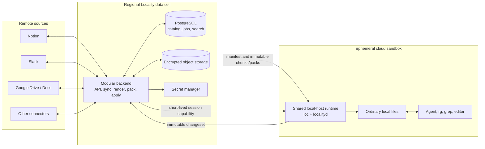
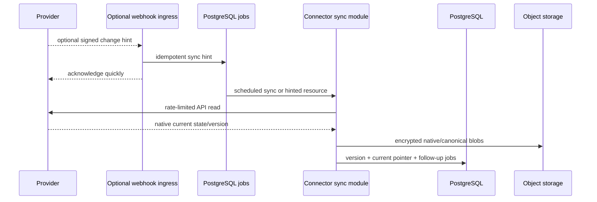
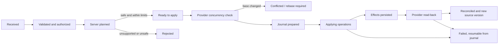

# Cloud Sandbox Data Plane Architecture

Status: proposed target architecture with a pragmatic v1 delivery path

Date: 2026-07-17

Scope: Locality backend, sandbox client, connector execution, replica transfer,
permissions, mutations, search, security, and migration

This document describes the target architecture for making Locality the data
layer for coding agents running in cloud sandboxes. It does not describe the
currently shipped local-first architecture; see [architecture.md](architecture.md)
for that system.

In this document, **sandbox v1** means the first generally usable backend data
plane release. It does not rename or replace the currently shipped local-first
Locality v1.

## Decision Summary

Locality should become a continuously maintained, multi-tenant replica of the
remote sources that a customer has explicitly connected and granted. A sandbox
must never crawl Notion, Slack, Google Drive, or another provider during startup,
and normal file reads must never call a provider or Locality API.

The main decisions are:

1. Use managed PostgreSQL as the transactional system of record for tenants,
   source identities, immutable resource versions, policies, replica metadata,
   changesets, apply journals, and audit metadata.
2. Store native payloads, canonical bodies, attachments, indexes, and immutable
   content chunks/packs in regional object storage with mandatory SSE-KMS (or
   the cloud's equivalent) and TLS. Serve authorized objects directly through
   short-lived exact-object grants; application servers must not proxy the
   bytes. V1 deliberately has no custom client-side encryption or key protocol.
3. In backend mode, run provider connector code only in backend workers.
   Provider credentials stay in a backend secret manager and never enter an
   agent sandbox. The existing direct connector mode remains available to the
   local-first desktop and headless `loc` client; a mount uses exactly one mode
   at a time.
4. Build tenant-scoped content packs around source/access boundaries, not around
   every workspace profile or runtime filter. A session first receives an
   authorized metadata catalog, filters it locally, and requests only packs
   containing selected files; it must not require a per-user corpus repack.
5. Materialize selected content as ordinary files on task-local disk before the
   agent starts. `rg`, `grep`, compilers, editors, and ordinary POSIX calls then
   operate at local filesystem speed with no read-time network calls.
6. Use `locality-core`'s three-tree model only for writable resources. Read-only
   content has one materialized tree plus identity, integrity, and permission
   metadata; it does not pay conflict-tracking or baseline-storage costs.
7. Treat a local edit as an explicit changeset. The agent can inspect it with
   `loc status` and `loc diff`, then submit it with `loc push`. The backend
   re-authorizes, re-plans, checks provider concurrency, applies, reads back,
   journals, and publishes the new version. Human review workflows can be added
   later without changing the changeset boundary.
8. Separate an administrator's read-disclosure ceiling (`DataGrant`) from a
   job's filesystem selection and write request (`WorkspaceProfile`). V1 may use
   broad, explicit grants for selected source scopes; profiles still strictly
   constrain writes. Profile filters shape the mounted filesystem but are not a
   second confidentiality boundary in v1.
9. Start backend search with PostgreSQL full-text search behind a replaceable
   interface. Move large Slack-like corpora to a dedicated search service only
   when measured query volume or corpus size warrants it. Search is always a
   derived, rebuildable projection, never the source of truth.
10. Deploy content in regional data cells close to supported sandbox fleets and
    pin each tenant to a home cell. V1 implements one Locality-managed cloud, but
    logical object references and the narrow storage/secret boundaries leave a
    later dedicated or customer-cloud cell possible without redesigning domain
    records.
11. Treat the backend and local host as adapters around the same versioned Rust
    domain and application workflows. The desktop app, headless `loc` CLI, and
    sandbox client share the filesystem-oriented local runtime; backend mode
    changes how remote truth is obtained, not how files, diffs, plans, and
    journals behave.

### Pragmatic Delivery Contract

The target model is intentionally broader than the first implementation. Build
the smallest vertical slice that proves the product, while fixing boundaries
that would be expensive to change later.

The first generally usable cloud-sandbox release is a multi-tenant product, not
a single-tenant or Notion-only pilot. It includes:

- one Locality-managed regional cell serving multiple customers;
- a small production connector set implemented through one connector-neutral
  synchronization contract, with at least two structurally different sources
  usable in the same profile before the release is called generally usable;
- coarse administrator-selected scopes such as roots, shared drives, channels,
  mailboxes, teams, or projects, plus explicit broad pilot groups/grants;
- reusable ACL-homogeneous content packs, an authorized SQLite catalog, and
  client-side materialization filters;
- ordinary task-local files, including read-only and explicitly writable paths;
- replica-at-start freshness with no live sandbox delta stream;
- a prebuilt read-only SQLite metadata base plus a small writable session store;
- PostgreSQL title/path/content search for profile discovery, with local `rg` as
  the primary search path after materialization; and
- local `status` and `diff`, explicit `push`, backend precondition checking,
  journaled apply, and read-back reconciliation for connectors whose declared
  capabilities include safe writes. Other initial connectors may be read-only.

"Broad" in v1 is an explicit product configuration, not an authorization
bypass. Tenant isolation, the source connection's visibility ceiling, encrypted
storage, signed artifacts, short-lived sessions, audit, and backend write checks
remain mandatory. The pilot grant is easy to replace with narrower grants later
because sessions, packs, catalogs, and changesets already carry stable tenant,
principal, source, access-set, and policy identities.

The first release does not need every high-cardinality personal-file or DM ACL
shape, exact-delivery filters, a dedicated search engine, a custom mmap file
format, multi-region active/active operation, WORM export, or an operated BYOC
product. It must, however, version replica/changeset formats, use logical object
references, and keep storage and secret access behind narrow boundaries so those
capabilities can be added without replacing the data model or pack authorization
boundary.

V1 has an explicit complexity budget: no custom cryptographic container/key
service, external job broker, separate global control-plane service, distributed
rate-limit service, live sandbox delta stream, export-seed pipeline, dedicated
search cluster, exact-delivery planner, persistent sandbox cache, or human
reviewer workflow. Add a deferred subsystem only when a measured launch blocker
or concrete customer requirement justifies its operational and security cost.
Interfaces and version fields may reserve room for later capabilities, but v1
code does not implement them.

## Why This Direction

The current architecture has two properties that conflict with cloud-agent
workloads:

- Initial discovery is performed by a short-lived client against source APIs.
  Notion alone limits a connection to an average of three requests per second
  and also applies a workspace-wide limit. A ten-minute source crawl cannot be
  put on the critical path of a sandbox with a bounded execution window.
- Virtual files hydrate on access. This turns ordinary reads into unpredictable
  remote operations, makes recursive filesystem tools expensive, and prevents
  the agent from assuming that the visible tree is locally searchable.

Central ingestion amortizes source API work across every sandbox. Immutable
replica artifacts then convert a rate-limited API problem into a bulk object
download problem. That is the right shape because cloud sandboxes already
optimize around prebuilt images, cached environments, local filesystems, and
reviewable diffs.

## Research Findings

The design is based on primary product and provider documentation retrieved on
2026-07-16.

| Observed pattern                                                                                                                                                      | Evidence                                                                                                                                                                                                                                                                                                                                                                                                                                                                                                                                                                                                                                                                             | Design implication                                                                                                                                                                                                                                  |
| --------------------------------------------------------------------------------------------------------------------------------------------------------------------- | ------------------------------------------------------------------------------------------------------------------------------------------------------------------------------------------------------------------------------------------------------------------------------------------------------------------------------------------------------------------------------------------------------------------------------------------------------------------------------------------------------------------------------------------------------------------------------------------------------------------------------------------------------------------------------------ | --------------------------------------------------------------------------------------------------------------------------------------------------------------------------------------------------------------------------------------------------- |
| Cloud coding agents start from an ephemeral checkout, run setup, edit local files, and hand back a diff or pull request.                                              | [Codex cloud environments](https://learn.chatgpt.com/docs/environments/cloud-environment), [GitHub Copilot cloud agent](https://docs.github.com/en/copilot/concepts/agents/cloud-agent/about-cloud-agent), [Claude Code on the web](https://code.claude.com/docs/en/claude-code-on-the-web)                                                                                                                                                                                                                                                                                                                                                                                          | Locality data should be staged beside the checkout as local files and use a diff/review workflow for writes.                                                                                                                                        |
| Sandbox vendors avoid repeated setup through cached environments, templates, snapshots, or persistent volumes.                                                        | Codex caches environments for up to 12 hours; Claude snapshots setup output for roughly seven days; [E2B templates and volumes](https://e2b.mintlify.app/docs/use-cases/coding-agents); [Daytona snapshots](https://www.daytona.io/docs/en/snapshots)                                                                                                                                                                                                                                                                                                                                                                                                                                | Precompute artifacts, but never bake customer data into a shared tool-image cache. Inject data into task-local storage after the generic environment is created; use a tenant-dedicated encrypted volume/cache where the platform exposes one.      |
| Network is denied or allowlisted by default, and credential-injecting proxies keep durable credentials outside the sandbox.                                           | [Codex agent internet access](https://learn.chatgpt.com/docs/cloud/internet-access), [GitHub Copilot firewall](https://docs.github.com/en/copilot/how-tos/copilot-on-github/customize-copilot/customize-cloud-agent/customize-the-agent-firewall), Claude's [secure deployment guide](https://code.claude.com/docs/en/agent-sdk/secure-deployment)                                                                                                                                                                                                                                                                                                                                   | The sandbox should need only the Locality API/data endpoint. Provider tokens belong in a backend vault or host-side proxy.                                                                                                                          |
| External business data is commonly exposed through MCP tools. Some hosted agents let MCP tools run autonomously, and firewall coverage may not include MCP processes. | [GitHub repository MCP configuration](https://docs.github.com/en/copilot/how-tos/copilot-on-github/customize-copilot/configure-mcp-servers)                                                                                                                                                                                                                                                                                                                                                                                                                                                                                                                                          | MCP remains a control/search fallback, not the bulk data plane. Tool allowlists and write authorization must remain explicit.                                                                                                                       |
| Provider change notifications are hints, not complete state.                                                                                                          | [Notion webhook delivery](https://developers.notion.com/reference/webhooks-events-delivery) omits full content, can arrive out of order, is aggregated, and can be delayed; Google Drive pairs [push notifications](https://developers.google.com/workspace/drive/api/guides/push) with a durable [changes feed](https://developers.google.com/workspace/drive/api/guides/manage-changes).                                                                                                                                                                                                                                                                                           | Persist idempotent hint jobs, fetch current head, and make scheduled cursor/poll repair the correctness path. Never treat a webhook payload as canonical content.                                                                                   |
| Source APIs make per-sandbox backfills fundamentally slow.                                                                                                            | [Notion request limits](https://developers.notion.com/reference/request-limits), [Notion search limitations](https://developers.notion.com/reference/search-optimizations-and-limitations), [Slack rate limits](https://docs.slack.dev/apis/web-api/rate-limits), [`conversations.history`](https://docs.slack.dev/reference/methods/conversations.history)                                                                                                                                                                                                                                                                                                                          | Do one resumable organization-level backfill, then maintain it incrementally. Sandbox startup only selects an already built revision.                                                                                                               |
| Object storage reaches high throughput by parallelizing requests and byte ranges.                                                                                     | [Amazon S3 performance guidelines](https://docs.aws.amazon.com/AmazonS3/latest/userguide/optimizing-performance-guidelines.html)                                                                                                                                                                                                                                                                                                                                                                                                                                                                                                                                                     | Use multiple immutable pack objects, concurrent transfers, range resume, regional placement, and no application-server byte proxy.                                                                                                                  |
| Relational policy and lifecycle state coexist well with semi-structured connector metadata.                                                                           | PostgreSQL [row security](https://www.postgresql.org/docs/current/ddl-rowsecurity.html), [partitioning](https://www.postgresql.org/docs/current/ddl-partitioning.html), [JSONB](https://www.postgresql.org/docs/current/datatype-json.html), and [full-text search](https://www.postgresql.org/docs/current/textsearch.html)                                                                                                                                                                                                                                                                                                                                                         | Use typed relational columns for identities and policy, JSONB for connector-owned metadata, and object storage for large bodies.                                                                                                                    |
| Cloud ETL products start with coarse workspaces, then add scoped roles and teams.                                                                                     | Airbyte makes the workspace an isolation boundary and issues short-lived workspace-scoped tokens ([workspaces](https://docs.airbyte.com/ai-agents/concepts/architecture/workspaces), [credentials](https://docs.airbyte.com/ai-agents/concepts/architecture/connectors-and-credentials), [RBAC](https://docs.airbyte.com/platform/access-management/rbac)). Fivetran scopes roles hierarchically across account, destination, connection, team, and workspace resources ([RBAC](https://fivetran.com/docs/getting-started/fivetran-dashboard/account-settings/role-based-access-control), [workspaces](https://fivetran.com/docs/activations/misc/security-and-privacy/workspaces)). | Offer one explicit broad pilot group for fast onboarding, but represent tenant, source, grant, profile, and session as separate scopes from day one. Keep provider credentials server-side and give jobs short-lived, narrowly scoped capabilities. |
| Mature data systems separate who may configure a pipeline from what the running pipeline may read.                                                                    | Estuary separates user grants, role/data grants, storage mappings, and data-plane placement, and supports progressively narrower catalog-name prefixes ([prefix access control](https://docs.estuary.dev/guides/prefix-access-control/), [catalogs](https://docs.estuary.dev/concepts/catalogs/)). AWS separates the launching principal, execution role, resource policy, and session/permission boundary ([AWS Glue IAM](https://docs.aws.amazon.com/glue/latest/dg/security-iam.html)).                                                                                                                                                                                           | Model control-plane administration, source-data disclosure, job selection, and runtime identity independently. Effective access is their intersection; an agent cannot inherit the administrator's credential power.                                |

The dominant current pattern is therefore two different data planes. Repository
context is cloned locally and can be searched or edited with native tools;
business-system context is usually fetched through setup scripts, direct APIs,
or one MCP tool call at a time. The latter adds network/provider latency to each
discovery step, puts secrets or a privileged tool server in the execution path,
and returns bounded tool results instead of a corpus on which `rg`, `find`, and
editors can operate. Code mutations benefit from branches, diffs, and pull
requests, while business-system mutations are often immediate API actions. The
target Locality design gives business data the useful properties of the first
plane and gives its writes an explicit review object analogous to a pull request.

Two cautions follow directly from the research:

- Codex Business/Enterprise caches may be shared by users of an environment,
  and Claude environment setup output is reused. A Locality bootstrap must run
  in a task-specific volume after cache restoration. A generic environment
  setup script may install `loc`, but it must not download tenant content into
  the cached image layer.
- A plain local filesystem cannot provide both native `grep` performance and a
  perfect server-side log of every file read. Governance should record exactly
  what was delivered to a sandbox and every backend action. Per-file read audit
  requires an explicitly slower, instrumented projection mode.

The ETL comparison also exposes a trap to avoid. Broad defaults are useful for
pilots, but additive inherited grants can become difficult to narrow later.
Locality therefore makes the pilot grant an explicit, replaceable `DataGrant`
and computes every session by intersection. A narrower profile or session can
always reduce an administrator's ceiling; no lower layer can expand it.

Airbyte and Fivetran RBAC primarily protect control-plane objects such as
workspaces, connections, destinations, and who may run or edit them. That is
necessary but does not preserve a Notion-page, Slack-channel, or Drive-file ACL
after data is replicated. Locality adopts their workspace/team hierarchy,
server-held credentials, and scoped job tokens, then adds a distinct
content-disclosure layer (`DataGrant` + provider ACL facts + ACL-homogeneous
packs). Estuary's separation of user, task-data, storage, and data-plane grants
and AWS's separation of launcher and execution role reinforce that boundary.

## Goals And Non-Goals

### Goals

- No provider API calls on sandbox startup, directory listing, file open, file
  read, local search, status, or diff.
- All selected content is present before the agent begins its task.
- Ordinary files support `rg`, `grep`, `find`, editors, language tools, and
  atomic rename-based writes.
- A reusable profile starts in time proportional to authorized bytes transferred,
  not source object count or provider request rate.
- Session startup does not perform an O(resource count) metadata import into a
  writable database before the agent can run.
- Arbitrary job filters can be evaluated against local immutable metadata
  without creating profile-specific packs or querying PostgreSQL per file.
- Source state is continuously maintained with resumable backfills, change feeds,
  webhooks, polling, and repair scans.
- Permissions can express read, search, update, create, move, delete, comment,
  and attachment access independently.
- Local edits are durable and reviewable even if the sandbox or backend worker
  crashes.
- Tenant isolation, residency, deletion, audit, and enterprise deployment are
  part of the data model rather than retrofits.
- Existing local pending changes and journals survive migration to backend mode.
- Direct-source and backend-replica modes use the same canonical renderer,
  projection rules, changeset planner, guardrails, and apply/reconcile state
  machine rather than implementations that can drift.
- Storage and transfer costs are observable per tenant, profile, and session,
  with within-tenant content reuse and explicit retention defaults.

### Non-goals

- A globally atomic replica across independent providers. A session records a
  separate replica revision, watermark, and freshness statement for every source.
- Zero-knowledge storage. Locality must decrypt content to render, search, diff,
  and apply it. The privacy boundary is a trusted regional data plane with
  encryption, isolation, and auditable policy.
- Instant support for every high-cardinality native ACL shape in the first
  release. V1 deliberately supports source scopes whose authorization can be
  represented by prebuilt ACL-homogeneous units; the format supports later
  per-resource composition without granting unauthorized plaintext.
- Exact byte-level minimization for every v1 filter. The default may deliver
  extra bytes from a pack only when every byte is inside the session's authorized
  read envelope. Exact `strict-delivery` is a deferred mode, not a v1 promise.
- Perfect recall of bytes already delivered to an ephemeral sandbox after an
  administrator revokes access. Revocation blocks new sessions, artifact grants,
  search, and mutations; short session TTLs and sandbox destruction bound prior
  exposure.
- Replacing Git or a code-host pull request. Locality changesets are a parallel
  review object for business-system data and may link to a code PR.
- Building a human-review workflow in v1. The agent or operator reviews locally
  with `loc status`/`loc diff` and explicitly runs `loc push`; a later approval
  service can bind a reviewer decision to the immutable changeset digest.

## System Architecture



### Deployment Shape

The first production deployment is a modular monolith. It has:

- one backend binary containing API, optional webhook ingress, connector sync,
  shared engine/provider execution, pack, search-index, and apply modules. It
  may run API and worker process modes independently for scaling, but they are
  not separate services;
- one managed PostgreSQL cluster per regional cell;
- one regional object-store namespace plus direct data endpoint;
- one managed secret store; and
- one PostgreSQL `jobs` table processed with leases and `FOR UPDATE SKIP LOCKED`.

PostgreSQL and object storage remain authoritative. Jobs are inserted in the
same transaction as the state that makes them necessary and may execute more
than once; every worker operation is idempotent against a durable event, version,
replica, or journal key. Add an external broker and outbox publisher only when
measured job volume, isolation, or database contention requires them.

V1 stores organizations, billing references, identity configuration, and the
tenant-to-cell record in a control-plane module and schema in the same deployment.
It does not run a separate global control-plane service. Customer content,
provider credentials, search documents, replica artifacts, and mutation journals
stay in the tenant's home cell. Split the control plane only when multiple cells,
residency routing, or independent scaling makes that operationally useful.

### Deployment Modes And Region Affinity

The cell is a portable deployment boundary, not shorthand for a Locality-owned
cloud account. Support these modes from the same binaries and schemas:

1. a multi-tenant Locality-managed regional cell;
2. a Locality-operated dedicated customer cell; and
3. a customer-operated cell in the customer's cloud/VPC.

Only the first mode is required for v1. Durable object references use logical
cell/object IDs rather than provider-specific bucket URLs. A narrow object-store
adapter requires TLS and managed encryption with a tenant key reference; it owns
the cloud-specific SSE-KMS/CMEK settings. A secret-store boundary keeps provider
tokens out of domain records. V1 uses PostgreSQL jobs and one-time bootstrap
tokens directly rather than inventing generic queue, KMS, workload-identity,
DNS, or multi-cloud orchestration frameworks. Those integrations can be added at
the cell boundary when a second deployment mode is implemented.

The control plane chooses a home cell using residency and supported sandbox
regions. Platform adapters should prefer a cell and object-store region close
to the sandbox fleet, because transfer time and cross-region/cross-cloud egress
can dominate session cost. Same-region transfer is not assumed to be free: each
platform path is benchmarked and priced, including cloud/account boundaries and
private connectivity. A later platform integration may provide an encrypted,
tenant-scoped persistent content cache, but customer bytes must never enter a
shared generic sandbox image.

## Core Data Concepts And Identities

Do not force every provider object into one lossy universal document table. The
model has five layers.

The authorization vocabulary is:

- **tenant**: one customer security, residency, billing, and encryption
  boundary;
- **principal**: a human or service identity that can authenticate and be
  audited; every workload binds a service principal even when it also acts for
  a human;
- **group**: a tenant-owned set of principals, usually synchronized from an IdP
  or explicitly managed in Locality; and
- **grant**: an administrator-owned, versioned rule assigning subjects a maximum
  resource scope and action set. A `DataGrant` never contains provider
  credentials and never implies that every resource visible to a connector is
  visible to its subjects.

Provider identities and groups link to Locality IDs through stable provider
subject IDs. Display names are never identity, and email addresses are used for
linking only after issuer/domain verification.

### 1. Source Resource

A source resource is a provider-owned identity:

- source connection and stable provider ID;
- provider kind and connector-owned object kind;
- current parent/membership edges;
- opaque provider version or concurrency token;
- deletion/tombstone state;
- connector metadata and native ACL observations; and
- discovery and observation timestamps.

Paths and titles are not identity. A resource may have multiple edges, aliases,
or shortcuts. A provider version is opaque and is compared for equality or
passed back as a provider precondition.

The shared Rust representation of this layer, `SourceObject`, is portable
provider state. It must not contain a local `MountId`, an absolute filesystem
path, SQLite row identity, hydration state, or a backend-only PostgreSQL row
handle. Hosts bind those concerns outside the connector/domain value.

### 2. Immutable Source Version

Every accepted fetch creates an immutable source version containing references
to:

- the encrypted native payload;
- a versioned canonical intermediate representation;
- one or more rendered artifacts;
- the provider version and fetch provenance;
- connector, renderer, and canonical-format versions; and
- content hashes and timestamps.

The current resource row points at the latest accepted version. Old versions are
retained according to policy so diffs, review, undo, and audit do not depend on
mutable current state.

### 3. Projection Entry

A projection entry is a filesystem artifact. It deliberately differs from a
source resource:

- a Notion page can map to a directory plus `page.md` and assets;
- a Slack thread can aggregate many message resources into one Markdown file;
- a Gmail thread can aggregate messages and attachments;
- a database can emit a directory, row entries, `_schema.yaml`, and views.

Each projection entry has a stable projection ID, relative path, content blob,
input resource versions, file kind, format version, and connector-supported
action set. Effective actions are session policy, not intrinsic content
metadata. The many-to-many `projection_inputs` relationship lets connectors
aggregate or split resources without corrupting remote identity.

Its `LogicalPath` is a normalized portable relative path, not a Rust `PathBuf`
or an OS-specific absolute path. The same `ProjectionEntry` can therefore be
packed by the backend or projected directly by a local connector. When a local
host binds it to a mount, it becomes a `LocalTreeEntry` with `MountId`, host
path, hydration/materialization state, dirty state, and local-store identity.
The current `TreeEntry` can remain as a compatibility adapter while connectors
migrate; it should not become the backend's canonical source object.

### 4. Replica Revision And Session Grants

A replica revision is the durable, immutable point-in-time publication for one
source connection. It records its source watermark, projection revision, and
references to reusable catalog artifacts and content packs. A new revision
reuses unchanged objects and never mutates a revision already used by a session.

Catalog authorization and pack authorization are derived session responses, not
additional durable domain aggregates:

```text
Replica revision
  -> reusable ACL-homogeneous catalog artifacts and content packs

Sandbox session + current grants + profile
  -> temporary signed catalog authorization
  -> temporary signed selected-pack authorization
```

The signed responses record the tenant, source/access-set and policy revisions,
watermarks, object IDs, sizes, hashes, compatibility versions, and expiry. The
session row persists the pinned revisions and response digests; each issued
catalog/pack grant also writes its complete delivered-object/entry inventory as
an immutable session-delivery manifest object for audit. V1 does not normalize every
authorized catalog or signed artifact grant into dedicated PostgreSQL tables
because the backend can reproduce them from durable inputs.

A session evaluates its profile and runtime filters against already-authorized
catalog artifacts, then requests grants only for packs containing selected
entries. The catalogs are not per-user content tarballs or keyed by workspace
profile. Correctness does not depend on an organization having a small number of
access cohorts.

Three sets must remain distinct:

- **authorized set**: entries the session may receive under its `DataGrant` and
  current source-ACL facts;
- **delivered set**: every plaintext entry contained in artifacts granted to the
  session, including authorized entries in a partially selected pack; and
- **materialized set**: entries actually extracted into the agent filesystem.

The delivered set is the authoritative disclosure boundary. Materialization is
authoritative only when a trusted host-side bootstrapper performs it; otherwise
it is client-reported telemetry, never an authorization control.

### 5. Sandbox Working Change

A working change exists only for an entry with a write action. It has a
delivered base entry, local bytes, and an optional latest backend head. It
becomes an immutable changeset with per-resource preconditions, planned source
operations, policy result, apply effects, and read-back result. A future review
workflow can attach an approval to the immutable changeset digest without
changing this base object.

For writable entries, this maps onto the existing three-tree vocabulary:

```text
Remote Tree = latest backend/provider head
Synced Tree = immutable replica base delivered to the sandbox
Local Tree  = current ordinary files in the sandbox
```

These are logical states, not three full physical trees. The client keeps the
working file and a compact baseline representation for write-enabled content;
the Remote Tree is normally only a resource/version token. Current remote bytes
are fetched only during rebase or conflict handling.

### Permission-Aware Client State

Read-only and writable content deliberately have different local costs:

| Content class      | Local state                                                                                                                                          | Update behavior                                                                                                       |
| ------------------ | ---------------------------------------------------------------------------------------------------------------------------------------------------- | --------------------------------------------------------------------------------------------------------------------- |
| Read-only          | One materialized file plus resource ID, content hash, source revision, and permission bits. Download packs may be deleted after verified extraction. | Fixed for an ephemeral session. A later session receives a newer replica revision; no merge or conflict state exists. |
| Writable but clean | Materialized working file plus a compressed/reflinked baseline and provider precondition. No local copy of remote head.                              | Eligible for local diff and explicit push.                                                                            |
| Writable and dirty | Working bytes, retained baseline, dirty journal, and changeset state for affected entries.                                                           | Three-way comparison occurs only when provider head differs at submit/apply.                                          |
| Conflicted         | Base, working, and fetched remote content for affected entries only.                                                                                 | Kept until rebase, resolution, rejection, or retention expiry.                                                        |

Portable v1 does not partition packs by write permission. During extraction it
retains per-file baseline bytes only for selected entries whose effective
session action includes a write, so `loc diff` remains local; it does not retain
shadow bodies for the read-only corpus or unselected members of the same pack.
Filesystems with reflinks or a read-only lower layer may avoid duplicate
unchanged blocks, but that is an optimization rather than a v1 requirement.

The backend may retain immutable historical source versions for policy,
changesets, audit, or recovery, but it does not create three backend copies per
sandbox. Tenant-scoped content addressing lets replica revisions and sessions
reference the same encrypted objects.

## PostgreSQL Data Model

Every content-bearing table includes `tenant_id` in its primary or leading
unique key. The complete logical model is intentionally richer than the first
physical schema:

| Group        | Tables and purpose                                                                                                                              |
| ------------ | ----------------------------------------------------------------------------------------------------------------------------------------------- |
| Identity     | `tenants`, `principals`, `groups`, `group_memberships`, `service_accounts`, `workloads`, `provider_identity_links`, `tenant_cells`              |
| Connections  | `source_connections`, `credential_refs`, `connector_versions`, `source_checkpoints`, `webhook_subscriptions`                                    |
| Source state | `source_resources`, `source_edges`, `source_versions`, `resource_acl_facts`, `access_sets`, `access_descriptors`, `ingest_events`, `tombstones` |
| Content      | `blobs`, `canonical_artifacts`, `projection_entries`, `projection_inputs`                                                                       |
| Policy       | `data_grants`, `data_grant_revisions`, `workspace_profiles`, `workspace_profile_revisions`, `compiled_policy_bindings`                          |
| Replica      | `replica_revisions`, `replica_source_watermarks`, `content_units`, `content_unit_entries`, `catalog_units`, `catalog_unit_entries`              |
| Runtime      | `sandbox_sessions`, `session_capabilities`, `materialization_receipts`, `client_checkpoints`, `write_claims`, `jobs`                            |
| Mutation     | `changesets`, `change_operations`, `approvals`, `apply_attempts`, `apply_effects`, `reconciliation_results`                                     |
| Governance   | `audit_events`, `retention_holds`, `deletion_requests`, `export_checkpoints`                                                                    |

High-value constraints include:

```text
UNIQUE (tenant_id, source_connection_id, provider_resource_id)
UNIQUE (tenant_id, source_resource_id, internal_version)
UNIQUE (tenant_id, source_connection_id, replica_revision)
UNIQUE (tenant_id, source_connection_id, checkpoint_kind, scope_id)
UNIQUE (tenant_id, source_connection_id, provider_event_id)
UNIQUE (tenant_id, changeset_id, operation_index)
UNIQUE (tenant_id, idempotency_key)
```

Use typed columns for IDs, state, timestamps, versions, parents, and common
filter fields. Use JSONB only for connector-owned metadata and policy extensions.
Do not store canonical Markdown, provider payloads, attachments, or pack bytes in
PostgreSQL.

The v1 physical schema should stay near twenty generic tables rather than
materializing every logical subtype:

| V1 record                                             | Consolidation rule                                                                                                                                    |
| ----------------------------------------------------- | ----------------------------------------------------------------------------------------------------------------------------------------------------- |
| `tenants`                                             | Includes home-cell and basic billing/identity configuration.                                                                                          |
| `principals`, `groups`, `group_memberships`           | A typed principal represents a human, service account, or workload; split subtypes only when their lifecycle differs.                                 |
| `source_connections`                                  | Includes credential reference, connector version, optional webhook state, health, and connector-owned configuration.                                  |
| `source_checkpoints`                                  | Durable cursor/fingerprint and completeness per root, channel, drive, mailbox, or other resumable connector scope.                                    |
| `source_resources`, `source_edges`, `source_versions` | Preserve stable provider identity, hierarchy/membership, immutable versions, current pointer, provider precondition, tombstone, and ACL observations. |
| `access_sets`                                         | Preserves the read-homogeneous authorization identity used by catalog and pack composition.                                                           |
| `blobs`, `projection_entries`, `projection_inputs`    | Preserves object reuse and the many-to-many source-to-filesystem mapping.                                                                             |
| `policies`, `policy_revisions`                        | Stores both `DataGrant` and `WorkspaceProfile` documents by kind; compiled results are rebuildable cache fields or objects.                           |
| `replica_revisions`, `content_units`                  | A content unit is a catalog or content artifact; immutable manifests carry large entry mappings.                                                      |
| `sandbox_sessions`                                    | Includes capability hash/claims, pinned revisions, selected/delivered digests, manifest reference, and compact receipts.                              |
| `jobs`                                                | Durable leased work, provider-event dedupe, retry, cooldown, and idempotency state.                                                                   |
| `search_documents`                                    | Rebuildable PostgreSQL full-text projection.                                                                                                          |
| `changesets`, `change_operations`                     | Operations hold attempt, effect, reconciliation, and error JSON until scale or retention justifies separate tables.                                   |
| `audit_events`                                        | Append-only security and lifecycle events; large inventories/diffs are immutable object references.                                                   |

This mapping is an implementation choice, not a weaker domain model. Bake in
the boundaries that are expensive to retrofit: tenant-leading keys and RLS,
stable provider IDs, immutable versions/provider preconditions, resource versus
projection identity, projection inputs, access-set IDs, policy/replica/format
revisions, resumable checkpoint identity, idempotency keys, and audit correlation
IDs. It is safe to normalize typed principal subtypes, webhook subscriptions, compiled
policy bindings, receipts, approvals, apply attempts/effects, holds, exports, or
partitions later through ordinary migrations.

### Isolation And Partitioning

- Enable row-level security with default-deny policies on every tenant table.
- Run the application as a non-owner role without `BYPASSRLS`; use a separate
  migration role. RLS is defense in depth in addition to mandatory `tenant_id`
  predicates in repositories.
- Do not partition v1 tables preemptively. Add tenant-hash and/or time
  partitioning to measured high-volume tables when index size, vacuum, retention,
  or tenant isolation requires it.
- Route a tenant to one database shard/cell. Reshard by moving whole tenants,
  not individual resources.
- Keep foreign keys within a shard and transaction. Do not create cross-cell
  content joins.

### Transaction And Event Rule

When a worker accepts a new source version, the same database transaction must:

1. insert the immutable version;
2. update the current resource pointer and edges;
3. record the durable ingest result; and
4. insert idempotent PostgreSQL jobs for render, search, replica publication, and
   audit work.

Workers lease those committed rows directly. Because the job is written in the
same transaction as its prerequisite state, a crash cannot commit a source
version without making its downstream work durable. If an external broker is
introduced later, this same `jobs` table becomes its transactional outbox; the
domain workflow and idempotency keys do not change.

## Database Decision

### Chosen Stack

| Concern                           | Choice                                                                          | Reason                                                                                                                                                     |
| --------------------------------- | ------------------------------------------------------------------------------- | ---------------------------------------------------------------------------------------------------------------------------------------------------------- |
| Transactional catalog and policy  | Managed PostgreSQL                                                              | Strong transactions for identity, policy, jobs, journals, and current-version changes; mature RLS, JSONB, indexing, backups, and operational tooling.      |
| Large immutable content           | Regional S3-compatible object storage                                           | Managed SSE-KMS, durable bodies and packs, direct high-bandwidth transfer, range requests, lifecycle policies, and optional private delivery acceleration. |
| Initial search                    | PostgreSQL `tsvector`/GIN                                                       | Lowest operational complexity and the same transactional job path. Keep the search repository replaceable.                                                 |
| Large-corpus search               | Dedicated OpenSearch-compatible or equivalent service when benchmarks demand it | Independent horizontal scaling, ACL-prefiltered lexical/hybrid search, and rebuildability from canonical versions.                                         |
| Client metadata and working state | Prebuilt read-only SQLite base + writable SQLite overlay                        | Immediate open without row import, atomic session mutations, existing Locality repository semantics, and no multi-tenant client concurrency requirement.   |

### Rejected As The Primary Backend Database

| Alternative                                     | Why it is not the primary store                                                                                                                                                                                                                                          |
| ----------------------------------------------- | ------------------------------------------------------------------------------------------------------------------------------------------------------------------------------------------------------------------------------------------------------------------------ |
| SQLite or a hosted SQLite derivative such as D1 | Excellent client/edge state, but not the primary multi-tenant catalog for concurrent workers, relational authorization, journals, tenant sharding, and the operational model above. The current OAuth Worker may remain at the edge without making D1 the content store. |
| MongoDB/document database                       | Native payload flexibility is attractive, but policy, hierarchy, approvals, idempotent journals, and cross-record invariants are relational. Raw documents belong in object storage and connector metadata can use JSONB.                                                |
| DynamoDB/key-value store                        | High scale, but makes hierarchical selectors, policy compilation, consistent multi-record changesets, and ad hoc operational queries substantially harder. It could later serve a narrow high-volume index.                                                              |
| CockroachDB/Spanner/global SQL                  | Global synchronous writes add cost, latency, and operational constraints without a product requirement for a tenant to write in several regions at once. Regional tenant cells and whole-tenant sharding are simpler.                                                    |
| Search engine as system of record               | Search indexes are eventually consistent and rebuildable. They cannot own mutation preconditions, audit journals, or access policy.                                                                                                                                      |
| PostgreSQL large objects for all content        | Database I/O, backup size, replication, and connection pressure would compete with control transactions. Object storage is the correct byte-serving layer.                                                                                                               |

The database decision is therefore not "PostgreSQL versus object storage." The
scalable design requires both, with an explicit responsibility boundary.

## Blob And Encryption Model

Object storage has separate logical classes for native payloads, canonical
artifacts, attachments, search-derived artifacts, content chunks, and transport
packs.

- Blob identities are tenant-scoped. Do not deduplicate content across tenants;
  cross-tenant hashes create existence side channels and complicate deletion.
- Reuse immutable content within a tenant. A tenant-keyed content identifier may
  let several profiles, replica revisions, and sessions reference one encrypted object
  without exposing a raw cross-tenant content hash.
- Native, canonical, projection, and transport records are logical roles, not a
  mandate to duplicate identical bytes. When two roles contain the same
  tenant-scoped bytes they reference one blob; transformations that differ are
  metered separately.
- A transport unit granted as one object must contain only entries with the same
  effective read access set. Write permissions are session policy, not pack
  membership. A future container may mix access sets only if chunks are
  independently authenticated/encrypted and the session receives neither keys
  nor usable ranges for unauthorized chunks.
- Require managed server-side encryption with a KMS-backed key and TLS. The
  portable storage interface expresses those requirements, while the cloud
  adapter uses S3 SSE-KMS, GCS CMEK, or the equivalent native mechanism.
- Separate object-read and KMS-decrypt permissions. An operator with S3 access
  but no KMS permission cannot retrieve plaintext through an S3 browser; the GET
  fails. Human production access is time-bound break-glass, and no standing
  console role combines unrestricted object access with KMS decrypt.
- Object keys are opaque random or tenant-keyed identifiers, never source titles,
  email addresses, channel names, or raw content hashes.
- Manifest integrity digests are tenant-domain-separated and signed; internal
  reuse keys are tenant-keyed. Raw body digests are not exposed across tenant
  boundaries.
- Provider credentials live in a secret manager and are referenced by an opaque
  `credential_ref`. Database rows and job payloads never contain bearer or
  refresh tokens.
- Logs contain IDs, sizes, states, provider request IDs, and timings, not bodies,
  authorization headers, signed URLs, or connector payloads.
- A retention job deletes unreferenced native/canonical versions after checking
  current source versions, replica revisions, open changesets, and policy. Add a
  generalized legal-hold/mark-and-sweep subsystem only with the corresponding
  enterprise retention feature; do not trust a fragile synchronous reference
  count in either implementation.

### V1 Managed Encryption Contract

V1 relies on the object store's mature encryption path rather than building a
Locality cryptographic container or distributing decryption keys to sandboxes:

PostgreSQL, backups, search volumes, and service disks also require their
cloud provider's managed encryption at rest. That is baseline infrastructure
configuration, not a second application encryption layer; database RLS and
service IAM remain the logical isolation controls.

```text
provider/backend bytes
  -> HTTPS PUT requiring tenant KMS key
  -> object store encrypts at rest
  -> exact-object HTTPS grant after Locality authorization
  -> object store decrypts transparently
  -> sandbox verifies, decompresses, and materializes
```

The managed-cell contract is:

- use one tenant-scoped KMS key for each early customer. Dedicated/BYOC cells
  can use the customer's key. Revisit physical key pooling only if measured KMS
  cost justifies it without weakening tenant isolation;
- deny public access and non-TLS requests. Bucket policy rejects writes that do
  not request SSE-KMS with the expected tenant key;
- give backend ingest/render/apply roles access only to the tenant prefix and
  required KMS operations. Sandboxes receive no cloud or KMS credentials;
- after catalog or pack authorization, issue GET-only grants naming the exact
  immutable objects, normally expiring in five minutes. A range-resume after
  expiry obtains a new grant only after current policy is rechecked;
- redact signed URLs from logs, traces, errors, and process listings. Treat a
  URL as a bearer secret until it expires;
- sign the Locality manifest and include the object SHA-256, compressed size,
  expanded-size limit, payload/encoding version, and expiry. The client hashes
  while streaming and atomically publishes only after verification;
- issue similarly narrow PUT grants for changeset bodies, with required
  SSE-KMS headers covered by the signature. Workers read submitted objects only
  after changeset authorization; and
- enable native KMS audit events and object data events. S3 Bucket Keys or an
  equivalent managed optimization may be enabled when measurements show KMS
  request cost matters; it is configuration, not a Locality key service.

SSE-KMS means object storage returns plaintext to an authorized GET over TLS. An
employee or console role with `s3:GetObject` but without `kms:Decrypt` receives
an access-denied error, not a downloadable ciphertext file. A role with both
permissions—including an authorized backend worker or time-bound break-glass
role—receives decrypted compressed/plain bytes and can open them. A sufficiently
privileged cloud administrator could grant that combination. V1 therefore relies
on least-privilege roles, separation of duties, short-lived audited elevation,
and access alerts; it does not claim that Locality is cryptographically unable to
read customer data.

Therefore a tenant-dedicated persistent cache stores sensitive compressed bytes,
not opaque application ciphertext: it must use an encrypted tenant-dedicated
volume, strict host-side access, TTL, and secure deletion. V1 must not use a
shared cross-tenant or generic sandbox-image cache. Final mounted files are also
plaintext by necessity so native `grep` works; they live on an encrypted,
ephemeral task volume and are destroyed with the sandbox.

This is not zero-knowledge encryption. Authorized Locality workers can read
customer data because rendering, search, conflict resolution, and provider apply
require it. The control is separation of duties and audited authorization, not a
claim that Locality's data plane cannot decrypt.

The AWS implementation follows
[S3 SSE-KMS](https://docs.aws.amazon.com/AmazonS3/latest/userguide/UsingKMSEncryption.html).
Other cell adapters must provide equivalent at-rest encryption, customer-key,
IAM, TLS, audit, and deletion behavior.

### Deferred Application-Level Encryption

Do not build client-side envelope encryption, per-artifact keys, HPKE bundles,
or a custom encrypted record format in v1. Add a versioned application-encrypted
artifact mode later only if a concrete customer/platform requirement cannot be
met by managed encryption, such as:

- making a stolen object URL useless without a proof-of-possession key;
- placing bytes in a cache/CDN that is not inside the trusted tenant data plane;
- a contractual requirement that storage operators can retrieve only
  application ciphertext; or
- portable ciphertext whose key remains in a customer-controlled system across
  clouds.

That mode must remain optional, benchmark on the smallest sandbox, reuse a
reviewed standard/library rather than inventing cryptography, and preserve the
same manifest and filesystem contracts. It is not a dependency for the first
working product or the managed-cell v1 launch.

## Ingestion And ETL

### Source Connection And Credential Lifecycle

The backend owns the full provider authorization lifecycle:

1. A human administrator starts OAuth from the Locality control plane with
   signed state, PKCE where supported, an exact redirect URI, and requested
   least-privilege scopes.
2. The callback exchanges the code in the regional cell and stores the refresh
   token or provider credential directly in the secret manager. It is never
   returned to the desktop/sandbox client.
3. PostgreSQL stores only the opaque credential reference, provider account and
   workspace identity, granted scopes, connection owner/mode, expiry, health,
   and audit timestamps.
4. Workers mint/refresh short-lived access tokens just in time. Refresh-token
   rotation updates the vault atomically and revocation changes connection state
   to `reauthorization_required` without discarding mirrored data or pending
   changesets.
5. Scope upgrades require a new explicit consent and grant review. A connector
   cannot infer write authority from read credentials.

Support two visible connection modes:

- **organization connection:** a service/bot identity mirrors admin-selected
  content; Locality DataGrants are mandatory for downstream users;
- **delegated user connection:** reads/writes as a mapped user when source-native
  attribution or ACL fidelity requires it.

The mode is part of source and audit identity. Locality must not silently switch
between them because that changes both visibility and who the provider records as
the writer. Connector onboarding must show the attribution consequence before
authorization: for example, whether Slack records a Locality bot or a delegated
user as the message author, and whether Notion/Drive audit logs show an
integration or user identity.

### Connection Bootstrap

Connecting a source is an organization setup operation, not a sandbox setup
operation.

1. An administrator authorizes the source and chooses the data ceiling.
2. Locality stores the provider credential in the cell's secret manager.
3. A durable backfill workflow enumerates the authorized source, checkpoints
   every cursor/container, and respects provider limits through the connection's
   owning worker. The scheduler prioritizes roots referenced by published
   profiles before the remainder of the organization mirror.
4. Connector jobs store native versions and invoke the shared canonical renderer;
   follow-up PostgreSQL jobs create projection, search, catalog, and pack
   artifacts. These are modules in one worker binary, not separate services.
5. A replica publisher advances the immutable source revision after required
   jobs for the selected scope complete.
6. A workspace profile becomes `ready` only when its selected roots have a
   complete initial replica revision or an explicitly documented partial policy.

If a source is still backfilling, a sandbox request fails quickly with
`source_bootstrapping` and progress. It never starts another crawl or silently
serves a structurally incomplete mount as complete.

Profile readiness is a scheduler objective, not only a status calculation. The
profile-priority scheduler fetches, in order:

1. selected roots and the ancestor metadata needed to place them safely;
2. selected descendants, permissions, attachments, and projection inputs;
3. resources needed by other published profiles; and
4. the remaining organization inventory.

Progress reports profile coverage separately from whole-source coverage. A
small production profile should become ready while an unrelated multi-day
organization backfill continues.

Administrator-export seeding is not part of v1 or the committed near-term plan.
Start with resumable, profile-prioritized provider API backfill and measure
time-to-first-ready on real customer workspaces. Revisit export seeding only if
that remains unacceptably slow after scheduler and API-efficiency improvements.

If implemented later, an export may seed bodies/attachments at object-storage
speed but must be treated as an untrusted accelerator and reconciled through the
provider API. It cannot claim authoritative ACLs, stable writable IDs, deletion
state, or freshness before reconciliation. Notion exports may lose block
identity/access facts, while Slack export availability and coverage vary by
plan, administrator authority, channel type, retention, and legal policy. An
export can never become the only connector path.

### Connector Synchronization Contract

All production connectors use one small, checkpointed lifecycle:

```text
bootstrap(scope, checkpoint) -> changes + next checkpoint + completeness
sync(scope, checkpoint, hints) -> changes + next checkpoint
fetch(resource, reason) -> native state + opaque provider version
render(native, format_version) -> canonical/projection artifacts
apply(changeset, operation_ids) -> effects       # optional capability
read_back(effects) -> authoritative versions     # required when apply exists
```

`bootstrap`, `sync`, `fetch`, and `render` are required. Write methods are
capability-gated per connector and operation type. Provider webhooks are optional
hints passed to `sync`; they are not a second ingestion architecture. A connector
without webhooks remains production-capable through scheduled polling, durable
cursors or fingerprints, and repair scans.

### Incremental Maintenance



Scheduled checkpointed synchronization and repair are the correctness path.
Where webhooks exist, handlers verify provider signatures, enforce body limits,
store an idempotent hint job, and acknowledge before doing expensive work.
Workers fetch current state because hints may be delayed, aggregated, duplicated,
missing, or out of order.

Every connector also runs repair work:

- cursor/change-feed reconciliation where the provider supports it;
- bounded metadata observation for hot resources;
- periodic subtree or full inventory repair at a provider-safe cadence; and
- explicit reauthorization/access repair after scopes or grants change.

### Connection Ownership And Rate Limits

One worker task owns a source connection at a time. It runs the existing
process-local `ConnectorNetworkGate`, serializes or bounds that connection's API
calls, and declares the provider dimensions it must respect, for example:

```text
Notion: provider workspace + connection
Slack: app + workspace + method
Google: project + user/source + method
```

Backfill, event repair, observation, and apply work for that connection all pass
through its owner and in-process limiter. Durable jobs, checkpoints, retry
timestamps, and provider cooldown deadlines remain in PostgreSQL, but token
bucket counters remain process-local. Interactive apply and hot-resource refresh
take priority over background backfill within the owner.

The PostgreSQL claim query uses `tenant_id`, `source_connection_id`, priority,
`available_at`, and lease state to bound concurrent work per tenant/connection
and prevent one customer's backfill from starving others. This is scheduler
fairness, not distributed provider-rate state.

Horizontal scaling assigns different `source_connection_id` values to different
worker processes; it does not concurrently process one connection from several
workers. A leased PostgreSQL ownership row or advisory lock provides single
ownership and failover. After a crash, the next owner resumes durable jobs and
starts its limiter conservatively. `Retry-After`, provider overload, and
connector-owned retry safety remain authoritative.

### Provider Strategies

| Provider                       | Initial backfill                                                                                                                                                                                                                            | Incremental path                                                                                                                                                                                | Repair requirement                                                                                                                                                  |
| ------------------------------ | ------------------------------------------------------------------------------------------------------------------------------------------------------------------------------------------------------------------------------------------- | ----------------------------------------------------------------------------------------------------------------------------------------------------------------------------------------------- | ------------------------------------------------------------------------------------------------------------------------------------------------------------------- |
| Notion                         | Traverse explicitly shared roots/data sources through a resumable, profile-prioritized API backfill; do not rely on search as exhaustive enumeration. Administrator-export seeding is deferred unless measured first-sync time requires it. | Signed webhook hints followed by page/block fetch; cheap observations for active objects. Capture selected attachment bytes during fetch because provider-signed download URLs are short-lived. | Periodic authorized-root and permission inventory because event coverage is incomplete, events can be aggregated/out of order, and search is eventually consistent. |
| Slack                          | Enumerate authorized channels and bounded history windows with cursor/time checkpoints. Aggregate messages into thread/day projection artifacts.                                                                                            | Events API for messages, edits, deletes, membership, reactions, and files; fetch details as needed.                                                                                             | Channel membership and history gap scans; handle Events API and method-specific rate limits.                                                                        |
| Google Drive/Docs              | Inventory selected drives/folders, store a start page token, export/render supported documents.                                                                                                                                             | `changes.list` from the saved token, optionally woken by `changes.watch` notifications.                                                                                                         | Renew expiring notification channels and reconcile the durable changes feed.                                                                                        |
| Providers without change feeds | Resumable inventory with version fingerprints.                                                                                                                                                                                              | Adaptive polling by freshness tier.                                                                                                                                                             | Periodic full reconciliation with a documented freshness bound.                                                                                                     |

### Freshness Contract

Each replica revision records, per source:

- `provider_observed_through` or opaque cursor;
- last successful event/change-feed processing time;
- last repair time;
- current backlog and provider cooldown;
- the newest canonical revision included; and
- a connector-specific confidence/coverage statement.

A profile chooses `maxLag` and `onStale: fail | wait | warn`. "Fresh" means the
backend is within the connector's published observation contract; it cannot
promise that a provider emitted an event it has not yet delivered. Push/apply
still performs an authoritative provider precondition immediately before write.

Freshness SLOs distinguish provider-edit-to-observation from
webhook-receipt-to-version. The former is bounded only when the provider offers
a complete durable change feed; for Notion, repair and observation scans carry
more of the correctness burden. If an attachment fetch URL expires or capture
fails, the version records an explicit incomplete attachment state and creates a
credentialed refetch rather than persisting the signed URL as durable content.

## Replica Compilation And Transfer

### Published Workspace Profiles

Fast startup depends on reusable profiles being published before the job. A
profile might be "engineering Notion plus the last 30 days of selected Slack
channels." Every selector or action edit creates an immutable profile revision.
Publication resolves human-readable paths to stable source IDs, validates that
requested writes are inside declared roots, and estimates file and transfer
sizes. It does not build profile-specific content packs.

Profiles are job configuration, not the reusable storage key. Pack builders
continuously advance source/access-set units as ingestion advances. At session
creation, current source ACL observations and `DataGrant` establish the maximum
read envelope; the published profile and runtime filters only narrow what the
bootstrapper materializes. Requested actions are independently intersected and
remain strict even when read delivery uses pack-granular overfetch.

### ACL-Aware Content Composition

Monolithic replicas keyed by an `access_cohort_hash` are not the durable reuse
unit. Native ACLs on personal Drive files, Slack private channels, and DMs can
produce nearly one effective set per user, making a cohort cache degenerate into
per-user cold repacking.

Instead, every projection entry is assigned an `access_set_id`. Pack builders
create tenant-scoped immutable content units with this hard invariant:

`access_set_id` names a versioned entitlement expression such as selected root,
source group/channel membership, or explicit Locality grant—not a hash of the
fully expanded list of users. Session authorization evaluates the principal
against that expression, so normal group-membership churn invalidates manifests
without forcing content repacks.

> A session granted a transport object must be authorized to decrypt and read
> every plaintext entry in that object. A client filter may discard authorized
> bytes; it must never be asked to discard unauthorized bytes.

For v1, a content unit is an ACL-homogeneous `tar.zst` pack. Pack membership is
deterministic by tenant, source connection, `access_set_id`, natural resource
locality, stable hash bucket, and pack-format version. It is not keyed by a
workspace profile, runtime filter, user, or write permission.

Notion roots/subtrees, Slack channel/time windows, and Shared Drive
folder/access boundaries are natural resource groups. Large attachments use
separate units. Consequently, one source edit rebuilds a bounded unit instead
of shifting every later pack, and any future tenant cache can reuse unaffected
units. The same immutable pack may be mounted read-only in one job and writable
in another because action policy is separate from read entitlement.

An access-cohort hash may memoize identical manifests, but it is not a security
or performance assumption. Creating a manifest must be metadata work, not a
content repack. Unauthorized paths, names, metadata, or plaintext are absent
from the authorized catalog and every pack it can grant.

#### Authorized Catalog And Local Selection

The fast path has two small authorization calls around a direct object-storage
data path:

1. The backend resolves the principal and groups, evaluates native ACL facts and
   `DataGrant`, and returns a signed manifest selecting one or more prebuilt,
   immutable, ACL-homogeneous SQLite catalog units containing only authorized
   entries. Each catalog row maps a projection entry to its `content_unit_id`
   and archive member and includes fields needed for local filtering. A coarse
   v1 source/access scope normally uses one reusable catalog unit, not a
   per-session SQLite build. A multi-source profile composes the small number of
   source/access catalog units it is authorized to use. Later large catalogs may
   expose authorized coarse summaries such as source/root, kind, and time range
   so the client can prune whole metadata units before downloading them.
2. A trusted host-side bootstrapper evaluates the profile and runtime filters
   against that catalog. It computes the distinct content-unit IDs containing
   at least one selected entry and submits that plan to the backend.
3. The backend checks that every requested unit belongs to the session's
   authorized catalog revision, binds a compact effective-action policy to the
   profile/session, and returns short-lived GET-only grants for those exact
   objects. Exact affected resource IDs are re-authorized when a changeset is
   submitted.
4. The bootstrapper downloads those packs concurrently, verifies them, streams
   only selected members to staging, and discards unmatched authorized members.
   A pack with no selected file is never downloaded.

PostgreSQL therefore performs policy resolution and validates a set of pack
IDs. It does not scan one row per source file during every launch, render
content, or stream bytes. Catalog filtering and member selection are local;
content flows directly from regional object storage. The signed catalog and
artifact responses are derived from the durable session, policy, access-set, and
replica revisions. The session stores their digests and optional immutable audit
manifest reference rather than normalized rows for every grant.

For a cold session, the object count is:

```text
metadata downloads = authorized catalog units for the selected sources/access sets
content downloads  = distinct selected content_unit_id values
future cache       = omit units already verified in a trusted tenant cache
```

Thus selecting files from three of twenty packs downloads one metadata unit and
three content packs, not twenty packs or one object per file. A future warm
trusted tenant cache can reduce either term to zero. PostgreSQL performs a
handful of indexed identity/grant/revision lookups plus validation proportional
to requested pack IDs, not source-file count.

A partially selected pack intentionally overfetches some authorized bytes. All
of those bytes belong to the delivered set and count toward disclosure and
cost metrics even though only selected members are materialized. Repeated high
overfetch is a signal to split a natural resource group or reduce the stable
pack target, not to create profile-specific packs.

Client-side selection is an efficiency and filesystem-shaping mechanism, not a
security boundary. The preferred host-side bootstrap runs before untrusted agent
code and keeps the session capability/catalog store outside the mounted root. If
the sandbox itself runs `loc bootstrap`, a malicious agent may ask for more of
its authorized packs, but the backend still prevents it from crossing the
`DataGrant`.

V1 has one read-delivery mode, `materialize-only`:

```text
materialized = requested ⊆ delivered ⊆ authorized
```

An include/exclude/date/property filter determines what appears in the mounted
filesystem, but every plaintext member of a granted pack counts as delivered.
If content must never enter a sandbox, the administrator must exclude it from
the `DataGrant` or put it behind a separate access set; a profile exclusion is
not a confidentiality control.

Reserve `strict-delivery` as a versioned future mode in which requested,
delivered, and materialized sets are equal, but reject it as unsupported in v1.
Implement it only for a concrete customer requirement. It may require catalog
and pack boundaries that exactly align with selectors or independently
authenticated/encrypted metadata and content chunks. Reserving the delivery-mode
field and entry-to-content-unit mapping avoids a protocol redesign without
building that planner now.

V1 supports multiple organization, shared-drive, team-channel, mailbox, or
project scopes whose permissions have coarse, stable access boundaries. Personal
Drive sharing, Slack DMs, and arbitrary delegated-user views may require the
later fine-grained format:
independently authenticated/encrypted content chunks, range-addressable pack
containers, and an artifact-grant manifest selecting chunk references/keys. The
logical entry-to-content-unit and `access_set_id` fields exist in v1 so adding
that transport does not change projection identity or authorization semantics.

### Immutable Replica Revisions And Optional Cache Reuse

Each ready source replica revision has a complete signed mapping from paths to
immutable content/catalog references and a source watermark. An authorized
catalog response composes one or more source revisions and records their
independent freshness; it does not imply a globally atomic point across apps. A
source change publishes a new revision referencing unchanged objects plus new
or tombstoned entries; it does not mutate a revision that an active session
already verified. Immutability provides reproducible sessions, safe caching,
review baselines, and unambiguous audit.

Base/delta layering is not required for v1 client correctness. A cold ephemeral
sandbox downloads the objects selected by its current catalog/artifact grant. A
platform or tenant cache may send its verified content IDs/source revisions and
download only missing immutable units. Long-lived desktop clients may later
request a delta manifest between two revisions, but sandbox startup does not
replay an unbounded delta chain and the client does not run a metadata
compactor.

V1 does not depend on or ship a persistent sandbox cache. Add one only after
measured repeat-session transfer cost or latency justifies its security and
operational surface. When introduced, persistent caches are encrypted and
isolated at least by tenant and cell. If a
cache is shared among principals inside a tenant, a trusted host-side cache
service—not the agent—enforces the signed artifact-grant manifest and never
exposes its object directory as a browsable shared volume. Revocation prevents
new grants; cache TTL and secure deletion bound retained bytes.

### Portable Pack Format V1

Start with a deliberately boring format:

- canonical JSON or CBOR catalog and artifact-grant manifests signed by a
  Locality cell signing key;
- multiple tenant-scoped, immutable, ACL-homogeneous `tar.zst` content units,
  targeting 32 MiB compressed with an 8-64 MiB range and smaller units at
  access/resource boundaries;
- disjoint access-set/resource partitions so downloads and extraction can run
  concurrently and all download packs can be discarded after materialization;
- one or more ACL-homogeneous, prebuilt immutable SQLite metadata artifacts
  containing entity identity, remote versions, hashes, paths, filter fields,
  content-unit/member mappings, source capabilities, and projection provenance
  (normally one artifact per coarse source/access scope); and
- a small signed session-policy document containing compact effective-action
  rules over stable source roots/projection attributes; content packs themselves
  do not encode write permission;
- tenant-domain-separated SHA-256 integrity digests and uncompressed-size limits
  for every artifact.

V1 compression parameters are normative:

- native `libzstd` 1.5.7 or newer through the Rust `zstd` bindings, not an
  unbenchmarked pure-Rust decoder on the sandbox path;
- Zstd level 1, one independent frame per content unit, a maximum 8 MiB decode
  window, a declared expanded size, and no custom dictionary;
- `compression=none` for JPEG, PNG, ZIP, video, and other already-compressed or
  measured-incompressible payloads; large attachments remain separate bounded
  artifacts; and
- compression before managed storage encryption. Pack builders never recompress
  or re-upload content synchronously during session startup.

The manifest versions the compression ID and parameters so the backend may later
prebuild `zstd --fast=1` or uncompressed variants for a platform whose smallest
sandbox cannot decode the default faster than its link. Do not add LZ4 or
duplicate every pack preemptively; add another encoding only from benchmark
evidence. Managed at-rest encryption and authorization do not change with
encoding.
The format follows [RFC 8878](https://www.rfc-editor.org/rfc/rfc8878); published
[Zstd reference benchmarks](https://github.com/facebook/zstd) are context, not a
substitute for Locality's smallest-sandbox release gates.

The extracted working file and its immutable content unit are not two logical
source versions. While streaming extraction, the client creates a compressed
per-file baseline or reflink only for selected writable files. It then deletes
every downloaded pack. This avoids retaining unselected files merely because a
writable member shared their pack and avoids baseline storage for the read-only
corpus. Controlled filesystems may use read-only lower layers instead.

Multiple medium packs avoid a request per file, provide parallel network flows,
bound retry cost, and allow range-resumed downloads. A custom chunking format is
not needed for the first ACL-coarse source scope. The manifest already models
content units independently so a chunk/range pack reader can be introduced for
high-cardinality ACL sources without changing the filesystem contract.

The bootstrapper uses a bounded pipeline:

```text
HTTPS object GET/SSE-KMS decrypt -> SHA-256 -> Zstd stream -> safe tar extraction
```

Set decode workers to `max(1, min(available_vCPUs, 4))`, object-download
concurrency to at most twice that value with a ceiling of eight, and memory to at
most 16 MiB per decode worker. Backpressure prevents downloaded data from growing
without bound. Because the agent has not started yet, bootstrap may use all
available vCPUs; it releases decoder state and removes temporary object-grant
material before the ready marker. A 1-vCPU sandbox therefore runs one
decoder with at most two downloads in flight, while a 2-vCPU sandbox runs two
decoders and at most four downloads.

Illustrative authorized-catalog manifest fields:

```json
{
  "format": "locality.authorized-catalog.v1",
  "catalog_id": "cat_...",
  "session_id": "ses_...",
  "tenant_id": "ten_...",
  "principal_id": "pri_...",
  "data_grant_revision": "dgr_...",
  "created_at": "2026-07-16T18:30:00Z",
  "expires_at": "2026-07-16T18:45:00Z",
  "required_client": { "catalog_reader": 1, "canonical": 4 },
  "sources": [
    {
      "source_id": "src_...",
      "connector": "notion",
      "replica_revision": "rep_...",
      "observed_through": "opaque",
      "lag_seconds": 41,
      "coverage": "complete_selected_roots"
    }
  ],
  "metadata_units": [
    {
      "id": "meta_...",
      "access_set_id": "aset_...",
      "payload_format": "sqlite-immutable-v1",
      "compression": "zstd-1-window-8m",
      "sha256": "...",
      "object_bytes": 4194304,
      "expanded_bytes": 16777216
    }
  ],
  "root_hash": "...",
  "signature": "..."
}
```

After local selection, a separate artifact-grant manifest binds the catalog,
session, profile revision, selected-set digest, compact effective-action policy,
and exact content-unit list. It contains format, digest, object/expanded sizes,
and an expiring exact-object grant for each selected unit. Neither document
contains provider credentials, KMS permissions, or backend secret references.
Permission and identity metadata use Locality IDs or stable remote IDs only
where the client needs them for safe changesets.

### Sandbox Bootstrap Flow

```mermaid
sequenceDiagram
  participant O as Sandbox orchestrator
  participant A as Locality API
  participant C as Object storage/data endpoint
  participant L as loc bootstrap
  participant F as Task-local filesystem
  participant G as Coding agent

  O->>A: exchange one-time bootstrap token or workload identity
  A-->>O: short-lived profile-scoped session
  O->>L: start task-local bootstrap
  L->>A: request latest authorized catalog
  A-->>L: signed catalog + short-lived metadata-object grants
  L->>C: download/open immutable SQLite metadata
  L->>L: apply profile + runtime filters; compute pack IDs
  L->>A: authorize selected-set digest + pack IDs
  A-->>L: signed policy + short-lived exact-object pack grants
  L->>C: parallel range-resumable pack downloads
  C-->>L: SSE-KMS-decrypted bytes over TLS
  L->>L: stream SHA-256 verification -> Zstd streams
  L->>F: safe-extract selected members into staging with file modes
  L->>F: open immutable metadata; create small writable overlay
  L->>F: atomic rename to final root
  O->>G: start agent only after ready marker
```

Most v1 orchestrators will inject a single-use, short-lived bootstrap token as
a secret. The exchange consumes it and returns a session capability bound to
the profile, task, and expiry; the bootstrap token is then deleted. Workload-
identity federation replaces this step on platforms that actually support it,
but is not a v1 dependency.

Extraction rejects absolute paths, `..`, symlinks, hard links, device files,
case/Unicode collisions, reserved names, oversized entries, and archive members
absent from the signed catalog/pack membership. It extracts only the local
selected set whose digest is bound to the artifact grant, uses directory-relative
safe opens, and never trusts tar paths directly. All work happens under a
bounded staging quota. Failure of any manifest signature, object digest,
compressed/expanded-size limit, archive-membership check, or filesystem check
deletes staging and never exposes a partially ready mount to the agent.

The client does not insert every metadata row into its writable store. It opens
the downloaded, verified SQLite metadata artifacts read-only (and may enable
SQLite/OS mapping after benchmarks) and creates a separate small SQLite overlay
for dirty paths, virtual mutations, writable baselines, changesets, and session
state. Repository reads consult the overlay first, then the immutable base set.
V1 normally opens one base per coarse source/access scope and must compose a
bounded set of authorized SQLite bases for a multi-source profile without
copying their rows.
Profile publication enforces the client's negotiated attachment/unit limit;
initial release fixtures include at least two structurally different sources.
Metadata units obey the same
plaintext authorization invariant as content units. There is no custom
FlatBuffers reader or client compaction job in v1. A later replica base replaces the
immutable base only after pending work is pushed, discarded, or rebased safely.

The final data root should normally sit outside the Git checkout, for example
`/mnt/locality`, so business data cannot be accidentally committed to the code
repository. The agent receives the path through instructions and
`LOCALITY_ROOT`; a sandbox integration may add it as an allowed workspace root.

### Optional Controlled-Sandbox Fast Path

Millions of small files can make extraction and inode creation slower than the
download. For sandbox platforms that provide mount privileges, a later fast path
can deliver a local EROFS or SquashFS image as the read-only lower layer and use
OverlayFS/fuse-overlayfs for a task-local writable upper layer. Reads and `grep`
remain local; no network filesystem is involved. The upper layer is also a cheap
dirty-set source.

The portable ordinary-file path remains mandatory because many hosted sandboxes
do not allow kernel mounts. The image path should ship only after benchmark and
security parity with the portable extractor.

## Sandbox Client Architecture

Cloud mode changes the remote-truth transport, not the correctness model.
The local filesystem path is not desktop-specific: the desktop app, headless
`loc` CLI, and sandbox client all use the same local-host runtime and repository
semantics.

### New Client Boundary

Introduce a connector-neutral backend transport instead of teaching every
existing command about HTTP:

```rust
trait ReplicaService {
    fn create_session(&self, request: SessionRequest) -> Result<SessionGrant>;
    fn acquire_catalog(&self, request: CatalogRequest) -> Result<AuthorizedCatalog>;
    fn authorize_artifacts(&self, request: ArtifactPlan) -> Result<ArtifactGrant>;
    fn submit_changeset(&self, changeset: ChangeSet) -> Result<ChangeSetReceipt>;
    fn changeset_status(&self, id: ChangeSetId) -> Result<ChangeSetStatus>;
}
```

The concrete API should be asynchronous and streaming; the trait above only
shows the ownership boundary.

Place that transport behind a local `RemoteTruthProvider` port with two
implementations:

```text
DirectSourceReplica -> first-party connector -> provider API
BackendReplica      -> ReplicaService        -> Locality data cell
                              |
                              v
                shared local working-copy engine
                              |
                  ordinary paths + SQLite state
                              |
              loc CLI / desktop UI / sandbox agent
```

`DirectSourceReplica` preserves the existing local-first product, local
development, on-premises installations, and deliberate recovery.
`BackendReplica` downloads verified replica artifacts and submits immutable
changesets. Both populate the same projection and working-copy abstractions; no
CLI or desktop command gets a second cloud-specific diff or push pipeline.

A mount is configured for exactly one remote-truth provider at a time. Locality
must never silently fall back from backend mode to direct provider writes
because that would create two independent mutation authorities.

### Local State

The client repository reads two tiers:

- one or more verified, immutable SQLite bases shipped with the replica
  revisions; and
- a small writable SQLite overlay created for the session.

The immutable base contains:

- mounts and projection paths;
- entities and current replica/base versions;
- hashes for every entry and block/shadow identity only for writable entries;
- source capabilities, stable filter fields, archive-member names, and
  content-unit mappings;
- replica/catalog/grant provenance; and
- access-set and source-watermark provenance.

The overlay contains the session's compact effective-action policy, selected
and materialized entry set, delivered-pack receipts, dirty entries, virtual
creates/moves/deletes, references to per-file writable baselines, journals,
submitted changesets, and crash-recovery state.

Overlay rows take precedence over base rows. Read-only entries never acquire
shadow bodies or three-tree records merely because they are present in the
replica.

Add explicit component versions for:

- authorized-catalog, artifact-grant, replica, and pack layout;
- compression profile and object-integrity manifest;
- canonical document and block representation;
- projection path rules;
- remote-replica protocol;
- immutable metadata-base and writable-overlay semantics; and
- changeset protocol.

Clients reject newer required versions with an update-required result. The
backend should serve at least the current and previous supported portable format
during rolling upgrades. Replacing the immutable base must not reset a dirty
file, local virtual mutation, journal, or submitted changeset.

### Files And Daemon

Cloud mounts use `plain_files` by default, but unlike today's stub projection all
selected bodies are already hydrated. `localityd` is the shared local-host
runtime, not a desktop-only component. It serves the desktop app, headless
`loc`, and sandbox execution where a daemon is available, and remains useful
for:

- inotify/fanotify-style dirty tracking and atomic rename handling;
- flagging local modifications to read-only entries as policy violations without
  creating a writable baseline;
- local status and diff acceleration;
- uploading/submitting a changeset.

If the daemon cannot run, `loc status` and `loc diff` fall back to a bounded hash
scan of the writable scope against its retained baseline. An explicit
read-only-integrity check can compare materialized files with their stored
hashes, but read-only files never enter a diff/push plan. Ordinary reads never
depend on the daemon.

Read-only files are emitted as mode `0444`, writable files as `0644`, directories
as `0555` or `0755`, and all data as non-executable. These modes improve agent
behavior but are not the security boundary: an agent running as the owner may
change modes. The backend re-authorizes every changeset operation.

### Session Freshness, Not Live Sandbox Deltas

An ephemeral sandbox uses immutable source replica revisions selected at session start. V1
does not subscribe through SSE/WebSocket, poll for content deltas, or rewrite
files while an agent is working. This removes daemon complexity and makes every
local diff relative to an unambiguous delivered base.

Correctness at write time does not depend on those revisions still being current.
The backend reads current provider state and checks the delivered precondition
before applying a changeset. Drift produces a no-op, rebase, or conflict.

Desktop Live Mode and unusually long-running sandboxes may later use revision
deltas. That is a separate capability negotiated by the client; it is not part
of the sandbox v1 bootstrap or readiness path.

### Platform Adapters

The preferred integration is for a sandbox orchestrator to stage data after it
creates a task-local VM/volume and before it launches the agent:

| Platform shape                                                   | Integration                                                                                                                                                                                                                                                                           |
| ---------------------------------------------------------------- | ------------------------------------------------------------------------------------------------------------------------------------------------------------------------------------------------------------------------------------------------------------------------------------- |
| Locality-controlled, E2B, Modal, Daytona, or self-hosted sandbox | A host-side bootstrap downloads the replica artifacts into a per-task volume. A host-side Locality sidecar owns the session capability and exposes a scoped Unix socket for changeset submission.                                                                                     |
| GitHub Actions/Copilot-style ephemeral runner                    | Setup workflow installs `loc`, exchanges OIDC or an Agents secret for a job-scoped capability, stages the replica outside the repo, then deletes the bootstrap credential. Egress is allowlisted to Locality.                                                                         |
| Codex cloud                                                      | The generic cached setup installs the binary only. Tenant content must be injected after cache restore through a task-scoped integration. Until such a hook exists, `loc bootstrap` can be the first task command, but must not write content into a shared cached environment layer. |
| Claude Code on the web                                           | Do not place content in the seven-day environment cache. Prefer a per-session hook/connector or host-side artifact injection. Claude's current environment configuration is not a dedicated secrets store.                                                                            |

A later platform integration may keep verified immutable content units on a
tenant-dedicated persistent volume when measurements justify it. The per-task
mount must still contain only entries selected by that session's signed artifact
grant. Cache keys include tenant/cell and format version, cache bytes are
encrypted, and revocation/retention cleanup is enforced outside the agent.

Where a host-side sidecar is unavailable, the sandbox may hold a short-lived
Locality capability. It is deliberately less powerful than a provider token:

- bound to tenant, session, profile revision, and action set;
- read artifacts and/or propose changes only;
- no policy administration or arbitrary search;
- short expiry and revocable session ID; and
- current policy is rechecked on every submission.

## Selection And Permission Configuration

### Authorization, Selection, And Action Layers

`DataGrant` is administrator-owned and defines the maximum data and actions a
subject may receive. `WorkspaceProfile` is workflow-owner-managed and requests
a filesystem view and actions for a class of jobs. A session binds a workload,
an optional user on whose behalf it acts, one immutable profile revision, and
runtime filters. No lower layer can broaden an upper-layer ceiling.

```text
authorized_read_set = source connection visibility
                    ∩ native ACL facts when authoritative/observed
                    ∩ DataGrant(workload principal)
                    ∩ DataGrant(actingFor, when present)

requested_materialization_set = authorized_read_set
                              ∩ WorkspaceProfile selectors
                              ∩ runtime narrowing filters

effective_write_set = source-visible resource/parent scope
                    ∩ DataGrant resource/action scope
                    ∩ WorkspaceProfile selected resource/parent/action scope
                    ∩ session capability
                    ∩ connector capability
                    ∩ current provider/source state
```

For `materialize-only` delivery, the exact relationship is:

```text
materialized = requested ⊆ delivered ⊆ authorized
```

Write scope is always exact: overfetched pack members never gain a write action
and cannot appear in a valid changeset. `strict-delivery` is a reserved future
mode and is rejected by v1 profile validation.

Notion integration visibility, for example, is only a source ceiling: content
visible to a shared bot is not automatically authorized for every agent. If a
provider does not expose human ACLs, an explicit Locality grant is mandatory. If
it does, native ACL facts are another intersection term. Policy compilation
assigns the versioned `access_set_id` used for read-homogeneous pack composition;
write policy is not part of that pack key.

#### Pragmatic V1 Pilot Grant

Each initial connector provides a setup preset that:

1. lets a tenant administrator choose coarse source scopes such as roots, shared
   drives, channels, mailboxes, teams, or projects;
2. creates an explicit `locality-pilot` group and grants it read access to those
   scopes, then requires the administrator to add the users/service workloads
   that may launch against it; and
3. for write-capable connectors, optionally grants create/update under designated
   stable parents, with delete disabled and explicit `loc push` required.

This is deliberately broad enough for demos and design partners, but it is not
"all connector-visible data" and is never created silently. The UI previews the
scopes, estimated files/bytes, eligible subjects, write boundary, and delivery
mode before publication. Tenant isolation, encryption, short session expiry,
audit, source visibility, and backend write checks are unchanged. V1 need not
ship SCIM or perfect provider-native ACL fidelity; it must persist stable
principal/group/grant/access-set revisions so narrowing does not require a pack
or protocol redesign.

### Human-Friendly Profile

An illustrative profile:

```yaml
apiVersion: locality.ai/v1alpha1
kind: WorkspaceProfile
metadata:
  name: engineering-agent

spec:
  freshness:
    maxLag: 5m
    onStale: fail

  defaults:
    access: read
    changes:
      submission: explicit

  mounts:
    - name: notion-engineering
      sourceRef: notion-production
      target: /mnt/locality/notion
      select:
        enforcement: materialize-only
        roots:
          - sourceId: 4f5d7f2a-... # stable Notion page ID
        include:
          - "Projects/**"
          - "Architecture/**"
          - "Runbooks/**"
        exclude:
          - "**/Private/**"
          - "**/.loc/media/**"
        where:
          modifiedWithin: 365d
          kinds: [page, database_row]
      access:
        default: read
        rules:
          - match: "Projects/Agent Work/**"
            allow: [read, update, create]
          - match: "Architecture/Decisions/**"
            allow: [read, update]
          - match: "Runbooks/**"
            allow: [read]
      limits:
        maxChangedEntities: 20
        maxDeletes: 0

    - name: slack-engineering
      sourceRef: slack-production
      target: /mnt/locality/slack
      select:
        enforcement: materialize-only
        channels:
          - sourceId: C0123456789
          - sourceId: C9876543210
        history: 30d
        includeThreads: true
        includeAttachments: metadata
      access:
        default: read
```

The UI can generate this file from source pickers. Users may select paths and
titles, but publishing resolves them to stable source IDs and records the
resolution. Runtime policy never grants permission based only on a mutable path
or title.

`select.enforcement: materialize-only` makes selectors a filesystem-shaping
rule, not an additional confidentiality boundary. A trusted bootstrapper may
download a partially selected pack only because every member is already inside
the session's `DataGrant`. Consequently an `exclude: "**/Private/**"` rule is
not a security control; truly sensitive content must be outside the
`DataGrant`/access set. The UI and plan output must state this distinction next
to every exclusion rule. V1 rejects any other enforcement mode.

`submission: explicit` means an agent or user must run `loc push`; v1 does not
auto-submit merely because a file changed. A future human-review policy may
pause the immutable changeset after submission, but v1 proceeds after backend
authorization, safety checks, provider preconditions, and journal creation.

The core action vocabulary is more precise than read/write:

```text
read, search, download_attachment,
update, create, move, delete, comment,
update_properties, manage_schema
```

Connectors map those actions to supported source operations. A profile may also
restrict allowed property names, target parents, Slack channels, attachment
sizes, or operation counts.

### Who Configures A Sandbox Job

Responsibility is deliberately split:

| Role                 | Decision                                                                                                                        |
| -------------------- | ------------------------------------------------------------------------------------------------------------------------------- |
| Tenant administrator | Connects sources, chooses the source visibility ceiling, manages principals/groups, and publishes `DataGrant` revisions.        |
| Workflow owner       | Publishes a `WorkspaceProfile` selecting mounts, filters, requested actions, and limits inside that ceiling.                    |
| Sandbox orchestrator | Starts a session for an approved workload, immutable profile revision, acting principal, TTL, and optional narrowing filters.   |
| Agent                | Uses the already materialized view and proposes changes. It cannot edit grants, change `actingFor`, or broaden filters/actions. |

`actingFor` is never arbitrary request text. For an interactive launch it comes
from the authenticated launcher; for a scheduled job it is an administrator-
approved service account; for a user-triggered automation it is a signed claim
from the orchestrator. Both workload and acting principal are bound to the
session and audit record, and their applicable grants are intersected. Provider
delegation or impersonation still requires the corresponding administrator
consent at connection setup.

The primary configuration surface is a Web UI backed by the same versioned API
and YAML model used by CLI/GitOps. The v1 UI presents one guided **Sandbox
Profile** flow: the administrator selects sources, subjects, mounted subsets,
and write boundaries, and the backend creates or reuses the underlying
`DataGrant` plus `WorkspaceProfile` revisions. The objects remain distinct for
authorization and future delegation even though users need not manage two
separate workflows.

1. **Connections**: authorize a provider, choose organization/delegated mode,
   roots/history/attachment ceiling, residency, and write attribution.
2. **Data Grants**: assign Locality principals/groups to stable source roots and
   actions. V1 exposes the `locality-pilot` preset; advanced controls can remain
   hidden until enabled.
3. **Workspace Profiles**: pick the subset to mount, filters, target paths,
   write directories, and limits.
4. **Preview and publish**: show the effective subject, source identity,
   authorized/materialized file counts, packs, compressed transfer bytes,
   authorized overfetch, actions, and freshness before creating an immutable
   revision.

Source pickers query the continuously maintained Locality replica, so opening
the UI does not synchronously crawl the provider. Titles and paths aid selection;
published configuration stores stable IDs. `loc sandbox plan` exposes the same
preview for CI and reports a clear unsupported-mode error if configuration asks
v1 for `strict-delivery`.

### Translating Provider Access Control

Each connector produces a versioned `AccessDescriptor` rather than pretending
that every provider has the same ACL model:

```text
resource_id, access_set_id, read_subject_expression,
supported_actions, inherited_from, provider_acl_epoch, fidelity
```

`fidelity` is one of `delegated_authoritative` (the provider evaluates access
for the acting user), `membership_observed` (Locality has observed relevant
membership/ACL facts), or `connection_ceiling_only` (the credential reveals a
scope but not reliable per-human entitlements). The connector contract declares
which mode applies; Locality does not silently claim ACL fidelity it cannot
observe.

| Provider          | Read ceiling and identity                                                                                                                                                                                                                                        | Locality grant/selection                                                                                                                                                                                                      | Write considerations                                                                                                                                            |
| ----------------- | ---------------------------------------------------------------------------------------------------------------------------------------------------------------------------------------------------------------------------------------------------------------- | ----------------------------------------------------------------------------------------------------------------------------------------------------------------------------------------------------------------------------- | --------------------------------------------------------------------------------------------------------------------------------------------------------------- |
| Notion            | An organization integration sees explicitly shared roots, but that visibility is normally `connection_ceiling_only` for downstream human access.                                                                                                                 | Admin grants the pilot or named groups stable Notion roots. Profile paths and database/property filters only narrow materialization. Roots with different grants cannot share a pack.                                         | Separate create/update/comment/schema/delete actions; restrict creates/moves to stable parent IDs and use integration-vs-user attribution chosen at onboarding. |
| Google Drive/Docs | Delegated OAuth can be `delegated_authoritative` for one mapped user; Shared Drive membership/ACLs can be `membership_observed`. Personal per-file sharing is a later high-cardinality case.                                                                     | Intersect provider subject access with Locality grants; folders, MIME type, date, and Shared Drive selectors narrow the mount. Never interpret domain-wide delegation as permission for every job to read every mailbox/file. | Separate update/create/move/share/delete; provider revision/ETag is the apply precondition. Pack boundaries follow access sets, not arbitrary folders alone.    |
| Gmail             | The natural security boundary is one mailbox under delegated authorization. Labels, query terms, and date windows are selection filters, not ACLs.                                                                                                               | `actingFor` must map to the delegated mailbox owner and an explicit Locality grant. A domain-wide administrator credential is only a backend capability ceiling.                                                              | Distinguish read/download, draft, label changes, send, and delete. Sending should be separately gated and attributable.                                         |
| Slack             | Bot scopes and installed/selected channels form the connection ceiling. Private-channel membership may be `membership_observed`; public selected channels can use explicit Locality groups. DMs/group DMs are deferred until fine-grained composition is proven. | Channel IDs and history windows narrow the profile. Membership epoch changes invalidate catalogs/grants; a channel with different readers gets a different access set.                                                        | Onboarding chooses bot versus delegated-user attribution. Posting, editing, reacting, and deleting are separate actions; v1 can remain read-only.               |
| Linear            | A delegated user or service connection establishes the ceiling; team/private-team/project membership is used when reliably observable, otherwise fidelity is `connection_ceiling_only`.                                                                          | Locality grants stable teams/projects, and profiles select issues, states, cycles, or dates within them.                                                                                                                      | Separate create/update/comment/status/assignee/move/delete, with allowed team/project parents and issue-version preconditions.                                  |

These mappings are connector policy adapters, not a universal provider schema.
Stable provider subject IDs link to Locality principals/groups; display names and
unverified email matching never confer access.

### Policy Changes

Changing profile selection/projection creates a new profile revision but does
not rebuild content packs. Changing a `DataGrant`, group membership, or action
policy invalidates affected authorized catalogs and artifact grants while
reusing unchanged read-homogeneous content units. A native ACL change also
relabels/rebuilds only affected units when the old unit is no longer
authorization-homogeneous. New sessions always evaluate the new revision/ACL
epoch. Existing sessions may continue to read bytes already delivered until
expiry, but:

- no new artifact grants are issued; revocable grants are invalidated and
  already issued object URLs expire at their short TTL;
- backend search uses current policy;
- changeset submission is checked against current policy; and
- the audit log records the old session's exposure set and revocation.

## Mutation, Local Review, And Conflict Protocol

### User Experience

```text
loc sandbox init --profile engineering-agent
rg "rate limit" /mnt/locality
$EDITOR /mnt/locality/notion/Projects/Agent\ Work/Design/page.md
loc status /mnt/locality/notion
loc diff /mnt/locality/notion/Projects/Agent\ Work/Design/page.md
loc push /mnt/locality/notion/Projects/Agent\ Work/Design/page.md --wait
```

In backend mode, `loc diff` is the agent-accessible review step and `loc push`
means "submit this explicitly selected local plan to the Locality changeset
service." V1 does not wait for a separate human reviewer. The result can be:

```text
no_op
received
applying
applied
reconciled
conflicted
rejected
failed
```

It does not imply that the provider was mutated synchronously. Existing scripts
can request `--wait` and receive a final reconciled/conflict/rejected outcome.

### Changeset Contents

The client sends an immutable, content-addressed changeset containing:

- tenant/session/profile/policy/replica provenance;
- actor and workload identity;
- exact affected projection and source IDs;
- delivered base remote versions and shadow hashes;
- local canonical bodies or referenced encrypted upload blobs;
- the connector-neutral `PushPlan` and readable diff;
- deterministic operation IDs and an idempotency key;
- client validation results; and
- an optional code repository, commit, pull request, task, or agent transcript
  reference.

The client plan is advisory. The server parses and plans again using its version
of the canonical format and current policy. A mismatch is reported explicitly;
the server never applies unrecognized client operations.

### Server State Machine



Rules:

1. Re-evaluate current DataGrant, profile, session, operation limits, and source
   visibility before planning and again before apply.
2. Immediately before mutation, re-read authoritative provider metadata/content
   required by the connector's precondition. Backend catalog freshness is not
   sufficient for write safety.
3. Append a durable journal and operation IDs before the first provider write.
4. Persist each apply effect, including newly assigned remote IDs, so a crash can
   resume or reconcile without guessing.
5. Read back final provider state, create a new immutable source version, publish
   a new ready replica revision, and only then mark the changeset reconciled.
6. Never partially apply an unsupported undo or a plan whose safety class changed
   after server planning.

The existing `locality-core` push planner, preimages, operation IDs, guardrails,
apply effects, and undo contract are the foundation for this service. The major
change is moving the journal and authoritative connector apply into the backend.

### Conflict Handling

For an update, Locality compares:

```text
Base    = source version delivered in the replica
Head    = latest provider version fetched at apply/rebase
Working = agent-edited canonical file
```

- Head equals Base: apply the authorized plan.
- Head changed and Working did not: no-op or refresh the client.
- Head and Working changed disjoint stable blocks/properties: generate a new
  merge changeset and require another explicit `loc push` if the readable diff
  changed.
- Overlap, structural ambiguity, deletion/move collision, or unknown provider
  content: return a conflict artifact with inline markers or structured sides.
- Creates use a client-generated stable local ID; reconciliation maps it to the
  provider-assigned ID without path inference.

The original changeset remains immutable for audit. A rebase/merge is a child
changeset linked to it.

### V1 Apply Policy And Deferred Human Review

V1 always supports local inspection with `loc status` and `loc diff`, followed
by explicit `loc push`. The backend proceeds after authorization, deterministic
plan classification, provider precondition checks, and durable journal creation.

Direct-apply policy is deterministic and inspectable; an opaque ML safety score
is never the authorization boundary. Useful bounded classes include:

- create-only operations below designated parents;
- append-only block changes;
- updates to resources created by the same workload/session lineage;
- updates to an allowlist of properties; and
- plans below configured entity, byte, attachment, and operation counts.

Deletes, moves, schema or permission changes, broad plans, unknown-block
degradation, destructive replacements, and classification uncertainty are denied
in v1 unless the administrator explicitly enabled that bounded operation class.

A human-review service is deferred. The changeset already outlives the sandbox
and has an immutable digest, exact plan, base/head versions, policy revision,
readable diff, actor/task provenance, and blast-radius counts. A later workflow
can add `awaiting_approval`, `approved`, and `rejected` transitions bound to that
digest; any semantic replan invalidates the decision. Review delivery should
first deep-link from the PR, issue, or Slack thread that launched the task rather
than require a large standalone application.

### Concurrent Agent Intent

Provider preconditions and three-way conflict handling remain the correctness
boundary when several sandboxes edit the same resource. V1 does not implement an
advisory-claim table or API. Add short-lived claims over stable resource IDs or
subtrees only if production metrics show meaningful duplicated work; claims
remain scheduler hints and never replace provider preconditions.

## Search Architecture

Local files are the primary search path for mounted data. Agents should use
`rg`, `grep`, `find`, and normal language tools without calling Locality.

Backend search serves two narrower purposes:

1. selecting or discovering data that should be added to a workspace profile;
2. returning a bounded, authorized set of stable resource IDs/paths for discovery
   outside the current mount. V1 updates a profile or starts a new session to
   materialize those results; it does not build supplemental replicas on demand.

### Initial Index

Create a derived `search_documents` projection with:

- tenant, source, resource, version, and projection IDs;
- title/path/channel/thread and typed filter fields;
- normalized `tsvector` text plus GIN indexes;
- effective access-set/policy labels; and
- source freshness and deletion state.

Search authorization is pushed into the query/index filter. Do not retrieve an
unfiltered top-K set and discard unauthorized hits afterward; that produces
incorrect ranking and creates leakage through counts/timing.

Embeddings and vector search are not part of v1. If added later, they are derived
personal data subject to the same tenant, retention, residency, deletion, and
policy boundaries as source content.

### Dedicated Search Trigger

Move a cell or large tenant to a dedicated search engine when load tests show
that PostgreSQL indexing, query latency, vacuum, or replica impact violates the
catalog SLO. The migration replays immutable source/projection versions through
the search job contract into a rebuildable index; no
changeset or source identity moves out of PostgreSQL.

## Security And Privacy Architecture

### Trust Boundaries

```text
Provider credentials     trusted backend secret boundary
Native/canonical content trusted regional data cell
Replica bytes            authorized but untrusted input to the agent
Agent/sandbox code       hostile-capable execution boundary
Provider mutation        backend-only privileged operation
```

Source content is untrusted even when it came from an internal Notion page or
Slack message. It may contain prompt injection asking an agent to exfiltrate data
or invoke tools. Locality does not convert source text into agent instructions,
scripts, hooks, executable bits, symlinks, `.env` files, or reserved agent-rule
files. Generated Locality guidance is signed/product-owned and kept outside
source-controlled namespaces.

### Authentication

- Humans authenticate through enterprise OIDC/SAML; groups arrive through SCIM
  or explicit mapping.
- The common v1 sandbox path is an orchestrator-injected, single-use bootstrap
  token with a very short TTL. Its exchange is audited, consumes the token, and
  returns a narrower session capability; durable tenant API keys are not used.
- Sandboxes use workload identity federation instead where the platform exposes
  a trustworthy identity. This is preferred but not assumed to be universally
  available.
- A cloud-sandbox session capability is scoped to a profile revision and action
  set and expires quickly. V1 does not require a separate proof-of-possession or
  client key protocol; platforms may later negotiate one without changing the
  filesystem contract.
- The session's `actingFor` identity is derived from an authenticated launcher,
  approved service account, or signed orchestrator claim. It cannot be supplied
  or changed by agent-controlled request text.
- Provider OAuth refresh/access tokens remain in the backend secret manager.
- Connector/apply worker process modes obtain credentials through narrowly scoped
  runtime identity and secret-manager access. The API-only process mode cannot
  read provider tokens.

### Authorization

- Default deny at control plane, database RLS, repository, search, artifact,
  session, and apply layers.
- Artifact URLs/tokens are short-lived and name only content units in the
  session's authorized catalog. Requested pack IDs are revalidated server-side;
  tampering with local filters can at most select more already-authorized data.
  V1 URLs are bearer capabilities: redact them everywhere, issue GET-only exact-
  object grants, and keep their normal TTL at five minutes.
- Content units never combine tenants. A v1 transport object is
  ACL-homogeneous; later mixed containers require independent chunk encryption
  and grant only authorized chunk keys/ranges. The client is never trusted to
  discard unauthorized plaintext.
- Policy uses stable source/projection IDs. Paths are display and selection
  aids, never the sole authority for a write.
- Search, catalog/artifact grant, changeset, and apply all use current policy.
- Required native ACL observations carry an epoch and maximum age. New catalog
  or artifact grants fail closed when those facts are stale or unavailable;
  `connection_ceiling_only` sources instead rely on the explicit Locality grant
  the administrator reviewed.
- A provider credential's broad visibility does not grant Locality users broad
  visibility.

### Sandbox Hardening

- Mount or stage data outside the code repository with `noexec`, `nodev`, and
  `nosuid` where the platform permits it.
- Give the agent no provider token and no cloud KMS/secret-manager access.
- Restrict egress to the model endpoint, code host/package endpoints actually
  needed, and Locality. Prefer a host-side proxy or sidecar that injects Locality
  session credentials.
- Do not put customer content or credentials in a shared base image/environment
  cache.
- Destroy the task volume at session end; encrypt any sandbox-provider volume
  and set a short retention policy.
- Treat downloaded attachments as untrusted; scan according to enterprise policy
  and never preserve source executable permissions.

### Threats And Controls

| Threat                              | Required controls                                                                                                                                                                                             |
| ----------------------------------- | ------------------------------------------------------------------------------------------------------------------------------------------------------------------------------------------------------------- |
| Cross-tenant query or object access | Tenant cell routing, RLS/default deny, tenant-leading keys, opaque object names, tenant-scoped encryption/CAS, automated isolation tests.                                                                     |
| Prompt injection and exfiltration   | No provider credentials in sandbox, deny-by-default egress, source content never becomes instructions, explicit bounded changesets, destructive-plan denial, narrow session capability.                       |
| Stolen sandbox capability           | Short TTL, narrow profile/actions, revocable session, current-policy check, no provider token, exact-object grants, and signed-URL redaction.                                                                 |
| Leaked signed object URL            | GET-only exact object, five-minute normal TTL, no logging, tenant/session audit, current-policy check before replacement grants, sandbox egress controls.                                                     |
| Object-store credential compromise  | SSE-KMS, separate object/KMS roles, opaque keys, no standing human role with both object and decrypt access, tenant-scoped key/prefix policies, provider audit events.                                        |
| Malicious archive/path              | Signed manifest, hash/size checks, safe `openat` extraction, no links/devices, collision/reserved-name validation.                                                                                            |
| Forged/replayed webhook             | Provider signature validation, timestamp/body limits, durable unique event ID, current-state fetch.                                                                                                           |
| TOCTOU between planning and write   | Immutable changeset/plan digest and provider precondition immediately before apply; changed plans require another explicit push.                                                                              |
| Partial provider apply              | Journal-first deterministic operation IDs, per-effect persistence, idempotent resume/read-back, explicit failed/ambiguous state.                                                                              |
| Revoked/deleted source data         | New replica/search/artifact-grant denial, active-session revocation, tombstones in subsequent replica revisions, short TTL, retention/deletion workflow. Already delivered bytes require sandbox destruction. |
| Search leakage                      | Authorization prefilter, no global cross-tenant index, policy-aware counts, opaque result IDs, derived-index deletion tests.                                                                                  |

### Privacy

- Collect only data selected by an administrator grant; make Slack history and
  attachment windows explicit.
- Keep source/canonical content out of application logs, metrics labels, traces,
  support dumps, and job payloads.
- Record data purpose/profile, home region, and retention on every
  connection/profile. Add legal-hold state with the enterprise hold workflow.
- Support tenant export and deletion across PostgreSQL, object storage, search,
  backups according to documented retention windows.
- Treat embeddings, summaries, indexes, caches, diffs, and audit attachments as
  derived copies of the same regulated data.
- Mirror provider deletion and retention events into every derived copy. Slack
  content must not silently become a second indefinite-retention archive; legal
  holds and customer retention overrides are explicit, audited policy.
- Keep direct/local mode as a supported trust choice, and make managed,
  dedicated, and customer-VPC cells conform to the same portable data-plane
  interfaces. An operated BYOC offering may ship later, but Locality-owned cloud
  services are not architectural dependencies.

End-to-end encryption against Locality is not compatible with backend rendering,
search, conflict resolution, and provider apply. That limitation must be stated
clearly in product and security documentation. A Locality-managed cell therefore
makes Locality a customer-data subprocessor and requires the associated DPA,
subprocessor inventory, security controls, incident process, penetration tests,
and source-specific retention/eDiscovery posture; it is not marketed as merely
the existing local-first product running remotely.

## Governance And Audit

Every backend-visible action emits an append-only audit event with:

- tenant, actor, principal, service account, agent platform, and session;
- action, source, stable resource/projection IDs, and policy decision;
- replica/profile/policy/base versions;
- changeset, operation, provider request, and outcome IDs;
- before/after content hashes and a separately protected readable diff reference;
- timestamp, home cell, client version, and correlation ID; and
- denial, conflict, retry, and failure reason.

For bootstrap, audit records three distinct inventories: the authorized catalog
set, every entry/byte in granted packs (delivered exposure), and the client- or
trusted-bootstrapper-reported materialized set. The delivered set is the
authoritative security record. A materialized set reported by an agent-controlled
client is useful telemetry but is not trusted proof of what the sandbox could
read. A host integration submits a compact materialization receipt containing
the selected-set root and an object reference to the compressed stable-ID
inventory; large inventories do not become PostgreSQL rows or audit-log payloads.

Audit covers:

- connection and grant changes;
- profile publication;
- catalog contents authorized, packs/entries delivered, and entries materialized;
- signed object grants issued/refreshed/denied, SSE-KMS configuration and key
  changes, KMS/object access events, and break-glass access—using opaque object
  IDs and never signed URLs or content;
- backend searches and results disclosed;
- changeset submission, local-review digest, rejection, apply, reconciliation,
  and undo; and
- exports, holds, deletions, key changes, and administrative access.

A future enterprise extension exports audit events to a customer SIEM and
optionally immutable/WORM storage. Keep audit metadata separate from content and
apply stricter access controls to readable diffs from the beginning.

### Read-Audit Tradeoff

In the default high-performance mode, Locality knows every entry whose plaintext
was delivered in granted packs but not which selected local files `grep` opened.
That delivered inventory is the correct defensible audit boundary; the selected
materialization inventory is recorded separately.

Customers requiring per-file read telemetry can enable an audited projection
implemented with a host filesystem monitor or local-image overlay instrumentation.
It may add overhead, can produce enormous event volume during recursive search,
and still records OS reads rather than proving semantic model use. This mode must
be explicit and benchmarked; it must not weaken the ordinary-file default.

## Performance Model And Bottlenecks

Cold-start latency is approximately:

```text
session authorization + authorized-catalog fetch/open
+ local profile/filter evaluation + pack-plan authorization
+ max(
     required object bytes / available parallel bandwidth,
     compressed bytes / Zstd throughput,
     expanded bytes and entries / filesystem materialization throughput
   )
+ immutable metadata open and atomic publish
```

The object store handles decryption before bytes arrive over TLS. Transfer,
decompress, and extract are pipelined, so their maximum, not their sum, dominates
steady-state throughput. Provider latency is absent from this equation for a
ready profile.

### Performance Targets

Initial engineering targets, to be validated on reference sandboxes:

- Session creation, catalog lookup, and pack-plan authorization: P95 below 500
  ms in-region excluding catalog/object transfer.
- Define `B` per sandbox platform/region as sustained throughput for a large
  SSE-KMS-encrypted, uncompressed control object from the same object endpoint
  into the same task volume. On the smallest supported 1-vCPU/1-GiB and
  2-vCPU/2-GiB shapes, Zstd-only throughput must be at least `2 * B` and the
  complete download/verify/decompress/materialize pipeline at least `1.25 * B`
  for the representative document corpus.
- Artifact serving and materialization: at least 80% of measured `B` for a
  512-MiB-or-larger replica with an ordinary document-size/file-count
  distribution, up to the configured client, storage, and filesystem ceiling.
- Bootstrap decoder memory: no more than 16 MiB per worker and 96 MiB total RSS
  attributable to artifact processing on the 1-GiB reference shape.
- No application API CPU or memory growth proportional to replica bytes; bytes
  go from object storage/data endpoint to client.
- Portable extraction: sustained throughput high enough that network remains the
  dominant cost for normal document-size distributions; gate v1 on 10k- and
  100k-file corpora. Treat a 1M-file corpus as a later scale/soak qualification.
- Local page reads after bootstrap: ordinary filesystem performance and zero
  network calls.
- `rg` against a materialized tree: within 10% of the same unpacked control tree.
- Webhook receipt to accepted canonical version: P95 below 60 seconds for a
  single-resource update when the provider is not rate-limiting.
- Accepted canonical version to latest ready replica revision: P95 below 120
  seconds.

These are service objectives, not assumptions. Load tests and production
histograms decide pack sizing, parallelism, cache strategy, and dedicated search.
The official Zstd 1.5.7 reference benchmark reports approximately 1.55 GB/s
level-1 decompression on its older desktop reference CPU, but Locality accepts no
throughput claim from that number alone; every supported sandbox shape must pass
the gates above. If the default fails, benchmark a prebuilt `zstd --fast=1`
variant, then a prebuilt uncompressed variant. If file creation rather than
decoding fails, reduce projection file count or use the controlled filesystem
image path. Never recompress during launch, weaken encryption, or market an
unqualified bandwidth-limited claim for a platform that misses these gates.

### Unit Economics, Retention, And Placement

Latency and cost use the same variables and must be reviewed together:

```text
stored bytes = current native + canonical/projection + retained versions
             + indexes + transport units not yet collectible

session egress = delivered catalog/content artifact bytes
               - optional future trusted-cache hits

content overfetch bytes = delivered content plaintext bytes
                        - materialized content plaintext bytes

content overfetch ratio = delivered content plaintext bytes
                        / materialized content plaintext bytes

daily egress = sum(session transferred bytes by source region and destination)

client disk = materialized selected files + immutable metadata
            + compressed/reflinked writable baseline + dirty/conflict bytes
```

Track storage expansion separately for native payloads, canonical bodies,
attachments, indexes, writable baselines, transport artifacts, and any measured
alternate encodings. Track SSE-KMS request/key cost and compression savings
without creating a custom cryptographic cost model. Within-tenant content
addressing avoids duplicate immutable bodies across profiles/sessions;
cross-tenant deduplication remains prohibited. A session estimate reports
authorized catalog bytes, requested/materialized bytes, delivered pack bytes,
overfetch, expected transfer bytes, expanded bytes, entry count, and the
source/destination region before work starts.

Profile publication records byte/file budgets and warns or requires an
administrator override when estimated storage, expanded disk, cold-session
transfer, or pack overfetch exceeds tenant/platform limits. Runtime quotas fail
before issuing artifact grants rather than halfway through extraction.

The client-disk equation deliberately has no three-times-corpus term. Read-only
packs are disposable after extraction; baseline and conflict bytes are limited
to the profile's writable scope and then to affected resources.

Initial privacy-oriented defaults, configurable by tenant policy and overridden
by legal hold when that enterprise feature is enabled, are:

| Data class                                                 | Initial default                                                                                      |
| ---------------------------------------------------------- | ---------------------------------------------------------------------------------------------------- |
| Current selected source/canonical content                  | Retain while selected and present at the provider.                                                   |
| Superseded versions not referenced by open work            | 7 days.                                                                                              |
| Old replica revisions and unreferenced transport units     | 7 days after no active session/changeset reference.                                                  |
| Terminal changeset readable bodies/diffs                   | 30 days; retain audit metadata and hashes separately.                                                |
| Audit metadata without source bodies                       | 365 days.                                                                                            |
| Provider-deleted, retention-expired, or deselected content | Tombstone immediately and purge derived bytes within 24 hours unless policy/hold requires otherwise. |

These defaults are product policy, not hard-coded object lifecycle rules. The
v1 retention job resolves active sessions, changesets, source retention, and
backup windows before deletion; it also checks holds after that feature exists.

Each sandbox-platform integration records supported regions, measured
throughput, request pricing, transfer pricing across cloud/account boundaries,
and persistent-cache capability. The control-plane module prefers a compatible
same-region cell/object store and reports when policy forces a costly route.
Region affinity is the v1 repeat-transfer optimization. Add a tenant-scoped
persistent cache only when production egress/latency metrics justify it; such a
cache changes repeat-session cost from full profile bytes to missing immutable
units and never belongs in a shared sandbox template.

### Bottleneck Matrix

| Bottleneck                  | Current failure mode                                                     | Target mitigation                                                                                                                                                                      |
| --------------------------- | ------------------------------------------------------------------------ | -------------------------------------------------------------------------------------------------------------------------------------------------------------------------------------- |
| Source crawl/rate limits    | Every sandbox repeats slow enumeration.                                  | One resumable backend backfill per connection; a connection-owning worker enforces provider limits and prioritizes interactive work.                                                   |
| API on file read            | Read latency is provider/network latency; recursive tools explode calls. | Fully materialized local files; no provider or backend calls on read.                                                                                                                  |
| Too many small HTTP objects | Request/TLS/header overhead dominates bytes.                             | Medium immutable content units, concurrent flows, range resume, regional object endpoint.                                                                                              |
| SSE-KMS request overhead    | Excessively small objects amplify storage/KMS request cost and latency.  | Medium immutable packs; direct concurrent GETs; enable the object store's managed bucket-key optimization only when measurements justify it.                                           |
| Too many small local files  | Inode creation and metadata I/O dominate extraction/search.              | Connector aggregation (Slack threads), profile filters, parallel safe extraction, optional local filesystem image.                                                                     |
| Dynamic replica packing     | Query-time serialization delays start and burns API CPU.                 | Prebuild ACL-aware catalog/content units; session work opens an authorized catalog and validates selected pack IDs. Filters run locally; v1 rejects the deferred strict-delivery mode. |
| Compression CPU             | Link is idle while one decoder saturates a core.                         | Native Zstd level 1, 8-MiB window cap, independent packs, vCPU-bounded parallel decode, no recompression of media, measured fast/uncompressed variants, and pipeline-to-link gates.    |
| SQLite import               | Row-by-row inserts serialize startup.                                    | Open a prebuilt immutable SQLite base and create only a small writable overlay.                                                                                                        |
| Replica churn               | Repack entire corpus for one edit.                                       | Immutable content-unit reuse; new replica manifests reference unchanged units and replace only affected ACL/path partitions.                                                           |
| Repeat-session egress       | Ephemeral sessions download nearly identical bytes.                      | Start with region affinity and immutable-unit metrics; add encrypted tenant/platform caches only when measured savings justify them.                                                   |
| ACL cohort explosion        | Per-user native ACLs force per-user tarball builds.                      | Authorized catalog manifests select reusable ACL-aware catalog/content units; v1 restricts sources to coarse ACL shapes and the format supports later independently encrypted chunks.  |
| Provider event storms       | Duplicate work and rate exhaustion.                                      | Durable job dedupe, entity-level coalescing, current-head fetch, and per-connection priority.                                                                                          |
| Search ACL joins            | Slow queries or post-filter leakage.                                     | Compiled access sets, tenant/source indexes, prefilter in query engine, dedicated search only when needed.                                                                             |
| Client disk limit           | Replica cannot fit in a 10-30 GiB sandbox.                               | Required profile filters, size estimate before session, attachment policies, fail fast or use a controlled image/volume later.                                                         |

The phrase "bandwidth-limited" applies to transfer. A million-file tree can be
materialization-limited even when its compressed archive downloads instantly.
The product must show estimated authorized, delivered, materialized, overfetch,
compressed, expanded, and required-transfer bytes; entry/pack count; transfer route/cost
class; and platform disk requirements before a profile is used.

## Backend API Surface

The first protocol can be HTTP/JSON for control and signed binary artifacts for
data. All mutation endpoints accept idempotency keys.

```text
POST /v1/connections
POST /v1/data-grants
POST /v1/data-grants/{id}/revisions
POST /v1/workspace-profiles
POST /v1/workspace-profiles/{id}/revisions
POST /v1/workspace-profiles/{id}/plan

POST /v1/sessions                            # consumes one-time bootstrap token
GET  /v1/sessions/{id}
GET  /v1/sessions/{id}/catalog            # signed authorized metadata grant
POST /v1/sessions/{id}/artifacts:authorize # selection digest + pack IDs

POST /v1/changesets                         # submits immutable changeset
GET  /v1/changesets/{id}
POST /v1/changesets/{id}/cancel

POST /v1/search                            # current policy, bounded results
```

An SSE/revision-delta endpoint is a later desktop/long-session extension, not a
sandbox v1 endpoint. Human-review and advisory-claim endpoints are later
extensions to the changeset/session state machines, not v1 placeholders.

The catalog endpoint returns only metadata inside the session's authorized read
set plus short-lived exact-object metadata grants. Artifact authorization
verifies that every requested pack belongs to that catalog revision and returns
a compact signed effective-action policy plus short-lived exact-object pack
grants. The API returns IDs, hashes, sizes, and grants; it does not stream pack
bytes or expose cloud/KMS credentials. Signed URLs are bearer secrets and are
redacted from access logs, traces, errors, and audit payloads.

## Mapping To The Current Codebase

The reuse boundary is the domain decision and application workflow, not a shared
physical database schema. Keep one Rust implementation of connector behavior,
canonical rendering, projection, changeset planning, guardrails, apply
orchestration, read-back reconciliation, and journal transitions. Give the
local host and backend separate persistence, credential, scheduling, and
transport adapters.

```text
                     locality-core
           pure values, rules, diff, journals
                           ^
                           |
                  locality-connector
                    portable ports
                    ^             ^
                   /               \
     first-party provider crates   locality-engine
          provider behavior       shared workflows
                   \               /
                    \             /
             local-host or backend composition
                 /                         \
 localityd + SQLite                  PostgreSQL + S3 + jobs
 loc CLI / desktop / sandbox         HTTP API + workers
```

The arrows denote inward dependencies. The desktop and backend never depend on
one another; both compose lower shared crates.

| Component                      | Target treatment                                                                                                                                                                                                                                                                                                                                                                   |
| ------------------------------ | ---------------------------------------------------------------------------------------------------------------------------------------------------------------------------------------------------------------------------------------------------------------------------------------------------------------------------------------------------------------------------------- |
| `locality-core`                | Preserve as deterministic, connector-agnostic, I/O-free domain code: portable identities and logical paths, writable-entry three-tree classification, diff/planning rules, validation, guardrails, merge/conflict, journal states, readable diff, and undo planning. Read-only entries do not instantiate three-tree/shadow state.                                                 |
| `locality-connector`           | Define host-neutral provider ports and transfer values. It may depend on `locality-core`, but not local storage, daemon, UI, backend, or cloud infrastructure.                                                                                                                                                                                                                     |
| First-party connector crates   | Own API clients/DTOs, OAuth metadata, provider retry classification, checkpoint/change observation, native fetch, render/parse/projection, attachment capture, ACL observations, source-specific validation, concurrency checks, apply, and read-back. The same crates run locally or in backend workers.                                                                          |
| `locality-engine` (new)        | Own only the shared application workflows described below. It depends on `locality-core` and connector ports, but not SQLite, PostgreSQL, Tauri, filesystem watchers, cloud SDKs, or concrete HTTP transports.                                                                                                                                                                     |
| `locality-protocol` (new)      | Own versioned replica, catalog, artifact-grant, and changeset wire envelopes. Reuse or wrap domain values; do not create a second canonical identity, operation, or policy model.                                                                                                                                                                                                  |
| `locality-pack` (new)          | Own deterministic ACL-aware catalogs/content units, manifests, integrity verification, native `libzstd` integration, and safe extraction. Backend workers build packs; backend-mode desktop, headless `loc`, and sandbox clients all read the same format.                                                                                                                         |
| `locality-store` SQLite        | Remain the durable local-host store. Split the sandbox repository view into shipped immutable SQLite bases and the existing writable overlay. Add replica/profile/changeset component versions; do not make PostgreSQL implement every local repository trait or use this schema as the backend multi-tenant catalog.                                                              |
| `localityd`                    | Remain the shared local-host runtime for desktop, headless `loc`, and sandbox use. In direct mode it schedules connectors; in backend mode it bootstraps replicas and submits changesets. In both modes it owns watchers, atomic-write handling, local working-copy safety, status/diff acceleration, local journals, and platform projections. Sandbox v1 has no live-delta loop. |
| `loc-cli`                      | Remain the common command/reporting library and `loc` binary. Commands call local-host/application boundaries and do not duplicate workflows for desktop, direct, or backend mode. The desktop UI may invoke the same library where appropriate.                                                                                                                                   |
| File Provider/FUSE/Cloud Files | Remain local-host projection adapters. Cloud sandbox default is a fully materialized plain tree or local image overlay, never remote-on-read FUSE.                                                                                                                                                                                                                                 |
| `locality-backend` (new)       | Compose shared engine/provider/pack/protocol crates with tenant auth, DataGrants, PostgreSQL repositories/jobs/search, object storage, secret manager, web/API endpoints, and audit. Keep it as one modular backend binary in v1.                                                                                                                                                  |
| OAuth service                  | Evolve from a stateless exchange broker into the edge of an account/control-plane module backed by tenant identity and a backend token vault. Direct local credentials remain in the local credential store; backend credentials never reach a client.                                                                                                                             |

`locality-engine` starts with exactly three workflow families:

1. **Synchronize and project:** accept connector checkpoint/change/fetch facts,
   invoke the versioned renderer/projector, and return portable source versions
   and projection outputs for a host repository to persist.
2. **Prepare changeset:** classify a local working tree against its delivered
   base, validate policy/capability, and produce the readable diff and
   deterministic source-operation plan.
3. **Apply and reconcile:** recheck preconditions, journal operation IDs, invoke
   connector apply/read-back, and reduce effects into the next authoritative
   state.

Do not move every CLI command into this crate. Filesystem watching, pack
downloading, SQL transactions, HTTP routing, and UI remain host concerns. The
backend must call the same prepare workflow to re-plan an uploaded changeset; it
never trusts a client-supplied operation plan merely because its digest is
valid.

`locality-pack` owns deterministic pack/manifests, integrity verification, and
safe extraction. The backend storage adapter enforces managed object-store
encryption/TLS and issues narrowly scoped object grants; the sandbox client
contains no Locality cryptographic key-management implementation in v1. Split
policy, catalog, search, jobs, or infrastructure into independent services only
after ownership or scaling requires it.

Keep host-specific concerns explicit:

| Local-host only                                                                                                                                                                                   | Backend only                                                                                                                                                      |
| ------------------------------------------------------------------------------------------------------------------------------------------------------------------------------------------------- | ----------------------------------------------------------------------------------------------------------------------------------------------------------------- |
| SQLite schema/migrations, local credential store, logical-to-host path binding, hydration/materialization and dirty state, filesystem watchers, File Provider/FUSE/Cloud Files, desktop/Tauri IPC | tenant authentication, DataGrant/RLS enforcement, PostgreSQL schema/jobs/search, S3/KMS grants, backend secret manager, webhooks, session APIs, and central audit |

Do not hide these differences behind a giant repository interface or
`cfg(backend)` branches throughout core code. Use narrow ports at workflow
edges. This preserves useful code sharing without coupling SQLite migrations to
the server schema or making local operation require cloud infrastructure.

### Connector Trait Evolution

The current synchronous trait combines full enumeration, observation, fetch,
render, and apply. Evolve it toward the required `bootstrap`/`sync`/`fetch`/
`render` and optional `apply`/`read_back` contract defined in the ingestion
section; do not create parallel webhook-specific connector traits.

The portable contract uses the data-layer distinctions defined above:

- `SourceObject` carries provider identity, kind, edges, opaque version,
  deletion state, connector metadata, and ACL observations;
- `ProjectionEntry` carries stable projection identity, `LogicalPath`, content
  reference, input versions, format, and supported actions; and
- `LocalTreeEntry` is created only by a local host and adds `MountId`, host path,
  hydration/materialization, dirty, and local repository state.

Connector requests and results must not require local `MountId`, absolute
`PathBuf`, hydration state, SQLite records, or `local_root`. The host supplies
connection/scope context separately and binds portable results to a local mount
or backend tenant repository. During migration, preserve the existing
`TreeEntry`-based trait behind default methods/adapters and move one connector at
a time; do not require a flag-day rewrite.

Connector calls receive a backend execution context containing credential
reference resolution, tenant/cell, source connection, trace ID, and
cancellation/deadline. The connection-owning worker supplies the process-local
network gate; tokens are never values in the domain request or job payload.

Keep connector APIs synchronous for v1 unless a provider implementation has a
measured reason to change. Backend owners run them on bounded blocking worker
threads under the one-owner-per-connection rule; do not build a second async
connector stack. Provider-specific rendering, validation, and apply behavior
that currently leaks into `localityd` moves behind connector/provider ports so
both hosts execute the same implementation.

## Migration Without Resetting User State

The writable SQLite overlay remains durable user state. The downloaded
read-only SQLite metadata base is replaceable replica state. Backend adoption
is an in-place source-mode migration, not a clean start.

1. Add versioned `remote_truth_mode` and backend binding state to mounts.
2. Mirror the connected provider in the backend while the existing direct mount
   remains authoritative.
3. Build a backend replica and compare stable `(connector, workspace,
remote_id)` identities with local entities and shadows.
4. For clean files, bind the verified immutable backend base and replace
   projection content atomically without copying every entity into the overlay.
5. For dirty/conflicted files, preserve local bytes, old shadow, pending virtual
   mutations, and journals. Attach the backend head as a review/rebase target.
6. Stop the direct daemon scheduler before binding the backend replica source.
   There is one remote-truth authority at a time.
7. Verify status, diff, create/move/delete mutations, and push/read-back through
   backend mode.
8. Only after explicit successful cutover may the user remove local provider
   credentials. Failure rolls back the mode binding, not the local working state.

Newer replica or protocol state must produce `NeedsUpdate`, not an implicit
reset. Rebuildable indexes and incomplete artifact downloads have repair paths.

## Implementation Plan

### Phase 0: Contracts And Measurements

- Add an architecture decision record for PostgreSQL + object storage and define
  component versioning.
- Capture crawl, aggregation, hydration, file-read, `rg`, and push latency for
  representative hierarchical-document and message/thread connectors on
  1k/10k/100k-resource fixtures, including stored-byte expansion and same-region/
  cross-region transfer cost.
- On the smallest 1-vCPU/1-GiB and 2-vCPU/2-GiB reference sandboxes, record raw
  SSE-KMS object bandwidth plus Zstd-only, combined streaming extraction, inode
  creation, and peak RSS. Freeze default pack size/concurrency only after the
  `2 * B` and `1.25 * B` gates pass.
- Define the ACL-aware entry/content-unit, authorized-catalog, local-selection,
  and artifact-grant contracts and golden fixtures before freezing the first
  pack format.
- Define and test the managed object-store contract: mandatory SSE-KMS/TLS,
  tenant key/prefix policy, exact-object grant TTL/scope, signed manifest
  integrity, changeset PUT requirements, and audit/redaction behavior.
- Define the immutable SQLite metadata-base/writable-overlay repository boundary.
- Define `SourceObject`, portable `ProjectionEntry`/`LogicalPath`, and local
  `LocalTreeEntry` boundaries. Introduce `RemoteTruthProvider` with direct and
  backend adapters without changing direct behavior.
- Add `locality-engine`, define its three workflow families, and first extract
  changeset preparation from the current local path. Extract synchronize/project
  and apply/reconcile as phases 1 and 3 need them; do not pre-build unused
  framework code.
- Add legacy connector adapters so the current `MountId`/`TreeEntry` contract can
  migrate one connector at a time. Keep the synchronous provider implementation
  and run it through a bounded backend worker rather than rewriting it for async.
- Define the v1 physical PostgreSQL schema and preserve the hard-to-retrofit
  tenant/resource/version/projection/access-set/checkpoint/revision/idempotency
  boundaries.
- Implement only narrow object-store and secret-store boundaries for the first
  managed cloud. Use PostgreSQL jobs and one-time bootstrap tokens directly; do
  not build generic KMS, queue, or workload-identity frameworks.

Exit: current direct-mode tests pass unchanged through the new boundaries,
dependency checks prevent shared crates from importing host infrastructure, and
golden format fixtures are reviewed, including a proof that a session cannot
receive plaintext outside its authorized content units.

### Phase 1: Multi-Tenant Read Data Plane And First Connector

- Deploy one regional managed cell with the modular backend binary, PostgreSQL,
  object storage, and a secret manager. Run API and worker modes separately only
  when useful for scaling.
- Implement tenants, RLS with the real non-owner application role, typed
  principals/groups, broad pilot DataGrants, WorkspaceProfiles, sessions,
  PostgreSQL jobs, audit events, and basic retention.
- Move the first connector's bootstrap/sync/fetch/render execution into the
  common backend connector contract. Notion is a useful first hierarchical
  connector, but this phase is a vertical slice rather than the v1 product
  boundary.
- Prove that a provider fixture processed through direct mode and through the
  backend synchronize/project workflow produces byte-identical canonical files,
  logical paths, projection inputs, and version metadata.
- Implement resumable, profile-prioritized initial backfill, scheduled sync/
  repair, immutable replica publication, and ready-profile state for selected
  coarse scopes.
- Build signed ACL-homogeneous `tar.zst` content units, authorized SQLite
  catalogs, local filter/pack planning, artifact grants, and the safe streaming
  extractor.
- Implement native Zstd level 1, signed digest/size validation, exact-object
  SSE-KMS GET/PUT grants, and bounded download/decompress/extract backpressure.
- Implement the explicit `locality-pilot` group/DataGrant preset for selected
  source scopes. Connector visibility alone never authorizes a sandbox; a minimal
  guided Web UI previews subjects, scopes, bytes, overfetch, and actions.
- Ship a prebuilt immutable SQLite metadata base and create a small writable
  overlay without bulk metadata import.
- Exchange a one-time orchestrator bootstrap token for a short-lived session.
- Add `loc sandbox init --profile ...` and a plain-file cloud mount.

Exit: a fresh sandbox receives a complete selected tree from the first connector
with no provider API calls, stores read-only content as one tree, and can run
`rg` immediately. At least two isolated test tenants exercise the same cell and
schema.

### Phase 2: Multi-Connector Read, Freshness, And Search

- Add at least one structurally different production connector through the same
  contract—for example selected Slack channels/thread projections or Google
  Shared Drive/change tokens. The exact connector lineup is a product decision;
  multiple sources in one profile is a v1 requirement.
- Require checkpointed scheduled synchronization and repair for every connector;
  add signed webhook ingress only as an optional wake-up optimization where the
  provider offers it.
- Publish complete immutable replica revisions that reuse unchanged content
  units, with independent source watermarks, coverage, freshness SLOs, and stale
  policy. Do not add live sandbox deltas.
- Add the rebuildable PostgreSQL `search_documents` projection and bounded,
  policy-prefiltered search for source pickers and unmounted discovery. Do not add
  vectors or supplemental on-demand replicas.
- Generalize the guided pilot grant/profile UI across connector-specific coarse
  scopes and validate that resource/version/projection separation works without
  source-specific tables becoming a second catalog.

Exit: several customer tenants can maintain and mount at least two structurally
different sources in one profile, each with independent watermarks. Remote edits
converge through scheduled repair even when webhook hints are absent or dropped,
and a prioritized profile becomes ready before a full source backfill.

### Phase 3: Explicit Review And Push

- Extend the DataGrant/Profile compiler with bounded write actions for connectors
  whose declared capabilities include safe mutations. Keep action policy outside
  read-entitlement packs; other connectors remain read-only.
- Retain local baseline/shadow content only for writable entries and preserve
  `loc status`/`loc diff` against the immutable base.
- Move journaled provider precondition, apply, and read-back into backend worker
  modules using the shared engine and connector changeset contract. Re-plan on
  the backend with the same preparation function used by `loc` before applying.
- Implement explicit `loc push`, wait, conflict, another-push-after-replan,
  idempotent resume, create-ID mapping, and reconciliation states.
- Apply only deterministic bounded classes after explicit push. Deny destructive,
  broad, or uncertain plans; do not build human-review endpoints or UI.

Exit: an agent can locally review and push changes end to end through at least one
write-capable production connector. Read-only denial, provider drift,
crash-resume, create mapping, bounded-plan limits, and destructive-plan rejection
pass. This is the v1 product boundary; phases 1-3 must pass before the sandbox
data plane is called generally usable.

### Phase 4: Measured Scale And Product Extensions

- Add connectors and write capabilities according to customer demand.
- Add narrower named-group/native-ACL fidelity and independently authenticated/
  range-addressable chunks only when real ACL cardinality cannot be represented
  safely by coarse homogeneous units.
- Add `strict-delivery` only for a concrete exact-disclosure requirement.
- Add a tenant/platform persistent cache only when measured repeat transfer cost
  or latency justifies it.
- Reconsider administrator-export seeding only when profile-prioritized API
  backfill remains too slow.
- Add human review, task-origin notifications, or advisory write claims only
  when workflow and concurrency metrics justify them.

Exit criteria are defined per measured trigger; none of these extensions block
the v1 release.

### Phase 5: Operated Enterprise Cells And Governance

- SIEM/WORM audit export, advanced retention/legal holds, enterprise export and
  deletion workflows, SCIM groups, and customer-managed keys.
- Tenant sharding/move tooling, dedicated cells, residency controls, disaster
  recovery, and capacity isolation.
- Package and operate the already-portable data cell in a customer cloud/VPC;
  verify there are no Locality-account KMS, object, identity, or DNS
  assumptions.
- Optional audited-read and local filesystem-image modes.

Exit: tenant-isolation penetration tests, restore drills, deletion verification,
and dedicated-cell operational runbooks are complete.

## Test And Release Gates

### Compatibility

- Old replica/profile/component versions open or migrate.
- Newer required versions fail with update-required and preserve pending work.
- Backend serves current and previous negotiated readers during rollout.
- Direct-to-backend cutover preserves dirty/conflicted files, journals, virtual
  creates/moves/deletes, and apply effects.

### Shared-Code Conformance

- The same provider fixtures produce byte-identical canonical artifacts,
  `LogicalPath` values, projection-input mappings, and source-operation plans in
  direct and backend modes.
- A backend pack materializes to the same ordinary-file tree as the direct
  connector projection for the pinned versions, modulo explicitly documented
  host metadata such as absolute root and file timestamps.
- `loc status`/`loc diff` and the desktop invocation of those local-host paths
  produce identical structured results. Backend re-planning of the submitted
  base and local edits produces the same operations before current-policy and
  provider-precondition checks are added.
- SQLite and PostgreSQL journal adapters pass the same engine state-transition
  suite wherever their semantics overlap, while retaining independent schema
  and transaction tests.
- Dependency checks enforce: core imports no connector, store, platform, or
  cloud code; provider crates import no `localityd`, local store, or backend;
  engine imports no SQLite, PostgreSQL, Tauri, filesystem watcher, or cloud SDK;
  and local-host and backend crates depend on shared crates rather than each
  other.

### Ingestion

- Scheduled-sync dedupe, cursor expiry, retry/cooldown, auth expiry, source
  deletion, ACL loss, and backfill resume after crashes.
- For connectors that support webhooks: duplicate, delayed, out-of-order,
  forged, missing, and burst hints; dropping every hint must still converge via
  scheduled sync/repair.
- Profile-priority scheduling under a concurrent full-workspace backfill.
- Provider-specific permission repair, expired attachment URLs, and attachment
  refetch after capture failure across the initial connector set.
- Exact canonical output and projection paths across connector/renderer upgrades.
- Repair convergence after deliberately dropped events.

### Replica And Client

- Exact manifest/pack golden files and deterministic content builds.
- SSE-KMS/TLS policy integration: PUT without required SSE-KMS or with the wrong
  tenant key denial, public/non-TLS denial, S3-only role without KMS decrypt
  denial, tenant-prefix/key isolation, and managed key rotation.
- Exact-object GET/PUT grant scope, five-minute expiry, range-resume regrant after
  current-policy check, revoked-session behavior, and proof that signed URLs do
  not appear in logs, traces, errors, or audit payloads.
- ACL-homogeneous pack validation plus catalog/artifact-grant tests proving that
  unauthorized metadata, plaintext bytes, or object grants are never delivered,
  including tampered local filters and distinct coarse access-set fixtures.
- Local selection tests proving that packs with no selected entries are not
  requested, partial packs extract only selected members, every pack member is
  authorized, v1 rejects `strict-delivery` as unsupported, and only selected
  writable entries retain baselines.
- Signature/hash/size failure, path traversal, link/device, case collision,
  Unicode normalization, disk-full, interrupted range resume, and atomic rollback.
- Immutable-base/writable-overlay precedence, dirty-state preservation across a
  base replacement, tombstone handling, and client crash between stage/publish.
- Read-only replicas create no shadow/three-tree bodies and may delete their
  downloaded packs after verified materialization.
- 10k/100k-entry SSE-KMS download, Zstd, extraction, immutable metadata open,
  `rg`, and disk benchmarks on the smallest supported sandbox shapes. Assert the
  decode/pipeline ratios to measured `B`, worker/RSS bounds, and that startup
  performs no O(entry count) writable-overlay inserts. Run 1M-entry and cache
  qualifications only when those features/scales are targeted.

### Policy And Security

- Cross-tenant ID/object/search attempts at every repository/API boundary.
- RLS with the actual application role, including owner/bypass regression tests.
- Grant/profile narrowing and revocation during download, search, changeset
  submission, and apply.
- Pilot-grant replacement by narrower grants without pack-format migration;
  workload/`actingFor` intersection and forged identity-claim tests.
- Access-set changes and attempts to request an object outside the current signed
  artifact grant.
- Expired/stolen/replayed capabilities and signed artifact grants.
- Object-store-only credentials cannot decrypt; sandbox sessions receive no
  cloud/KMS credentials; break-glass and KMS/object access are audited; signed
  URLs and credentials never enter logs, manifests, job payloads, or crash
  dumps.
- Prompt-injection fixtures that attempt network exfiltration or unauthorized
  mutation.
- Search/index/replica deletion and attachment scanning/size policy.

### Mutation

- Full three-tree matrix for writable entries only, proof that read-only entries
  cannot become changeset operations, block/property disjoint merge, overlap
  conflict, move/delete collision, create reconciliation, and source
  read-after-write lag.
- Crash before journal, after journal, after each provider operation, after apply,
  and before/after read-back.
- Operation idempotency, duplicate job execution, another explicit push after a
  semantic replan, undo, and no silent partial success.
- Parallel-session edits must preserve provider-precondition correctness without
  advisory claims.

No release should enable backend writes until the read-only replica path and
journaled apply chaos tests are passing.

## Operational Metrics

At minimum, measure by cell, connector, and tenant-safe bounded category:

- source and per-profile backfill objects/bytes remaining, time-to-first-ready
  profile, and oldest job age;
- provider quota utilization, cooldowns, retries, 429/529 responses, and fair
  per-connection job delay;
- scheduled-sync/checkpoint lag, optional webhook-receipt-to-version lag, and
  version-to-replica lag;
- ready profile age, content-unit reuse/rebuild bytes, access-set cardinality,
  pack-size distribution, and build failures;
- session/catalog/pack-plan latency; authorized, delivered, materialized,
  overfetch, transferred bytes and, when a cache exists, hit/miss ratio; transfer
  route, object-store egress class/cost, pack throughput, resume rate,
  Zstd/end-to-end throughput as ratios of measured `B`, network utilization,
  decoder workers/peak RSS, extraction/metadata-open throughput, entries, and
  disk expansion;
- exact-object grants issued/refreshed/denied/expired, SSE-KMS request cost,
  KMS/object-store access denials and throttles, key-rotation state, and signed-
  URL redaction canaries;
- current/retained native, canonical, attachment, index, changeset, and transport
  bytes plus lifecycle-deletion lag;
- search index lag and policy-filtered query latency;
- changeset state duration, conflicts, apply retries, ambiguous journals, and
  read-back lag; and
- authorization denials, capability revocations, cross-tenant test canaries, and
  deletion backlog.

Metrics labels contain opaque IDs and bounded categories, never titles, paths,
queries, channel names, or content.

## Explicitly Rejected Product Paths

- **Keep crawling from each sandbox:** source quotas and sandbox time limits make
  this structurally incapable of fast cold start.
- **Make remote FUSE faster:** caching can improve a virtual filesystem, but the
  first recursive search still turns into remote I/O and availability coupling.
  Cloud mode needs a complete local replica.
- **Serve each file from a backend API:** request overhead, authorization work,
  and latency scale with file count instead of bytes. The backend should serve
  immutable content units.
- **Build one complete tarball per access-cohort hash:** native per-user ACLs can
  make cohorts as numerous as users. Reuse ACL-aware content units, filter an
  authorized catalog locally, and grant selected units instead of repacking a
  corpus on cold start.
- **Store three physical trees for every mounted file:** read-only content cannot
  create a valid update or conflict. Keep one read-only materialization and
  allocate baseline/working/conflict state only to writable affected entries.
- **Give the agent provider tokens:** this expands blast radius, makes audit and
  revocation provider-specific, and lets prompt injection bypass Locality policy
  and review.
- **Use Git as the canonical business-data database:** Git has attractive pack
  and review mechanics, but provider identities, ACLs, source cursors, aggregate
  projections, attachments, retention, and operation journals do not map cleanly
  to commits. Locality can borrow immutable-base/diff concepts without making
  every tenant corpus a Git repository.
- **Put all providers into one universal document schema:** source semantics and
  safe reverse operations would be lost. Use a narrow resource envelope,
  connector-owned native/canonical data, and explicit projection mappings.
- **Post-filter unauthorized search results:** it leaks and produces incorrect
  top-K results. Authorization must be part of retrieval.
- **Bake live company data into sandbox templates:** templates and environment
  caches may be shared or long-lived. Only the Locality binary belongs there;
  content is injected per session.
- **Build a custom application-encryption/key-distribution protocol for v1:**
  managed SSE-KMS plus IAM/TLS/audit satisfies the initial trusted-data-plane
  model with less client CPU and substantially less security-critical code.
  Revisit application encryption only for a concrete requirement listed in the
  deferred-encryption section.
- **Build separate cloud connectors, renderers, or mutation planners:** this
  would make desktop, headless `loc`, and backend behavior drift at the exact
  correctness boundary Locality depends on. Compose the same provider and
  engine crates with different host adapters.
- **Make PostgreSQL implement the entire local SQLite repository surface:**
  mount paths, hydration, filesystem watchers, and durable local work are
  local-host concerns. Share domain state transitions and narrow workflow ports,
  not physical schemas or a giant persistence abstraction.
- **Turn every logical component into a v1 service or table:** the target domain
  vocabulary preserves future boundaries, but the first deployment is one
  modular backend and the v1 physical schema consolidates low-volume state.
  Split services/tables only for measured scaling, retention, isolation, or
  ownership reasons.
- **Persist every signed session grant as a normalized aggregate:** catalog and
  pack grants are reproducible, short-lived responses. Persist their input
  revisions, digest, delivered object IDs, and immutable session audit manifest
  instead of duplicating the durable replica model.
- **Build exact-delivery, human review, or advisory claims preemptively:** reserve
  versioned extension points, but use broad explicit grants, materialize-only
  delivery, local review, explicit push, and provider preconditions until a real
  requirement justifies each subsystem.
- **Stream live deltas into every ephemeral sandbox:** replica-at-start plus an
  authoritative write precondition provides v1 correctness with less daemon
  complexity. Live revision updates remain a desktop/long-session feature.

## Decisions To Validate, Not Reopen By Default

The following need benchmarks or provider prototypes, but do not change the
core architecture:

- whether reference benchmarks justify changing the 32-MiB/Zstd-level-1 default
  or prebuilding a platform-specific encoding;
- the request/ACL-cardinality point at which independently encrypted,
  range-addressable chunks replace ACL-homogeneous `tar.zst` units;
- whether repeat transfer cost/latency justifies a tenant cache and, only then,
  its TTL/volume strategy for a supported sandbox platform;
- whether measured first-sync time after profile-priority/API optimization is
  high enough to justify building administrator-export seeding and reconciliation;
- the entry/byte point at which the local EROFS/SquashFS fast path wins;
- when PostgreSQL search should move a tenant/cell to a dedicated engine;
- when PostgreSQL job contention justifies an external broker/outbox publisher;
- which logical records need separate tables or partitions based on measured
  query, vacuum, retention, or isolation behavior;
- whether a concrete customer requires `strict-delivery`, human approval, or
  advisory multi-agent claims;
- provider-specific ACL fidelity and whether a connection runs as an
  organization bot or delegated user; and
- which hosted sandbox products expose a safe post-cache, pre-agent artifact
  injection hook.

The major decisions—central continuous ingestion, PostgreSQL plus object
storage, ACL-aware immutable content composition, ordinary local files,
permission-aware client state, backend-held credentials, changeset-based
writes, and one shared Rust domain/engine/provider implementation across local
and backend hosts—should be treated as the architectural baseline.
