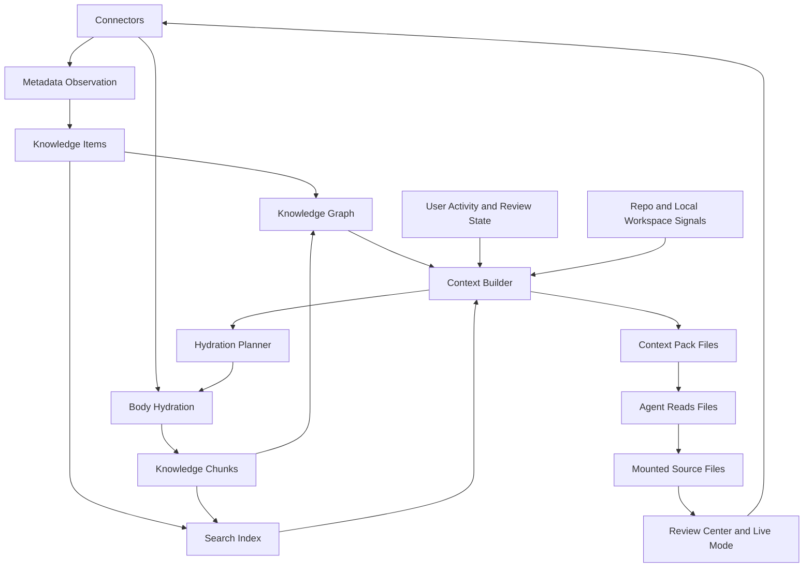

# Local Connected Knowledge Cache Design

Draft date: July 22, 2026

Status: design draft for iteration, not an implementation commitment

## Executive Summary

`loc locate <url>` is an important primitive, but it cannot be the main product
experience. In real workflows, the agent often does not know the exact Notion
URL, Google Doc URL, Gmail thread, Granola note, Slack thread, or issue link.
The agent usually starts with a task:

```text
Prepare today's scrum update.
Review launch readiness.
Find the customer context behind this bug.
Update the onboarding docs from the latest implementation.
```

Locality should therefore become a local connected knowledge cache. Connectors
feed a durable local index and graph. Agents search, inspect, and edit through
files. Hydration happens lazily by relevance, not accidentally by directory
recursion. Sync back remains conservative and reviewable.

The goal is not to copy Notion search, Obsidian, Glean, or MCP. The goal is to
own a different surface:

```text
Company knowledge as a local, permission-aware, source-backed filesystem for agents.
```

This is the moat: Locality can combine source identity, local files, durable
sync state, freshness, pending edits, push journals, remote provenance, and
agent-readable paths into one system. Generic MCP tools can fetch from apps, but
they do not naturally provide a persistent local working memory that agents can
grep, diff, edit, review, and safely sync back.

## Strategic Thesis

The current product is already more than a mount tool, but the user experience
can still feel mount-first:

- connect source;
- mount source;
- browse files;
- paste URL;
- pull or push.

That is useful when the user knows exactly where the work lives. The larger
opportunity is workflow-first:

- user or agent states an objective;
- Locality finds the relevant knowledge across connected sources;
- Locality returns a ranked evidence pack with local paths;
- Locality hydrates only what is useful;
- the agent works in files;
- Locality syncs safe changes back through Review Center and Live Mode.

In this model, `loc locate --offline <url>` is a fast identity resolver.
`loc resolve <url>` is a remote repair path. `loc pull <file>` is precise body
hydration. `loc context build` is the main agent-facing primitive when the URL is
unknown.

## Product Principles

### 1. Filesystem First, Search Assisted

The winning agent interface remains files, folders, grep, diffs, and normal
editor operations. Search and graph retrieval should produce file paths and
context packs, not replace the filesystem.

### 2. Local First, Remote Second

The normal query path should be local and fast. Remote APIs should feed the
cache through scheduled observation, explicit resolve, bounded hydration, and
source-specific sync jobs. Remote APIs should not sit inside every keystroke or
every agent search step.

### 3. Metadata Before Bodies

Locality should index cheap metadata broadly and hydrate bodies selectively.
Metadata gives enough signal to rank candidates, explain coverage, and decide
where to spend remote API budget.

### 4. Relevance Before Recursion

Directory recursion is a bad default for context. A directory may contain 5
pages or 5,000 pages. `loc pull <directory>` should be explicit about recursive
policy. Context hydration should rank first, then hydrate only the top useful
items and their most relevant neighbors.

### 5. Identity And Path Are Different

Remote identity must be stable even when a visible path changes. Paths are the
human and agent interface. Remote IDs, source URLs, connector IDs, and access
scopes are the durable identity layer.

### 6. Freshness Must Be Visible

A good result is not just relevant. It must be honest:

- ready;
- metadata only;
- stale;
- remote changed;
- disconnected;
- pending local changes;
- conflicted;
- read-only;
- not hydrated yet.

Agents should not mistake stale or metadata-only context for fresh body content.

### 7. Source Ownership Stays Clear

Derived knowledge views should not blur write ownership. The source-backed tree
is writable according to connector rules. Generated knowledge views and context
packs are read-only or explicitly staged until write semantics are clear.

## The Missing URL Problem

The product cannot expect agents to know URLs. The user often does not know the
URL either. The system needs to answer:

```text
Given this goal and this user/workspace, what local knowledge is likely useful?
```

That requires a retrieval layer with signals beyond exact ID lookup:

- title, path, and body lexical matches;
- source URLs and aliases;
- current project or mount;
- recently opened or edited files;
- Review Center pending files;
- Live Mode tracked files;
- recent git commits and changed paths;
- people mentioned in the task;
- dates and time windows;
- document links and backlinks;
- source-specific metadata such as Notion properties, Gmail participants,
  Granola attendees, Google Docs owners, Slack channels, issue labels, and
  pull request authors;
- graph neighbors around high-confidence matches.

The UX should let the agent start from a goal, not from a URL.

## Core Concepts

### Knowledge Item

A connector-neutral record for a source-backed object.

Examples:

- Notion page;
- Notion database row;
- Google Doc;
- Gmail thread;
- Gmail message;
- Granola note;
- Slack thread;
- Linear issue;
- GitHub pull request;
- local mounted Markdown file.

Important fields:

```text
item_id
connector
connection_id
mount_id
remote_id
source_url
kind
title
projected_path
absolute_path
hydration_state
access_state
remote_version
observed_at
indexed_at
updated_at
created_at
actors
source_metadata_json
```

### Knowledge Chunk

A searchable unit inside a knowledge item.

Examples:

- page heading section;
- Notion block range;
- Google Docs paragraph group;
- Gmail message body;
- Granola transcript segment;
- code-linked launch note section.

Important fields:

```text
chunk_id
item_id
source_block_id
chunk_kind
heading_path
text
frontmatter_json
content_hash
start_offset
end_offset
indexed_at
```

### Knowledge Edge

A relationship between items or chunks.

Examples:

- parent-child;
- contains;
- links-to;
- mentioned-by;
- same-person;
- same-project;
- same-date;
- attached-to;
- duplicate-url;
- references-commit;
- references-pr;
- blocks;
- depends-on;
- discussed-in.

Important fields:

```text
edge_id
from_item_id
from_chunk_id
to_item_id
to_chunk_id
to_external_ref
edge_type
confidence
source
created_at
```

### Context Pack

A generated, task-specific evidence bundle for an agent.

The context pack is not a new source of truth. It is a local workspace artifact
that explains what Locality found and why.

Suggested shape:

```text
.locality/context/
  2026-07-22-scrum-update/
    context.md
    manifest.json
    evidence/
      notion-engineering-wiki-standups.md
      granola-product-sync.md
      gmail-customer-thread.md
    paths.txt
    freshness.md
    missing-access.md
    hydration-plan.json
    trace.jsonl
```

### Hydration Plan

A deterministic plan for which metadata-only or stale items should be hydrated
for a workflow.

The plan should be explicit:

```text
hydrate_policy: none | metadata | top-k | neighbors | bounded-recursive
max_items
max_depth
max_remote_calls
max_wall_time_ms
source_budgets
reasons
```

### Knowledge Cache

The durable local store composed of:

- source metadata;
- indexed chunks;
- graph edges;
- freshness state;
- activity signals;
- hydration plans;
- context packs;
- sync and review state.

This cache is rebuildable where possible, but it must preserve durable source
identity and pending local work.

## Proposed User And Agent Workflow

### Workflow: Agent Does Not Know The URL

Task:

```text
Generate today's engineering update from recent git changes and relevant company context.
```

Expected path:

1. Agent calls `loc context build` with the task, repository path, and time
   window.
2. Locality searches the local knowledge cache first.
3. Locality ranks candidates by text, recency, graph signals, activity, source
   confidence, and workflow hints.
4. Locality hydrates only top candidates that need body content, within a bounded
   budget.
5. Locality writes a context pack with file paths, snippets, freshness labels,
   and missing-access notes.
6. Agent reads `context.md`, `manifest.json`, and the referenced mounted files.
7. Agent writes the output to the correct mounted `page.md` or creates a draft.
8. Live Mode or Review Center handles safe sync back.

Example command:

```bash
loc context build \
  --goal "Generate today's engineering update" \
  --repo /Users/me/orgs/research/afs \
  --since 24h \
  --sources notion,granola,gmail,google-docs \
  --hydrate top-k \
  --max-items 25 \
  --out .locality/context/today-engineering-update
```

### Workflow: User Gives A URL

Task:

```text
Open this Notion page and update the launch risks.
```

Expected path:

1. `loc locate --offline <url>` checks the local index only.
2. If found and fresh enough, return the local file path immediately.
3. If missing or path looks stale, `loc resolve <url>` repairs remote identity
   and parent path metadata.
4. `loc pull <file>` hydrates exactly the target page.
5. Agent edits the file.
6. Review Center or Live Mode syncs back.

This keeps locate, resolve, and hydration measurable and predictable.

## Command Surface

### `loc locate --offline <query-or-url>`

Purpose:

- fast local resolution;
- no remote connector calls;
- safe for agent loops and desktop typeahead.

Behavior:

- returns local file path when known;
- returns metadata-only status when known but not hydrated;
- returns no match when local cache does not know it;
- never performs remote parent repair.

### `loc resolve <url-or-id>`

Purpose:

- remote identity and parent/path repair;
- source-specific URL handling;
- explicit API work.

Behavior:

- contacts the connector;
- validates access;
- saves parent/path metadata;
- does not hydrate body content unless asked;
- emits trace spans for remote calls and repaired path entries.

### `loc pull <file>`

Purpose:

- hydrate exactly one entity body;
- repair missing assets for that entity;
- preserve local dirty or conflicted state.

Behavior:

- no recursive descendant hydration by default;
- no mount-wide enumeration;
- safe and measurable.

### `loc pull <directory>`

Purpose:

- explicit directory policy.

Required flags:

```bash
loc pull <directory> --children
loc pull <directory> --recursive --max-depth 2 --max-items 50
loc pull <directory> --hydrate-policy metadata
loc pull <directory> --hydrate-policy top-k --query "launch readiness"
```

Directory pulls should not accidentally become a broad recursive hydration
benchmark.

### `loc search <query>`

Purpose:

- search the local knowledge cache.

Behavior:

- local by default;
- returns snippets and matched fields;
- returns safety and freshness labels;
- can filter by connector, mount, kind, person, project, date, and status;
- can schedule deeper search through a separate flag.

Suggested examples:

```bash
loc search "onboarding live mode" --json
loc search "launch risks" --source notion --kind page --json
loc search "customer renewal" --source gmail --since 30d --json
loc search "review_needed" --status review-needed --json
```

### `loc context build`

Purpose:

- the main primitive for the missing-URL case;
- converts a task into a ranked evidence pack.

Behavior:

- searches local index;
- optionally reads repository state;
- ranks candidates;
- hydrates bounded top candidates;
- writes a context pack;
- explains why each item was included;
- emits trace spans for ranking, hydration, and token-relevant output size.

Suggested command:

```bash
loc context build \
  --goal "Prepare launch readiness summary" \
  --cwd "$PWD" \
  --since 7d \
  --sources notion,google-docs,granola,gmail \
  --hydrate top-k \
  --max-items 30 \
  --json
```

### `loc context explain <context-id>`

Purpose:

- make retrieval auditable.

Behavior:

- shows query terms;
- shows ranking signals;
- shows hydrated items;
- shows skipped items;
- shows stale or inaccessible sources;
- shows remote calls and timings.

## Desktop Experience

### Home

Home should surface work, not mounts alone:

- recently opened files;
- recently hydrated files;
- recent context packs;
- Review Center count;
- source health;
- suggested workflows such as "Prepare standup" or "Review launch readiness".

### Search Or Ask

The command bar should support:

- exact URL open;
- title/path search;
- body search;
- "ask a workflow" query;
- add result to context;
- copy path;
- reveal in file browser;
- open remote source;
- hydrate result.

Result groups:

- best matches;
- ready files;
- metadata-only matches;
- pending review;
- recent activity;
- online-only candidates;
- disconnected sources, hidden by default.

### Sources

Sources should explain cache coverage:

- connected account;
- mounted paths;
- metadata indexed count;
- body indexed count;
- stale count;
- failed sync count;
- last observation time;
- next scheduled sync;
- per-source "sync metadata" and "hydrate selected" actions.

### Context Packs

Desktop should show a small "Context" workspace:

- created context packs;
- task name;
- sources used;
- files included;
- freshness;
- missing access;
- copy agent prompt;
- open context folder.

This becomes the human-visible version of `loc context build`.

## Architecture



### Components

#### Connector Observation Jobs

Cheap metadata refresh:

- known objects;
- child containers;
- source roots;
- recent changes where supported;
- webhook or incremental checkpoints where supported.

Observation should avoid body hydration.

#### Body Hydration Jobs

Fetch and render source content:

- explicit file pull;
- file open;
- context-pack top-k hydration;
- Live Mode remote fast-forward;
- user-selected source sync.

Hydration should emit spans for connector fetch, render, local store writes,
projection writes, shadow writes, and conflict checks.

#### Knowledge Indexer

Builds searchable records from:

- entity metadata;
- remote observations;
- hydrated shadows;
- visible file contents when safe;
- frontmatter;
- source-specific metadata;
- extracted links and mentions.

The first implementation should use SQLite FTS5 because the repo already uses
SQLite and has an entity metadata FTS path. Move to a dedicated search engine
only after product-grade field weighting, fuzzy matching, or scale makes it
necessary.

#### Graph Builder

Creates edges from:

- source parent-child structure;
- Markdown links;
- Notion links and mentions;
- Google Docs links;
- Gmail sender/recipient/thread relationships;
- Granola attendees and meeting timestamps;
- Slack channel/thread/message relationships;
- issue IDs;
- pull request URLs;
- commit hashes;
- shared people, projects, labels, and dates.

Graph edges should be explainable and confidence-scored.

#### Ranker

Ranks candidates for search and context packs.

Initial scoring can be deterministic:

```text
score =
  lexical_match
  + title_path_boost
  + body_snippet_boost
  + recency_boost
  + current_workspace_boost
  + user_activity_boost
  + graph_neighbor_boost
  + source_priority_boost
  + freshness_boost
  - stale_penalty
  - disconnected_penalty
  - conflict_penalty
  - duplicate_penalty
```

An LLM reranker can be added later, but the first pass should not require an LLM
to retrieve useful local context.

#### Context Builder

Converts a task into an evidence pack.

Inputs:

- goal text;
- current working directory;
- mounted source roots;
- optional time window;
- optional people or team;
- optional repo metadata;
- source filters;
- budget.

Outputs:

- `context.md`;
- `manifest.json`;
- `paths.txt`;
- `freshness.md`;
- `missing-access.md`;
- `hydration-plan.json`;
- trace events.

#### Hydration Planner

Decides whether to hydrate metadata-only or stale candidates.

Policies:

- `none`: use only local indexed content;
- `metadata`: refresh cheap metadata only;
- `top-k`: hydrate the best candidates;
- `neighbors`: hydrate direct graph neighbors around high-confidence matches;
- `bounded-recursive`: explicit depth and item cap.

The planner must respect source budgets and rate limits.

## Storage Model

Add a rebuildable knowledge subsystem, while preserving durable identity and
pending local work in existing state.

Suggested tables:

```text
knowledge_items
knowledge_chunks
knowledge_edges
knowledge_activity
knowledge_context_packs
knowledge_context_pack_items
knowledge_hydration_plans
knowledge_freshness
knowledge_aliases
knowledge_index_jobs
```

### `knowledge_items`

Source-backed object metadata. This can be rebuilt from mounts, entities, and
observations, but should preserve stable local IDs across rebuilds when remote
identity is unchanged.

### `knowledge_chunks`

Searchable text units from hydrated content and source metadata. Chunks are
rebuildable.

### `knowledge_edges`

Relationships across items. Most edges are rebuildable. User-pinned or
user-confirmed edges should be durable.

### `knowledge_activity`

Signals from:

- open file;
- copy path;
- reveal;
- context pack inclusion;
- push;
- pull;
- live-mode tracking;
- review;
- recent source sync.

### `knowledge_context_packs`

Auditable retrieval sessions. These are valuable for debugging, product metrics,
and enterprise trust.

## Context Pack Format

### `context.md`

Human and agent readable summary:

```md
# Context Pack: Today's Engineering Update

Goal: Generate today's engineering update.
Created: 2026-07-22 14:10:00 IST
Coverage: Notion, Granola, Gmail, Google Docs

## Read First

1. /Users/me/Library/CloudStorage/Locality/notion/engineering-wiki/standups/page.md
   Reason: exact title and recent activity match.
   Freshness: observed 3m ago, hydrated 2m ago.

2. /Users/me/Library/CloudStorage/Locality/granola/product-sync/summary.md
   Reason: meeting attendee and date match.
   Freshness: indexed 10m ago.

## Relevant But Not Hydrated

- Locality Launch QA Notes
  Reason: title match, metadata only.
  Suggested: loc pull "<path>"

## Missing Access

- Gmail account is connected but sync is paused.
```

### `manifest.json`

Machine-readable evidence list:

```json
{
  "goal": "Generate today's engineering update",
  "created_at": "2026-07-22T08:40:00Z",
  "items": [
    {
      "item_id": "notion:page:...",
      "connector": "notion",
      "title": "Standups with Locality",
      "absolute_path": "/Users/me/Library/CloudStorage/Locality/notion/engineering-wiki/standups/page.md",
      "source_url": "https://app.notion.com/...",
      "state": "ready",
      "freshness": "hydrated",
      "score": 92.4,
      "reasons": ["title_match", "recent_activity", "graph_neighbor"],
      "agent_readable": true
    }
  ]
}
```

## Benchmark Model

The benchmark phases should match product primitives:

```text
locate_offline
resolve_remote
hydrate_target
hydrate_context
agent_run
sync_review
push
```

This avoids mixing unrelated costs. For example, a single "locate and
prehydrate" number can hide URL repair, remote parent listing, target hydration,
recursive directory hydration, and local projection writes. Those are different
product decisions and should be measured separately.

Metrics:

- local search latency;
- remote resolve latency;
- target hydration latency;
- context hydration latency;
- number of remote calls;
- number of hydrated items;
- cache hit rate;
- agent wall time;
- agent tool calls;
- tokens;
- output quality score;
- freshness errors;
- sync conflicts;
- push success rate.

## Experiment Evidence

This design direction is partly motivated by the Amika comparison experiment we
ran against a Locality-mounted Notion workspace and a Notion MCP workflow.

Run shape:

- run id: `traced-20260721T213706Z`;
- model: `gpt-5.6-luna` with low reasoning;
- task: generate a launch-readiness style report from local git state plus
  Notion launch context;
- Locality path: locate target page, pull target page, locate context page,
  recursively hydrate context directory, let the agent read local files, write a
  mounted `page.md`, and inspect `loc diff`;
- MCP path: let the agent use Notion MCP calls for Notion context and local shell
  commands for git context;
- Locality trace mode: direct CLI tracing was forced so pull and hydration spans
  were visible.

Topline from this single traced run:

| Phase | Time |
| --- | ---: |
| Locality setup before agent | 141.2s |
| Locality agent wall time | 49.4s |
| Notion MCP agent wall time | 47.8s |
| Full run through both strategies | 239.5s |

Agent usage shape:

| Strategy | Input Tokens | Cached Input | Output Tokens | Tool Shape |
| --- | ---: | ---: | ---: | --- |
| Locality | 196,033 | 152,832 | 4,020 | 12 shell commands, 0 MCP calls |
| Notion MCP | 341,129 | 252,672 | 4,187 | 8 shell commands, 20 MCP calls |

Important interpretation:

- The Locality agent phase used fewer input tokens and no MCP calls, which
  supports the agent-native file interface thesis.
- The current Locality setup path was expensive. The agent got useful local
  files, but the synchronous locate and hydration work before the agent started
  dominated the Locality side of the run.
- This is one profile, not a statistical benchmark. It is useful for finding
  critical paths, not for claiming a universal win.

### What Prehydration Showed

Prehydration is valuable only when it is already done, cheap, or relevance
guided.

In this run, the Locality path spent `141.2s` preparing context before the agent
started. That setup included URL locate, target pull, context locate, recursive
context hydration, local search, and report target preparation. Once the files
were available, the Locality agent could work through normal shell reads and
file writes. The problem is that current prehydration is still too synchronous
and too broad.

This points to a product requirement:

```text
Locality should not make every agent workflow pay the full cost of locating,
repairing, pulling, and recursively hydrating at task time.
```

The local connected knowledge cache should move useful work earlier and make
task-time work bounded:

- metadata should already be indexed;
- known URLs should resolve through `loc locate --offline`;
- body chunks for hot files should already be searchable;
- stale or metadata-only candidates should be ranked before hydration;
- context hydration should use top-k or neighbor expansion, not recursive folder
  traversal by default.

### Critical Path Findings

The traced run showed these bottlenecks:

| Area | Finding | Design Implication |
| --- | --- | --- |
| URL locate | Target locate took `44.4s`; context locate took `32.0s`. Final local search was only `1-2ms`; most time was remote parent/path preparation. | Split `loc locate --offline` from `loc resolve`. Offline locate must stay local and fast. Remote path repair should be explicit and measured. |
| Target pull | Pulling the target page took `4.0s`, dominated by one `connector.fetch_render`. | Single-file hydration is acceptable as an explicit operation, but should avoid re-fetching if remote version is unchanged. |
| Context hydration | Context pull took `60.7s`, hydrated `19` pages, and enumerated `18` child entries. | Directory hydration must be policy-driven. Context building should hydrate ranked items, not recursively hydrate a page tree by default. |
| Fetch/render | Context fetch/render spans summed to `34.3s` across `19` calls. | Add skip-on-freshness checks and consider bounded concurrent remote reads once local commit/projection writes remain serial and deterministic. |
| Child listing | Context `list_children` spans summed to `26.1s` across `19` calls. | Avoid listing children unless the context plan needs neighbors. Add deeper connector spans so slow list calls can be separated into pagination, block-child listing, page/database metadata fetch, and rate-limit waits. |
| Agent phase | Locality agent wall time was similar to MCP agent wall time, but used fewer input tokens and no MCP calls. | The opportunity is not only faster agent execution. The bigger opportunity is fewer repeated tool calls, cheaper context, more local cache hits, and safer sync back. |

### Critical Paths To Improve

#### 1. Locate And Resolve Split

Current exact URL locate can do remote parent/path preparation. The product path
should split this:

```bash
loc locate --offline <url>
loc resolve <url>
loc pull <file>
```

This makes the common cached case instant and makes remote repair visible in
traces, benchmarks, and UI.

#### 2. Local Body Indexing

Search should not stop at metadata. Hydrated shadows and safe visible content
should produce chunks with snippets, headings, and freshness. This is the first
step toward agents discovering useful context without URLs.

#### 3. Relevance-Guided Context Hydration

`loc context build` should use a hydration policy:

```text
none -> metadata and already-indexed body only
top-k -> hydrate the highest ranked missing body candidates
neighbors -> hydrate graph neighbors around confident matches
bounded-recursive -> explicit depth and item cap
```

Recursive directory pull should remain a deliberate operation, not the default
way to prepare agent context.

#### 4. Freshness-Based Fetch Skips

If Locality has a hydrated page and remote metadata says the body version has
not changed, context build should not fetch/render that page again. The cache
must make "already good enough" cheap.

#### 5. Bounded Parallel Remote Reads

Fetch/render and child listing are currently strong candidates for bounded
parallelism, but only after the operation is split into:

- parallel remote read/list phase;
- serial deterministic local commit/projection phase.

This preserves Locality's state and sync safety while reducing wall time.

#### 6. Deeper Connector Spans

The current trace tells us `list_children` is expensive, but not always why. Add
spans for:

- Notion block children pagination;
- retrieve page metadata;
- retrieve database metadata;
- retrieve database rows;
- render canonical Markdown;
- rate-limit waits and retries;
- local SQLite writes;
- visible projection writes.

This turns "Notion is slow" into actionable work items.

#### 7. Cache Coverage UI

Desktop should show whether a source is:

- metadata indexed;
- body indexed;
- stale;
- hydration queued;
- failed;
- disconnected.

That gives users a reason to trust or refresh context before asking agents to
work.

### Experiment Follow-Up

Before using this comparison in external material, run a repeatable benchmark:

- `RUNS=5` minimum for each strategy;
- same model and reasoning effort;
- same output format;
- same Notion target and context corpus;
- separate timings for offline locate, resolve, target hydrate, context hydrate,
  agent run, diff, and optional push;
- record remote call counts, hydrated item counts, token usage, wall time,
  freshness failures, and output quality review.

The design target is clear even before repeated runs:

```text
Make the common path local, cache-backed, relevance-ranked, and explicit about
remote work.
```

## Moat

The defensible product advantage is not just a connector list. Connectors are
necessary but not enough.

The durable advantage is the combination of:

- local source-backed filesystem;
- permission-aware source identity;
- source-specific rendering and sync semantics;
- local search over mounted knowledge;
- graph relationships across apps;
- freshness and hydration state;
- pending local edits and Review Center state;
- Live Mode policy;
- push journals and auditability;
- context packs agents can read and cite;
- workflow traces that explain what happened.

This is difficult for a pure MCP architecture to reproduce because MCP is mostly
a tool invocation layer. It can call APIs, but it does not naturally maintain a
long-lived local graph, source-backed file tree, sync journal, review workflow,
or cache that agents can inspect with normal file tools.

## Research And Inspiration

This section is here so reviewers can debate sources and remove anything that
does not fit Locality's direction. The goal is not to copy these systems. The
goal is to understand which ideas are durable and which ideas should remain
outside the product.

### Glean And Enterprise Knowledge Graphs

References:

- https://docs.glean.com/security/knowledge-graph
- https://docs.glean.com/connectors/connectors-power-glean

Useful ideas:

- enterprise search needs a permission-aware view of indexed company knowledge;
- people, documents, projects, activity, and source relationships all improve
  relevance;
- connectors are not just API wrappers, they feed a normalized index and graph;
- retrieval quality depends on source freshness and access correctness.

What Locality should not copy blindly:

- a search/chat-only product center;
- an opaque hosted index as the only user-visible surface;
- treating files as export artifacts rather than the primary agent interface.

Locality angle:

```text
Glean-like connected relevance, but with a local source-backed filesystem,
reviewable diffs, Live Mode, and sync back to the system of record.
```

### Obsidian And Local Knowledge Work

Reference:

- https://obsidian.md/help/plugins/graph

Useful ideas:

- backlinks help users discover related knowledge;
- local graph views can reveal nearby context around an active note;
- a local Markdown workspace gives users and agents a simple mental model.

What Locality should not copy blindly:

- making graph visualization the main product experience;
- asking users to manually curate tags and links as the core workflow;
- creating a separate knowledge base that drifts away from source apps.

Locality angle:

```text
Borrow backlinks, related items, local files, and command-palette navigation.
Do not become a personal notes app.
```

### Notion API Search Limits

References:

- https://developers.notion.com/reference/post-search
- https://developers.notion.com/reference/search-optimizations-and-limitations

Useful ideas:

- source APIs can help with exact locate, metadata discovery, and scoped query;
- source APIs should be part of ingestion and repair paths.

What Locality should not do:

- depend on Notion API search as the product's primary search engine;
- block desktop typeahead or agent retrieval on remote API calls;
- imply full workspace body search when only metadata or title coverage exists.

Locality angle:

```text
Remote search is a feeder and repair path. Locality search is the product path.
```

### MCP

References:

- https://modelcontextprotocol.io/specification/2025-06-18
- https://github.com/modelcontextprotocol/modelcontextprotocol

Useful ideas:

- common tool/resource protocol for model clients;
- connector ecosystem and standard integration contracts;
- clear separation between clients, servers, tools, and resources.

What Locality should not do:

- reduce itself to a bundle of API tools;
- make agents repeatedly rediscover state through tool calls;
- lose the durable local filesystem, sync journal, and review semantics.

Locality angle:

```text
MCP can be an access surface for Locality, but the durable value is the local
cache, graph, files, freshness, review state, and sync back.
```

### Retrieval-Augmented Generation

References:

- https://arxiv.org/abs/2005.11401
- https://proceedings.neurips.cc/paper/2020/hash/6b493230205f780e1bc26945df7481e5-Abstract.html

Useful ideas:

- models need access to external, updateable knowledge;
- provenance matters for knowledge-intensive tasks;
- retrieval can reduce reliance on model memory.

What Locality should not do:

- treat vector retrieval alone as sufficient;
- send private company content to hosted embedding services by default;
- hide provenance behind generated summaries.

Locality angle:

```text
Retrieval should return files, snippets, source URLs, freshness, and reasons.
Generation should happen after the agent can inspect evidence.
```

### GraphRAG

References:

- https://arxiv.org/abs/2404.16130
- https://www.microsoft.com/en-us/research/publication/from-local-to-global-a-graph-rag-approach-to-query-focused-summarization/

Useful ideas:

- graph indexes can help answer broad questions over large private corpora;
- entity and relationship extraction can improve sensemaking beyond keyword
  retrieval;
- community summaries may help when the user asks corpus-level questions.

What Locality should not do first:

- require LLM-derived graph construction before basic search works;
- make generated graph summaries authoritative;
- spend high model cost to maintain graph state before the product proves local
  lexical and metadata retrieval.

Locality angle:

```text
Start with deterministic edges from source structure, links, people, dates,
issues, commits, and activity. Add LLM-derived edges later as optional,
explainable, rebuildable enrichment.
```

### SQLite FTS5 And Tantivy

References:

- https://sqlite.org/fts5.html
- https://docs.rs/tantivy/latest/tantivy/
- https://github.com/quickwit-oss/tantivy

Useful ideas:

- SQLite FTS5 is a good first implementation path because Locality already uses
  SQLite state and can keep packaging simple;
- Tantivy is a strong Rust-native search library if Locality outgrows SQLite FTS
  field weighting, snippets, indexing scale, or query performance.

What Locality should not do:

- add a separate search engine before product requirements justify it;
- make search index state authoritative user state;
- block sync correctness on a rebuildable search index.

Locality angle:

```text
Use SQLite FTS5 first. Treat the search layer as rebuildable. Move to Tantivy
only when fielded search, ranking, snippets, fuzzy matching, or scale require it.
```

## Deliberate Non-Goals And Obsolete Paths

These paths are tempting, but they do not create the product we want.

### Remote API Search As The Main Product

Remote search APIs differ by source, rate limit, permissions, and result
quality. They are useful for ingestion and repair. They should not be the normal
agent retrieval loop.

### Recursive Hydration As Context Retrieval

Recursive folder pull is not retrieval. It is an expensive traversal. Context
retrieval should rank first, then hydrate a bounded set of useful items.

### URL-First Agent Workflows

URL-first workflows work only when the user or agent already knows the target.
The main product should accept goals and produce relevant local context.

### LLM Memory As The Cache

Model memory is not a durable company knowledge cache. Locality needs explicit
local state, source identity, freshness, provenance, and reviewable evidence.

### Vector Search As The Foundation

Embeddings are useful later, especially for recall. They should not replace
lexical search, source metadata, graph relationships, permissions, and freshness.

### One Flattened Global Folder

Flattening every app into one folder creates naming conflicts and write
ambiguity. Keep source-backed trees canonical. Build generated knowledge views
on top.

### Derived Views As Write Targets

Generated views such as `knowledge/projects` or context packs should be
read-only first. Writes should happen through source-backed files until ownership
rules are clear.

### MCP-Only Architecture

MCP tools can call APIs, but they do not automatically provide persistent local
files, source-backed paths, sync journals, freshness state, review state, or
agent-readable working sets. Locality can expose MCP later without becoming only
an MCP server.

## Roadmap

### Phase 0: Clarify Existing Primitives

Goal: make current behavior measurable and predictable.

Work:

- add `loc locate --offline`;
- add `loc resolve <url>`;
- make `loc pull <file>` single-entity by contract;
- require explicit policy flags for directory recursive hydration;
- split benchmark phases;
- keep current `loc locate` behavior behind compatibility defaults until the
  desktop flow migrates.

Success:

- exact URL open is faster when cached;
- remote repair is explicit;
- profiling tells us where time is spent.

### Phase 1: Body-Aware Local Search

Goal: search ready local knowledge, not only metadata.

Work:

- index hydrated shadow body chunks;
- index headings, frontmatter, source URLs, aliases, and snippets;
- return matched field and snippet;
- preserve safety labels;
- expose stable JSON for agents and desktop.

Success:

- agents can find relevant hydrated pages without knowing URLs;
- normal search remains local and fast.

### Phase 2: Context Pack MVP

Goal: solve the missing-URL workflow.

Work:

- add `loc context build`;
- implement deterministic ranker using lexical, path, recency, and activity
  signals;
- write `.locality/context/<id>` packs;
- include paths, freshness, missing access, and reasons;
- support `--hydrate none|top-k`;
- add traces for retrieval and hydration.

Success:

- scrum update and launch-readiness workflows can start from task text;
- context packs are auditable and repeatable.

### Phase 3: Connector-Neutral Graph

Goal: connect knowledge across apps.

Work:

- add `knowledge_edges`;
- extract links, mentions, people, dates, issues, PRs, commits, and source
  relationships;
- add related-items API;
- add context graph expansion;
- show backlinks and related work in desktop.

Success:

- Locality can answer "what else is related to this?" across sources;
- agents discover useful context they did not know to ask for.

### Phase 4: Background Freshness And Relevance

Goal: keep useful knowledge hot without broad crawling.

Work:

- prioritize active files, pending review, recent context packs, recent mounts,
  recent repo activity, and source-specific recent changes;
- add per-source API budgets;
- add cache coverage UI;
- add "hydrate selected" and "sync metadata" actions.

Success:

- most agent workflows hit ready local files;
- remote API work is bounded and explainable.

### Phase 5: Enterprise Controls

Goal: make the cache trustworthy in company environments.

Work:

- source and workspace policy controls;
- cache retention controls;
- local encryption where needed;
- admin-visible source coverage;
- audit export;
- redaction policy for sensitive sources;
- per-connector permission diagnostics.

Success:

- teams can understand what Locality cached, why, and who can access it.

### Phase 6: Optional Semantic Layer

Goal: improve recall after lexical search and graph are solid.

Work:

- chunk embeddings as rebuildable index;
- local embedding option first where practical;
- hosted embedding only with explicit workspace policy;
- semantic reranking for context packs;
- explain semantic matches with source snippets and paths.

Success:

- semantic search improves discovery without becoming an opaque source of truth.

## Immediate Implementation Slice

The smallest valuable slice:

1. Add command semantics:
   - `loc locate --offline`;
   - `loc resolve`;
   - single-entity `loc pull <file>` contract;
   - explicit directory hydration flags.
2. Extend local search:
   - hydrated body chunks;
   - headings;
   - snippets;
   - field weights;
   - JSON reasons.
3. Add `loc context build --hydrate none`:
   - local search only;
   - writes context pack;
   - no new remote calls.
4. Add `loc context build --hydrate top-k`:
   - bounded top candidate hydration;
   - source budgets;
   - trace spans.
5. Add desktop read-only surfacing:
   - recent context packs;
   - cache coverage;
   - "copy agent context path".

This gives us the product shape without destabilizing sync.

## Risks And Guardrails

### Permission Leakage

Risk: showing stale or disconnected content from old access.

Guardrail:

- hide disconnected sources by default;
- preserve access state in every result;
- never include inaccessible content in context packs unless explicitly allowed.

### Stale Context

Risk: agent uses outdated content.

Guardrail:

- freshness labels in search and context packs;
- stale penalty in ranking;
- `loc context build --require-fresh` for sensitive workflows.

### API Rate Limits

Risk: context hydration becomes broad crawling.

Guardrail:

- source budgets;
- top-k hydration;
- queue-based background jobs;
- no recursive default.

### Sync Ambiguity

Risk: derived knowledge views become confusing write targets.

Guardrail:

- source-backed trees are writable;
- context packs and knowledge views are read-only first;
- generated views link back to canonical source files.

### Local Storage Growth

Risk: broad body indexing consumes too much disk.

Guardrail:

- cache budgets;
- retention policies;
- chunk dedupe by content hash;
- source-specific attachment policies.

### Opaque Ranking

Risk: users do not trust why items were included.

Guardrail:

- `loc context explain`;
- reasons in manifest;
- trace output;
- desktop "why this result" affordance.

## Open Questions

1. Should context packs live under `.locality/context` inside the repo, under the
   Locality state root, or under the mounted Locality workspace?
2. Should `loc context build` be a CLI-only beta first, or should desktop expose
   it immediately as "Prepare context"?
3. What is the first non-Notion connector that should contribute graph signals:
   Gmail, Granola, Google Docs, Slack, Linear, or GitHub?
4. Should we index visible dirty local files directly, or only shadows plus
   Review Center state?
5. How should workspace admins define retention and indexing policies?
6. Should source-specific summaries be stored, or should summaries exist only
   inside context packs?
7. What quality benchmark should decide whether context retrieval is good:
   human rating, answer grounding, remote calls avoided, time saved, or task
   completion rate?

## Recommended Direction

Build Locality as the local connected knowledge cache for agents.

The product should keep its current filesystem and sync discipline, but add a
retrieval layer that starts from user intent instead of requiring a URL. The
first version should stay simple and deterministic: local FTS, source metadata,
freshness labels, activity signals, context packs, and bounded hydration. The
graph and semantic layer can follow once the local cache and context-pack
contract are reliable.

The end state is powerful:

- users connect company tools once;
- Locality keeps a local, source-backed knowledge cache;
- agents ask for context by goal;
- Locality returns ranked local files and evidence;
- agents work with normal file operations;
- Locality safely syncs back to the systems of record.

That is the product wedge and the long-term platform.
